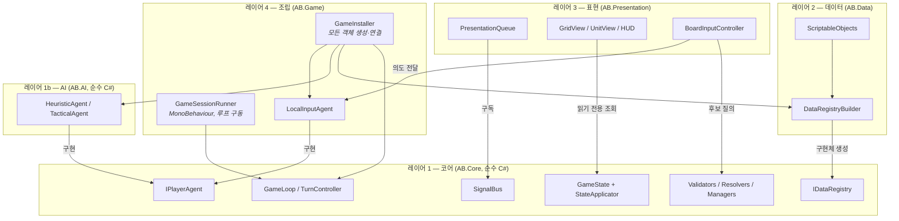
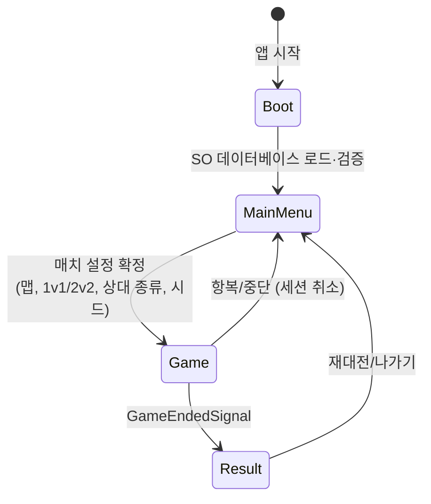
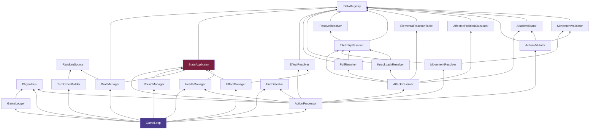

# 01 — 아키텍처: 어셈블리, 의존성, DI, 스레딩, 결정론

> 선행 문서: [README.md](README.md)
> 후행 문서: [02-domain-model.md](02-domain-model.md)

---

## 1. Unity 프로젝트 구성

- **Unity 버전**: Unity 6 LTS (6000.x) 이상. API Compatibility Level: **.NET Standard 2.1**.
- **렌더 파이프라인**: **URP 3D** — XCOM 스타일 카메라(90° 스냅 회전 포함)를 위해 3D 보드로 확정 (2026-06-13 결정, [13-camera-design.md](13-camera-design.md)). 보드 논리는 여전히 2D 격자이며 코어는 영향 없음.
- **언어 수준**: C# 9 기준으로 작성 (record 미사용 — 모든 타입은 명시적 class/struct로 정의되어 있어 Unity 버전이 더 낮아도 이식 가능).
- **외부 패키지 (필수)**: 없음. (선택: UniTask — `AB.Game`/`AB.Presentation`에서만 사용 가능. `AB.Core`에는 절대 도입 금지.)

### 1-1. 폴더 / 어셈블리 구조

```
Assets/
├── AB/
│   ├── Core/                       # [asmdef] AB.Core — UnityEngine 참조 금지
│   │   ├── Domain/                 #   기본 타입 (GridPos, Ids, Enums)
│   │   ├── Definitions/            #   순수 C# 메타데이터 (UnitDef, WeaponDef, ...)
│   │   ├── State/                  #   GameState, UnitState, TileState, ...
│   │   ├── Changes/                #   GameChange 18종 + ChangeBatch
│   │   ├── Actions/                #   PlayerAction 6종
│   │   ├── Validators/             #   IMovementValidator, IAttackValidator, ...
│   │   ├── Resolvers/              #   IAttackResolver, ITileEntryResolver, ...
│   │   ├── Managers/               #   StateApplicator, EffectManager, RoundManager, ...
│   │   ├── Loop/                   #   GameLoop, ActionProcessor, TurnController, EndDetector
│   │   ├── Agents/                 #   IPlayerAgent + ReplayAgent (코어 소속)
│   │   ├── Signals/                #   ISignalBus, 시그널 타입 전부
│   │   ├── Replay/                 #   GameLogger, ReplayData
│   │   └── Support/                #   IRandomSource, GameConstants, RuleErrorCode
│   ├── AI/                         # [asmdef] AB.AI → AB.Core
│   │   ├── HeuristicAgent.cs
│   │   └── Tactical/               #   BG3 스타일 전술 평가 AI
│   ├── Data/                       # [asmdef] AB.Data → AB.Core
│   │   ├── So/                     #   ScriptableObject 클래스들
│   │   ├── Registry/               #   DataRegistryBuilder (SO → Def 변환)
│   │   └── Editor/                 #   검증기, 임포트 도구
│   ├── Presentation/               # [asmdef] AB.Presentation → AB.Core
│   │   ├── Playback/               #   PresentationQueue, IChangePresenter 구현들
│   │   ├── Views/                  #   GridView, TileView, UnitView, EffectIconView
│   │   ├── Input/                  #   BoardInputController, TargetingController
│   │   ├── Hud/                    #   턴 배너, 타이머, 유닛 패널, 액션 버튼
│   │   └── DraftUi/                #   드래프트/순서 제출 UI
│   ├── Game/                       # [asmdef] AB.Game → Core, Data, AI, Presentation
│   │   ├── GameInstaller.cs        #   CompositionRoot (유일한 new 허용 지점)
│   │   ├── GameSessionRunner.cs    #   씬에서 GameLoop 실행/취소
│   │   ├── LocalInputAgent.cs      #   UI 입력 → IPlayerAgent
│   │   └── SceneFlow/              #   Boot → MainMenu → Game 씬 전환
│   └── Tests/
│       ├── CoreTests/              # [asmdef] AB.Core.Tests (EditMode) → Core, AI
│       └── PlayModeTests/          # [asmdef] AB.PlayMode.Tests → Game
├── GameData/                       # SO 에셋 (.asset) — 03-metadata.md 참조
│   ├── Units/  Weapons/  Skills/  Passives/  Effects/  Tiles/  Maps/
└── Scenes/
    ├── Boot.unity   MainMenu.unity   Game.unity
```

### 1-2. asmdef 정의

| asmdef | references | autoReferenced | noEngineReferences |
|---|---|---|---|
| `AB.Core` | (없음) | false | **true** ← 핵심 |
| `AB.AI` | AB.Core | false | **true** |
| `AB.Data` | AB.Core | false | false |
| `AB.Presentation` | AB.Core | false | false |
| `AB.Game` | AB.Core, AB.Data, AB.AI, AB.Presentation | true | false |
| `AB.Core.Tests` | AB.Core, AB.AI (+NUnit) | false | true |
| `AB.PlayMode.Tests` | AB.Game (+NUnit, UnityEngine.TestRunner) | false | false |

`noEngineReferences: true`로 컴파일러 수준에서 UnityEngine 참조를 차단한다.
→ `AB.Core`/`AB.AI`는 그대로 .NET 콘솔 프로젝트에 포함시켜 **헤드리스 시뮬레이션**(G-07)이 가능하다.

---

## 2. 레이어 책임 정의



| 레이어 | 해도 되는 것 | 하면 안 되는 것 |
|---|---|---|
| **AB.Core** | 룰 판정/계산/적용, 시그널 발행, 에이전트 호출 | UnityEngine 사용, 구독자 인지, 시간(`DateTime.Now`)/스레드 직접 사용 |
| **AB.Data** | SO 정의, SO→Def 변환, 에디터 검증 | 게임 로직, 상태 변경 |
| **AB.AI** | 상태 복제 후 시뮬레이션, 액션 선택 | 원본 상태 변경 (반드시 `Clone()` 사용) |
| **AB.Presentation** | 시그널 구독, 상태 **읽기**, 연출, 입력 수집 | 상태 변경, 룰 판단(가능 여부는 반드시 Validator에 질의) |
| **AB.Game** | 객체 생성/연결, 씬 흐름, 루프 시작/중단 | 룰 로직 |

---

## 3. 의존성 주입 (DI)

외부 DI 프레임워크(VContainer/Zenject) **없이 수동 생성자 주입**으로 구성한다.
객체 그래프가 작고(서비스 약 20개) 게임당 1회 조립이므로 충분하다.

### 3-1. GameContext — 코어 서비스 묶음

```csharp
namespace AB.Core.Context
{
    /// <summary>
    /// 한 게임 세션이 사용하는 모든 코어 서비스의 묶음 (DI 컨테이너 역할).
    /// GameContextFactory에서만 생성한다. 필드는 전부 readonly.
    /// </summary>
    public sealed class GameContext
    {
        public IDataRegistry Registry { get; }
        public IRandomSource Random { get; }
        public ISignalBus Bus { get; }

        public IMovementValidator MovementValidator { get; }
        public IAttackValidator AttackValidator { get; }
        public IActionValidator ActionValidator { get; }

        public IMovementResolver MovementResolver { get; }
        public IAttackResolver AttackResolver { get; }
        public ITileEntryResolver TileEntryResolver { get; }
        public IEffectResolver EffectResolver { get; }

        public IStateApplicator Applicator { get; }
        public IEffectManager EffectManager { get; }
        public IHealthManager HealthManager { get; }
        public IDraftManager DraftManager { get; }
        public IRoundManager RoundManager { get; }
        public ITurnOrderBuilder TurnOrderBuilder { get; }
        public IEndDetector EndDetector { get; }

        public IActionProcessor ActionProcessor { get; }
        public IGameLogger Logger { get; }

        // 생성자: 위 전부를 파라미터로 받아 대입 (생략 — 기계적)
    }

    /// <summary>코어 서비스 조립의 유일한 지점 (테스트 픽스처 제외).</summary>
    public static class GameContextFactory
    {
        /// <param name="registry">AB.Data가 만들어 넘기는 메타데이터 레지스트리</param>
        /// <param name="seed">결정론 보장용 시드. 리플레이 파일에 저장된다.</param>
        public static GameContext Create(IDataRegistry registry, ulong seed);
    }
}
```

### 3-2. GameInstaller — Unity 측 CompositionRoot

```csharp
namespace AB.Game
{
    /// <summary>
    /// Game 씬의 부트스트랩. 인스펙터에서 SO 데이터베이스/매치 설정을 받아
    /// GameContext와 에이전트, 프레젠테이션을 전부 조립하고 GameLoop를 시작한다.
    /// 프로젝트 내에서 'new'로 코어 객체를 만드는 곳은 여기와 테스트뿐이다.
    /// </summary>
    public sealed class GameInstaller : MonoBehaviour
    {
        [SerializeField] private GameDatabaseSo database;     // 03 문서 참조
        [SerializeField] private MatchConfigSo matchConfig;   // 맵, 모드(1v1/2v2), 에이전트 종류
        [SerializeField] private GameSceneRefs sceneRefs;     // GridView, HUD 등 씬 참조 묶음

        private GameSessionRunner runner;

        private void Awake()
        {
            // 1) SO → IDataRegistry
            IDataRegistry registry = DataRegistryBuilder.Build(database);
            // 2) 코어 조립
            GameContext ctx = GameContextFactory.Create(registry, matchConfig.ResolveSeed());
            // 3) 에이전트 조립 (인간 → LocalInputAgent, AI → HeuristicAgent ...)
            IReadOnlyList<IPlayerAgent> agents = AgentFactory.Create(matchConfig, ctx, sceneRefs);
            // 4) 프레젠테이션 구독 연결 (PresentationQueue가 Bus 구독)
            sceneRefs.Bind(ctx);
            // 5) 루프 실행
            runner = new GameSessionRunner(ctx, agents, matchConfig.MapId);
            runner.RunAsync(destroyCancellationToken).Forget(); // fire-and-forget + 예외 로깅
        }
    }
}
```

---

## 4. 스레딩 / 비동기 정책

| 정책 | 내용 |
|---|---|
| **T-01** | `GameLoop`는 **Unity 메인 스레드에서 async/await로 실행**된다. Unity의 `SynchronizationContext` 덕분에 await 재개는 항상 메인 스레드. 코어 자체는 스레드를 모른다. |
| **T-02** | 모든 대기는 `Task` + `CancellationToken`. 코어는 `Task.Delay`(타임아웃)와 `TaskCompletionSource`(입력 대기)만 사용. |
| **T-03** | AI가 무거운 탐색을 할 경우 `AIAgent` **내부에서** `Task.Run` + `state.Clone()`으로 워커 스레드 사용 가능. 결과 반환 시점에는 원본 상태를 건드리지 않으므로 안전. |
| **T-04** | 시그널 발행/구독 콜백은 **발행 스레드(=메인 스레드)에서 동기 실행**. 구독자는 콜백 안에서 무거운 작업 금지(큐에 적재만). |
| **T-05** | 게임 종료/씬 전환 시 `GameSessionRunner`가 `CancellationTokenSource.Cancel()` → 진행 중인 에이전트 대기가 모두 취소된다. |

### 타임아웃 구현 표준 패턴

```csharp
// TurnController 내부 — 에이전트 호출은 항상 이 패턴을 쓴다.
// 1) 타임아웃/취소 토큰 합성  2) 실패·타임아웃 시 폴백 액션
private static async Task<PlayerAction> RequestWithTimeoutAsync(
    IPlayerAgent agent, ActionRequest req, TimeSpan timeout,
    PlayerAction fallback, CancellationToken sessionCt)
{
    using var cts = CancellationTokenSource.CreateLinkedTokenSource(sessionCt);
    cts.CancelAfter(timeout);
    try
    {
        return await agent.RequestActionAsync(req, cts.Token);
    }
    catch (OperationCanceledException) when (!sessionCt.IsCancellationRequested)
    {
        return fallback; // 타임아웃 → 자동 Pass (룰 §6.2)
    }
    // 세션 취소면 OperationCanceledException 그대로 전파 → 루프 종료
}
```

---

## 5. 결정론 정책 (G-02)

| 정책 | 내용 |
|---|---|
| **D-01** | 난수는 전부 `IRandomSource` 주입. 사용처: 랜덤 지형 생성, 드래프트 타임아웃 자동 배치, 선공 동전 던지기. |
| **D-02** | `IRandomSource`는 시드 기반 (xoshiro256** 권장). 시드는 리플레이 헤더에 기록. |
| **D-03** | 코어에서 `DateTime`, `Time.*`, `Guid.NewGuid()` 사용 금지. 유닛 ID는 결정적 규칙으로 생성: `"{playerId}_u{slotIndex}"` (예: `"p0_u2"`). |
| **D-04** | 컬렉션 순회 순서가 결과에 영향을 주는 곳(예: 사망 판정, 효과 tick)은 반드시 **명시적 정렬 키**(유닛 생성 순서 = unitId의 슬롯 인덱스) 사용. `Dictionary` 순회 순서에 의존 금지 — 상태의 유닛 목록은 `List<UnitState>`로 보관한다. |
| **D-05** | 검증: 같은 시드 + 같은 액션 시퀀스를 리플레이로 재실행하면 모든 ChangeBatch가 바이트 단위로 동일해야 한다 (09 문서의 결정론 테스트). |

```csharp
namespace AB.Core.Support
{
    /// <summary>결정론적 난수 소스. 모든 무작위성은 이 인터페이스를 통해서만.</summary>
    public interface IRandomSource
    {
        ulong Seed { get; }
        /// <summary>[0, maxExclusive) 정수.</summary>
        int NextInt(int maxExclusive);
        /// <summary>true/false 동전 던지기. (선공 결정 §5.2)</summary>
        bool NextBool();
        /// <summary>리스트 셔플 (Fisher-Yates). 드래프트 자동 배치에 사용.</summary>
        void Shuffle<T>(IList<T> list);
        /// <summary>
        /// 독립 스트림 파생 (시드 = 부모 시드 ⊕ key). AI 에이전트별 RNG 분리용 (12 문서 A-04)
        /// — 에이전트가 난수를 소비해도 코어 스트림(지형/동전)이 흔들리지 않는다.
        /// </summary>
        IRandomSource Fork(int key);
    }
}
```

---

## 6. 씬 구조



| 씬 | 책임 |
|---|---|
| **Boot** | `GameDatabaseSo` 로드, 무결성 검증(참조 ID 존재 확인), 실패 시 에러 화면 |
| **MainMenu** | 매치 설정(`MatchConfigSo` 런타임 사본) 작성 |
| **Game** | `GameInstaller`가 전부 조립. 드래프트 → 전투 → 결과까지 단일 씬 |
| **Result** | Game 씬 위 오버레이 (별도 씬 아님) |

---

## 7. 코어 서비스 의존성 그래프 (클래스 수준)

> 04 문서의 인터페이스 정의와 함께 볼 것. 화살표 = "생성자에서 주입받음".



**읽는 법**: 최하단 `GameLoop`가 최상위 오케스트레이터. 붉은 `StateApplicator`가 유일한 상태 변경 지점.
`AttackResolver`가 가장 의존이 많다 — 공격 한 번에 흡수/반응/넉백/풀/타일 진입이 연쇄되기 때문 (08-rules §14).
