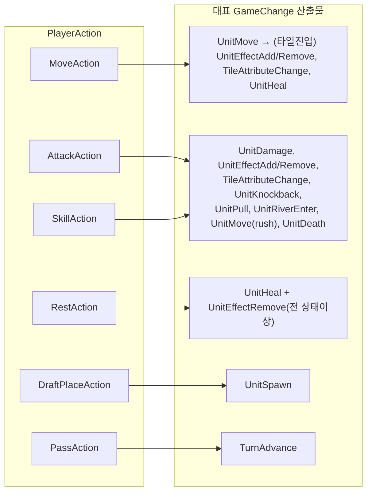

# 02 — 도메인 모델: 타입, 상태, GameChange, PlayerAction

> 선행 문서: [01-architecture.md](01-architecture.md)
> 본 문서의 모든 코드는 `AB.Core` 소속이며 UnityEngine을 참조하지 않는다.
> 룰 수치의 근거는 전부 [08-rules-reference.md](08-rules-reference.md)에 있다.

---

## 1. 기본 타입 (Domain/)

### 1-1. 좌표

```csharp
namespace AB.Core.Domain
{
    /// <summary>
    /// 그리드 좌표. Row가 세로(위→아래), Col이 가로(왼→오른).
    /// 직렬화/로그에서는 "row,col" 문자열을 쓴다.
    /// </summary>
    public readonly struct GridPos : IEquatable<GridPos>
    {
        public readonly int Row;
        public readonly int Col;

        public GridPos(int row, int col) { Row = row; Col = col; }

        /// <summary>맨해튼 거리. 사거리 판정의 기본 거리 함수.</summary>
        public int ManhattanTo(GridPos other)
            => Math.Abs(Row - other.Row) + Math.Abs(Col - other.Col);

        /// <summary>같은 행 또는 같은 열인가 (직교 직선 공격 가능 방향인가). 룰 §8.1.</summary>
        public bool IsOrthogonalTo(GridPos other)
            => Row == other.Row || Col == other.Col;

        /// <summary>
        /// other를 향하는 단위 방향 벡터 (직교일 때만 유효).
        /// 예: (2,2)→(2,5) 이면 (0,+1). 직교가 아니면 예외.
        /// </summary>
        public GridDelta DirectionTo(GridPos other);

        public GridPos Add(GridDelta d) => new GridPos(Row + d.DRow, Col + d.DCol);

        /// <summary>4방향(상하좌우) 인접 좌표. 순서: 상(-1,0), 하(+1,0), 좌(0,-1), 우(0,+1) — 고정(결정론 D-04).</summary>
        public static readonly GridDelta[] CardinalDirections = { /* 위 순서 */ };

        // Equals / GetHashCode / ==, != / ToString() => $"{Row},{Col}"
    }

    /// <summary>방향/오프셋 벡터.</summary>
    public readonly struct GridDelta
    {
        public readonly int DRow;
        public readonly int DCol;
        public GridDelta(int dRow, int dCol) { DRow = dRow; DCol = dCol; }
        /// <summary>반대 방향 (넉백 "away" 계산용).</summary>
        public GridDelta Negate() => new GridDelta(-DRow, -DCol);
    }
}
```

### 1-2. 식별자

타입 안전성을 위해 래퍼 구조체를 쓴다. 4종 모두 동일한 멤버 집합을 갖는다:
**`Value` 필드 + 생성자 + `Equals`/`GetHashCode`/`==`/`!=` (Value 위임) + `ToString`**.
`UnitId`를 기준 구현으로 삼고 나머지는 복사 후 이름만 바꾼다.

```csharp
namespace AB.Core.Domain
{
    /// <summary>
    /// 유닛 인스턴스 ID. 생성 규칙(결정론 D-03): "{playerId}_u{slotIndex}" 예: "p0_u2".
    /// </summary>
    public readonly struct UnitId : IEquatable<UnitId>
    {
        public readonly string Value;
        public UnitId(string value) { Value = value; }
        public bool Equals(UnitId other) => Value == other.Value;
        public override bool Equals(object obj) => obj is UnitId o && Equals(o);
        public override int GetHashCode() => Value?.GetHashCode() ?? 0;
        public static bool operator ==(UnitId a, UnitId b) => a.Equals(b);
        public static bool operator !=(UnitId a, UnitId b) => !a.Equals(b);
        public override string ToString() => Value;
    }

    /// <summary>플레이어 ID. "p0".."p3". (UnitId와 동일 멤버 집합)</summary>
    public readonly struct PlayerId : IEquatable<PlayerId> { public readonly string Value; /* UnitId 기준 구현 복사 */ }

    /// <summary>메타데이터 ID. 예: "t1", "wpn_ta_melee_kb", "effect_fire". (동일 멤버 집합)</summary>
    public readonly struct MetaId : IEquatable<MetaId> { public readonly string Value; /* UnitId 기준 구현 복사 */ }

    /// <summary>팀 ID. 1v1에서는 플레이어당 1팀, 2v2에서는 0/1. Value 타입만 int.</summary>
    public readonly struct TeamId : IEquatable<TeamId> { public readonly int Value; /* UnitId 기준 구현 복사 */ }
}
```

### 1-3. 열거형

```csharp
namespace AB.Core.Domain
{
    /// <summary>게임 페이즈. 룰 §2.</summary>
    public enum GamePhase { Draft, Battle, Ended }

    /// <summary>타일 타입 10종. 룰 §22. Plain이 기본값(0)이어야 한다.</summary>
    public enum TileType
    {
        Plain = 0, Road, Mountain, Sand, River,
        Fire, Water, Acid, Electric, Ice
    }

    /// <summary>공격/타일 속성. 룰 §9.1. None=무속성.</summary>
    public enum AttackAttribute { None = 0, Fire, Water, Acid, Electric, Ice, Sand }

    /// <summary>유닛 상태이상 효과 6종. 룰 §11.1.</summary>
    public enum EffectType { Fire, Acid, Electric, Freeze, Water, Sand }

    /// <summary>무기 공격 방식. 룰 §8.2.</summary>
    public enum AttackType
    {
        Melee,      // 근거리: 추가 제약 없음
        Ranged,     // 원거리: LOS 없음 (자유 조준)
        Artillery   // 곡사: 공격자-대상 사이 장애물(유닛/산) 1개 이상 필요
    }

    /// <summary>피격 범위 형태. 룰 §8.3, §8.6.</summary>
    public enum RangeType
    {
        Single,     // 단일 대상
        Penetrate,  // 1차 대상 + 같은 직선 뒤쪽 (방패가 전파 차단)
        Area        // 맨해튼 반경 radius 내 전체
    }

    /// <summary>유닛 클래스 (밸런스 분류용 — 룰 영향 없음).</summary>
    public enum UnitClass { Tanker, Fighter, Ranger, Brute }

    /// <summary>액션 종류. 룰 §6.3.</summary>
    public enum ActionKind { Move, Attack, Skill, Rest, Pass, DraftPlace }

    /// <summary>효과 제거 조건. 룰 §20 removeConditions.</summary>
    public enum EffectRemoveCondition
    {
        TurnsExpired,        // turnsRemaining이 0이 됨
        Rest,                // 휴식 액션 — 모든 상태이상 제거 (freeze 제외: 빙결 중엔 행동 불가)
        RiverEntry,          // 강 진입 (모든 효과)
        OnMove,              // 자발적 이동 시 (water, sand)
        CollisionWithFrozen  // 빙결 유닛과 충돌 (freeze 전용)
    }

    /// <summary>패시브 발동 트리거. 룰 §19.</summary>
    public enum PassiveTrigger
    {
        AlwaysOn,               // 상시 (면역류)
        OnTileEntryOf,          // 특정 속성 타일 진입 시 (파라미터: TileType)
        OnTileEntryAnyAttribute // 속성 있는 타일(Plain/Road 제외) 진입 시
    }

    /// <summary>패시브 액션 종류. 룰 §19.</summary>
    public enum PassiveActionKind
    {
        ConvertEnteredTile,     // 진입 타일을 다른 타입으로 변환 (파라미터: TileType)
        HealSelf,               // 자기 회복 (파라미터: amount)
        SpreadEnteredTileAttr,  // 진입 타일의 '원래' 속성을 4방향 전파
        ImmuneTileEffects,      // 타일 진입 효과 면제 (Step 2 스킵)
        ImmuneTileDamage,       // 턴 시작 타일 지속 피해 면제
        ImmuneElementalEffects  // 공격발 원소 효과 면제
    }

    /// <summary>게임 종료 사유. 룰 §24.</summary>
    public enum EndReason { AllUnitsDead, Surrender, RoundLimit, Disconnect }
}
```

### 1-4. 에러 코드

```csharp
namespace AB.Core.Support
{
    /// <summary>액션 거부 사유. 룰 §26. UI 메시지는 이 코드를 i18n 키로 변환해 표시한다.</summary>
    public enum RuleErrorCode
    {
        None = 0,
        // 이동
        MoveFrozen,            // 빙결 상태
        MoveAlreadyMoved,      // 이번 턴 이동 완료
        MoveOutOfRange,        // 그리드 범위 밖
        MoveBlockedUnit,       // 목적지에 유닛 / 강 타일(정지 불가)
        MoveBlockedMountain,   // 목적지/경로가 산
        MoveNoPath,            // 이동력 내 경로 없음
        // 공격
        AttackFrozen,
        AttackAlreadyAttacked,
        AttackInvalidTarget,   // 그리드 범위 밖
        AttackOutOfRange,      // 사거리 밖 / 대각선 방향
        AttackNoLos,           // artillery 장애물 없음 / rush·pull 경로 막힘
        // 스킬·휴식
        SkillAlreadyUsed,      // oneShot 스킬 재사용
        SkillUnknown,          // 보유하지 않은 스킬 ID
        RestAlreadyActed,      // 이번 턴에 이미 공격함 (휴식은 공격 대신 — 이동 후엔 가능)
        RestFrozen,            // 빙결 상태 — 행동 불가
        // 공통
        NotYourTurn,           // 현재 턴 슬롯의 유닛/플레이어가 아님
        UnitDead,
        InvalidAction,         // 페이즈 불일치 등
        // 드래프트
        DraftInvalidSpawn,     // 본인 스폰 포인트가 아님
        DraftPositionOccupied,
        DraftDuplicateMeta,    // 같은 metaId 중복 드래프트 (룰 §3.2)
        DraftSlotsFull
    }
}
```

### 1-5. 상수

```csharp
namespace AB.Core.Support
{
    /// <summary>룰 §25 상수 일람. 절대 코드에 리터럴로 풀어 쓰지 말 것 (P-01).</summary>
    public static class GameConstants
    {
        public const int MaxRounds = 30;
        public static readonly TimeSpan TurnTimeout      = TimeSpan.FromSeconds(60);
        public static readonly TimeSpan UnitOrderTimeout = TimeSpan.FromSeconds(30);
        public static readonly TimeSpan DraftTimeout     = TimeSpan.FromSeconds(180);

        public const int KnockbackCollisionDamage = 1;
        public const int RiverPushDamage          = 0;

        /// <summary>기본 플레이어 우선순위 (모두 동일 → 항상 선공 교대 적용). 룰 §5.2.</summary>
        public const int DefaultPlayerPriority = 1;
    }
}
```

> 타일 이동 비용(강 2, 모래 2 등)과 효과 지속 턴(화염 3 등)은 상수가 아니라
> **TileDef / EffectDef 메타데이터**에 들어간다 (03 문서). 위 상수는 메타데이터로
> 표현할 수 없는 시스템 수치만 모은 것이다.

---

## 2. Definition 타입 (Definitions/) — 읽기 전용 메타데이터

SO(AB.Data)가 로드 시 1회 변환해 만드는 순수 C# 객체. **생성 후 절대 변하지 않는다.**
모든 필드 값은 [08-rules-reference.md §데이터](08-rules-reference.md)에 명시.

```csharp
namespace AB.Core.Definitions
{
    /// <summary>유닛 원형. 룰 §16.</summary>
    public sealed class UnitDef
    {
        public MetaId Id { get; }                    // "t1", "f1", ...
        public string NameKey { get; }               // i18n 키
        public UnitClass Class { get; }
        public int BaseMovement { get; }             // 라운드 시작 시 복원되는 이동력
        public int BaseHealth { get; }
        public int BaseArmor { get; }                // 피해 경감치 (룰 §8.9)
        public MetaId PrimaryWeaponId { get; }
        public IReadOnlyList<MetaId> SkillIds { get; }
        public IReadOnlyList<MetaId> PassiveIds { get; }
    }

    /// <summary>무기 원형. 룰 §17. 스킬도 내부적으로 무기를 참조한다.</summary>
    public sealed class WeaponDef
    {
        public MetaId Id { get; }
        public AttackType AttackType { get; }
        public RangeType RangeType { get; }
        public int MinRange { get; }                 // 직교 거리 하한 (포함)
        public int MaxRange { get; }                 // 직교 거리 상한 (포함)
        public int Damage { get; }
        public AttackAttribute Attribute { get; }    // 기본 공격 속성

        /// <summary>Area 무기 전용: 맨해튼 반경. Single/Penetrate에서는 0.</summary>
        public int AreaRadius { get; }
        /// <summary>Area 무기 전용: 중심 타일 포함 여부.</summary>
        public bool AreaIncludesCenter { get; }

        /// <summary>null이면 넉백 없음. 룰 §10.1.</summary>
        public KnockbackSpec Knockback { get; }
        /// <summary>null이면 풀 없음. 룰 §10.2.</summary>
        public PullSpec Pull { get; }
        /// <summary>null이면 돌진 없음. 룰 §8.4.</summary>
        public RushSpec Rush { get; }

        /// <summary>r1 전용: 인접 타일 속성 흡수 가능 여부. 룰 §8.7.</summary>
        public bool AdjacentTileAbsorb { get; }
    }

    /// <summary>넉백 사양.</summary>
    public sealed class KnockbackSpec
    {
        public int Distance { get; }                       // 밀어내는 칸 수
        public KnockbackDirection Direction { get; }       // Away | Fixed
        public GridDelta FixedDelta { get; }               // Fixed일 때만 사용
    }
    public enum KnockbackDirection { Away, Fixed }

    /// <summary>풀 사양. 현재 무기는 모두 landAdjacent=true.</summary>
    public sealed class PullSpec
    {
        public bool LandAdjacent { get; }            // 공격자 바로 인접 칸으로 끌어옴
        public bool RequiresClearPath { get; }       // 경로에 장애물 있으면 사용 불가
    }

    /// <summary>돌진 사양.</summary>
    public sealed class RushSpec
    {
        public bool RequiresClearPath { get; }       // 공격자→대상 사이 전 칸 비어 있어야 함
    }

    /// <summary>스킬 원형. 룰 §18.</summary>
    public sealed class SkillDef
    {
        public MetaId Id { get; }
        public string NameKey { get; }
        public bool IsActive { get; }                // false면 보유만으로 발동(방패 등)
        public bool OneShot { get; }                 // 게임당 1회 (룰 §6.4)
        /// <summary>액티브 스킬이 사용하는 무기. 패시브형이면 default.</summary>
        public MetaId WeaponId { get; }
        /// <summary>방패: 관통 전파 차단 + 자기 타일 흡수. skill_shield_defend 전용 플래그.</summary>
        public bool BlocksPenetration { get; }
        public bool AbsorbsOwnTile { get; }
    }

    /// <summary>패시브 원형. 룰 §19.</summary>
    public sealed class PassiveDef
    {
        public MetaId Id { get; }
        public PassiveTrigger Trigger { get; }
        /// <summary>Trigger==OnTileEntryOf일 때 대상 타일 타입.</summary>
        public TileType TriggerTile { get; }
        /// <summary>실행 순서대로 정렬된 액션 목록 (룰 §13 Step 1의 1→2→3 순서 보장).</summary>
        public IReadOnlyList<PassiveAction> Actions { get; }
    }

    public sealed class PassiveAction
    {
        public PassiveActionKind Kind { get; }
        public TileType ConvertTo { get; }           // ConvertEnteredTile 전용
        public int HealAmount { get; }               // HealSelf 전용
    }

    /// <summary>효과 원형. 룰 §20.</summary>
    public sealed class EffectDef
    {
        public MetaId Id { get; }                    // "effect_fire" 등
        public EffectType Type { get; }
        public int DamagePerTurn { get; }
        /// <summary>0이면 영구 (water/sand). 양수면 해당 턴 수 후 자동 제거.</summary>
        public int DurationTurns { get; }
        public bool BlocksAllActions { get; }        // freeze=true
        /// <summary>부여 시 유닛이 선 타일도 같은 속성으로 변환 (acid=true). 룰 §11.2.</summary>
        public bool AlsoAffectsTile { get; }
        /// <summary>부여 직전에 기존 효과 전부 제거 (freeze=true). 룰 §11.3.</summary>
        public bool ClearsAllEffectsOnApply { get; }
        /// <summary>피격 데미지 배율 (acid=2.0, 그 외 1.0). 룰 §8.9.</summary>
        public float IncomingDamageMultiplier { get; }
        public IReadOnlyList<EffectRemoveCondition> RemoveConditions { get; }
    }

    /// <summary>타일 원형. 룰 §22.</summary>
    public sealed class TileDef
    {
        public TileType Type { get; }
        public int MoveCost { get; }                 // 진입 비용 (Impassable이면 무시)
        public bool Impassable { get; }              // mountain=true
        public bool CannotStop { get; }              // river=true (통과만 가능)
        public int DamagePerTurn { get; }            // 턴 시작 시 위에 선 유닛에게
        /// <summary>진입 시 부여할 효과. default면 없음.</summary>
        public MetaId AppliesEffectId { get; }
        /// <summary>진입 시 제거할 효과 타입들 (water → fire, acid).</summary>
        public IReadOnlyList<EffectType> RemovesEffectTypes { get; }
        /// <summary>진입 시 모든 효과 제거 (ice=true). 룰 §13 Step 2-1.</summary>
        public bool ClearsAllEffects { get; }
        /// <summary>이 타일 타입에 대응하는 공격 속성 (fire 타일 ↔ Fire). 흡수 메카닉용. None이면 무속성 타일.</summary>
        public AttackAttribute Attribute { get; }
    }

    /// <summary>맵 원형. 룰 §23.</summary>
    public sealed class MapDef
    {
        public MetaId Id { get; }
        public string NameKey { get; }
        public int GridRows { get; }
        public int GridCols { get; }
        public int PlayerCount { get; }              // 2 또는 4
        public int TeamSize { get; }                 // 1(1v1) 또는 2(2v2)
        public int MaxUnitsPerPlayer { get; }
        /// <summary>플레이어 인덱스 → 스폰 포인트 목록.</summary>
        public IReadOnlyList<IReadOnlyList<GridPos>> SpawnPoints { get; }
        /// <summary>고정 지형. 비어 있으면 랜덤 지형 생성 (룰 §23 생성 규칙).</summary>
        public IReadOnlyDictionary<GridPos, TileType> TileOverrides { get; }
    }
}
```

### IDataRegistry — 메타데이터 조회 창구

```csharp
namespace AB.Core.Definitions
{
    /// <summary>
    /// 모든 Definition의 읽기 전용 저장소. AB.Data의 DataRegistryBuilder가 생성.
    /// 존재하지 않는 ID 조회는 즉시 예외 (조용한 null 금지 — 데이터 오류는 빨리 터뜨린다).
    /// </summary>
    public interface IDataRegistry
    {
        UnitDef GetUnit(MetaId id);
        WeaponDef GetWeapon(MetaId id);
        SkillDef GetSkill(MetaId id);
        PassiveDef GetPassive(MetaId id);
        EffectDef GetEffect(MetaId id);
        /// <summary>EffectType → EffectDef 역조회 (타일이 부여하는 효과 찾기 등).</summary>
        EffectDef GetEffectByType(EffectType type);
        TileDef GetTile(TileType type);
        MapDef GetMap(MetaId id);
        IReadOnlyList<UnitDef> AllUnits { get; }
        IReadOnlyList<MapDef> AllMaps { get; }
    }
}
```

---

## 3. 게임 상태 (State/)

### 3-1. 변경 규약

- 상태 클래스의 setter는 전부 `internal`이며 **`StateApplicator`만 호출**한다
  (같은 어셈블리 내 규약 — 코드 리뷰로 강제, 필요 시 `#if AB_STRICT`로 컴파일 검사 추가).
- 코어 밖(Presentation, AI)에는 `IReadOnlyGameState`만 노출한다.
- AI 시뮬레이션은 `GameState.Clone()`(깊은 복사) 위에서만 한다.

### 3-2. 정의

```csharp
namespace AB.Core.State
{
    /// <summary>턴 순서의 한 칸. 룰 §5.</summary>
    public sealed class TurnSlot
    {
        public PlayerId PlayerId { get; }
        public UnitId UnitId { get; }
    }

    /// <summary>턴당 액션 사용 기록. 라운드 시작 시 리셋. 룰 §4.2, §6.4.</summary>
    public sealed class ActionsUsed
    {
        public bool Moved { get; internal set; }
        public bool Attacked { get; internal set; }
        public bool SkillUsed { get; internal set; }      // oneShot 스킬은 게임 전체 1회 → 별도 보존 (아래 UsedOneShotSkills)
        internal void ResetForRound() { Moved = Attacked = SkillUsed = false; }
        // 휴식(Rest)은 별도 플래그가 필요 없다 — 즉시 턴을 끝내며, 사용 조건이 "이번 턴 미공격"(이동 무관)이므로.
        // 주의: SkillUsed(턴 단위)와 달리 oneShot 사용 기록은 UnitState.UsedOneShotSkills에 영구 저장
    }

    /// <summary>유닛에 붙어 있는 효과 인스턴스.</summary>
    public sealed class EffectInstance
    {
        public MetaId EffectId { get; }
        public EffectType Type { get; }
        /// <summary>null이면 영구. 턴 시작 tick마다 1 감소, 0이 되면 제거. 룰 §11.5.</summary>
        public int? TurnsRemaining { get; internal set; }
    }

    public sealed class UnitState
    {
        public UnitId Id { get; }
        public MetaId MetaId { get; }                 // UnitDef 참조 키
        public PlayerId OwnerId { get; }
        public GridPos Position { get; internal set; }
        public int CurrentHealth { get; internal set; }
        public int CurrentArmor { get; internal set; }
        public int MovementPoints { get; internal set; }
        public bool Alive { get; internal set; }
        public ActionsUsed ActionsUsed { get; }
        /// <summary>적용 순서 보존 (빙결의 전체 제거 등에서 순서 결정성 필요).</summary>
        public IReadOnlyList<EffectInstance> Effects { get; }   // 내부는 List
        /// <summary>게임 전체에서 이미 사용한 oneShot 스킬 ID.</summary>
        public IReadOnlyCollection<MetaId> UsedOneShotSkills { get; } // 내부는 HashSet

        public bool HasEffect(EffectType type);
        public EffectInstance FindEffect(EffectType type);      // 없으면 null
        /// <summary>빙결 등 모든 행동 차단 효과 보유 여부. Validator들이 사용.</summary>
        public bool IsActionBlocked(IDataRegistry registry);
    }

    public sealed class PlayerState
    {
        public PlayerId Id { get; }
        public TeamId Team { get; }
        public int Priority { get; }                  // 기본 1. 룰 §5.2
        public bool Surrendered { get; internal set; }
        /// <summary>이 플레이어 소유 유닛 ID — 생성(슬롯) 순서 고정 (결정론 D-04).</summary>
        public IReadOnlyList<UnitId> UnitIds { get; }
    }

    public sealed class MapState
    {
        public int Rows { get; }
        public int Cols { get; }
        /// <summary>기본(Plain)이 아닌 타일만 저장. 키에 없으면 Plain.</summary>
        public IReadOnlyDictionary<GridPos, TileType> Tiles { get; }  // 내부는 Dictionary

        public bool InBounds(GridPos p);
        public TileType TileAt(GridPos p);            // 범위 밖이면 예외
    }

    public sealed class GameState
    {
        public MetaId MapId { get; }
        public int Round { get; internal set; }                   // 1부터
        public GamePhase Phase { get; internal set; }
        public int CurrentTurnIndex { get; internal set; }        // TurnOrder 인덱스
        public IReadOnlyList<TurnSlot> TurnOrder { get; internal set; }
        public IReadOnlyList<PlayerState> Players { get; }        // 인덱스 = 플레이어 인덱스
        /// <summary>전체 유닛 — 생성 순서 고정 리스트 (Dictionary 순회 금지, D-04).</summary>
        public IReadOnlyList<UnitState> Units { get; }
        public MapState Map { get; }
        /// <summary>마지막 라운드의 선공 플레이어/팀 (교대 규칙용). 룰 §5.2.</summary>
        public PlayerId? LastFirstMover { get; internal set; }
        public GameResult Result { get; internal set; }           // null이면 진행 중

        // ── 조회 헬퍼 (전부 읽기 전용) ──
        public UnitState GetUnit(UnitId id);                      // 없으면 예외
        public UnitState UnitAt(GridPos p);                       // 생존 유닛만, 없으면 null
        public IEnumerable<UnitState> AliveUnitsOf(PlayerId p);
        public IEnumerable<UnitState> AliveUnitsOfTeam(TeamId t);
        public TurnSlot CurrentSlot { get; }

        /// <summary>AI 시뮬레이션용 깊은 복사. 시그널/로거는 복사되지 않는다.</summary>
        public GameState Clone();
    }

    /// <summary>게임 결과. 룰 §24.</summary>
    public sealed class GameResult
    {
        /// <summary>승리 플레이어들 (팀전이면 팀원 전부). 무승부면 빈 리스트.</summary>
        public IReadOnlyList<PlayerId> Winners { get; }
        public EndReason Reason { get; }
        public bool IsDraw => Winners.Count == 0;
    }
}
```

### 3-3. IReadOnlyGameState — 코어 밖 노출용 읽기 뷰

`GameState`가 이 인터페이스를 구현한다. Presentation/AI/에이전트는 이 타입으로만 상태를 받는다.
(내부 setter가 `internal`이므로 다른 어셈블리에서는 어차피 변경 불가 — 인터페이스는 의도를
명시하고 테스트 목 주입을 가능하게 하는 역할.)

```csharp
namespace AB.Core.State
{
    public interface IReadOnlyGameState
    {
        MetaId MapId { get; }
        int Round { get; }
        GamePhase Phase { get; }
        int CurrentTurnIndex { get; }
        IReadOnlyList<TurnSlot> TurnOrder { get; }
        IReadOnlyList<PlayerState> Players { get; }
        IReadOnlyList<UnitState> Units { get; }
        MapState Map { get; }
        PlayerId? LastFirstMover { get; }
        GameResult Result { get; }

        UnitState GetUnit(UnitId id);
        UnitState UnitAt(GridPos p);
        IEnumerable<UnitState> AliveUnitsOf(PlayerId p);
        IEnumerable<UnitState> AliveUnitsOfTeam(TeamId t);
        TurnSlot CurrentSlot { get; }
        GameState Clone();   // AI 시뮬레이션용 — 복제본은 자유 변경 가능
    }
}
```

> `PlayerState`/`UnitState`/`MapState`는 setter가 `internal`이라 외부에서 이미 읽기 전용이므로
> 별도 ReadOnly 인터페이스를 만들지 않는다 (타입 수 최소화).

---

## 4. GameChange (Changes/) — 원자적 상태 변화 18종

> 기존 TS의 `game-change.ts` discriminated union을 C# 클래스 계층으로 재설계.
> **모든 룰 효과는 반드시 GameChange로 표현되어야 한다.** Resolver는 GameChange를
> 만들 뿐 상태를 건드리지 않고, StateApplicator가 적용하며, PresentationQueue가 같은
> 객체로 연출을 재생한다. (한 객체 = 상태 변경 + 연출 + 로그의 공통 단위)

### 4-1. 공통 베이스와 분류

```csharp
namespace AB.Core.Changes
{
    /// <summary>switch 분기용 태그. 클래스 타입 검사 대신 이 enum으로 분기한다.</summary>
    public enum ChangeKind
    {
        UnitMove, UnitDamage, UnitHeal, UnitEffectAdd, UnitEffectRemove,
        UnitDeath, UnitKnockback, UnitRiverEnter, UnitRiverExit, UnitPull,
        UnitActionsReset, UnitMovementRestore, UnitSpawn,
        TileAttributeChange, TileEffectTick,
        TurnAdvance, RoundAdvance, PhaseChange
    }

    public abstract class GameChange
    {
        public abstract ChangeKind Kind { get; }
    }

    /// <summary>피해 출처 — 로그/연출/킬 크레딧용.</summary>
    public abstract class DamageSource
    {
        public sealed class Attack : DamageSource   // 공격 피해
        {
            public UnitId AttackerId { get; }
            public MetaId WeaponId { get; }
        }
        public sealed class Effect : DamageSource   // 상태이상 tick
        {
            public MetaId EffectId { get; }
        }
        public sealed class Tile : DamageSource     // 타일 지속 피해
        {
            public TileType TileType { get; }
        }
        public sealed class Collision : DamageSource { }  // 넉백 충돌 (피해 1)
        public sealed class RiverPush : DamageSource { }  // 강 밀림 (피해 0)
    }
}
```

### 4-2. 변화 타입 전체 정의

```csharp
namespace AB.Core.Changes
{
    /// <summary>자발적 이동 또는 돌진 이동. 룰 §7, §8.4.</summary>
    public sealed class UnitMoveChange : GameChange
    {
        public UnitId UnitId { get; }
        public GridPos From { get; }
        public GridPos To { get; }
        /// <summary>연출용 전체 경로 (From..To, 다익스트라 결과). 적용 로직은 To만 사용.</summary>
        public IReadOnlyList<GridPos> Path { get; }
        /// <summary>true면 돌진 이동 — ActionsUsed.Moved를 세우지 않는다. 룰 §8.4.</summary>
        public bool IsRushMovement { get; }
    }

    public sealed class UnitDamageChange : GameChange
    {
        public UnitId UnitId { get; }
        public int Amount { get; }                  // 0 이상 (반응 배율 0이면 0)
        public DamageSource Source { get; }
        public int HpAfter { get; }                 // 적용 후 HP (연출/검증용 스냅샷)
    }

    public sealed class UnitHealChange : GameChange
    {
        public UnitId UnitId { get; }
        public int Amount { get; }                  // 최대 HP 클램프 후 실제 회복량
        public int HpAfter { get; }
    }

    public sealed class UnitEffectAddChange : GameChange
    {
        public UnitId UnitId { get; }
        public MetaId EffectId { get; }
        public EffectType EffectType { get; }
        public int? TurnsRemaining { get; }         // null = 영구
    }

    public sealed class UnitEffectRemoveChange : GameChange
    {
        public UnitId UnitId { get; }
        public MetaId EffectId { get; }
        public EffectType EffectType { get; }
        public EffectRemoveCondition Reason { get; }
    }

    public sealed class UnitDeathChange : GameChange
    {
        public UnitId UnitId { get; }
        public GridPos Position { get; }
        public DamageSource KilledBy { get; }
    }

    /// <summary>넉백 1스텝의 결과. 룰 §10.1. 막혔으면 From==To.</summary>
    public sealed class UnitKnockbackChange : GameChange
    {
        public UnitId UnitId { get; }
        public GridPos From { get; }
        public GridPos To { get; }
        /// <summary>충돌로 막힌 경우: 막은 유닛 ID. 벽이면 BlockedByWall=true.</summary>
        public UnitId? BlockedByUnit { get; }
        public bool BlockedByWall { get; }
    }

    /// <summary>넉백/풀로 강에 들어감 — 모든 효과 초기화. 룰 §10.3.</summary>
    public sealed class UnitRiverEnterChange : GameChange
    {
        public UnitId UnitId { get; }
        public GridPos Position { get; }
        public IReadOnlyList<MetaId> ClearedEffectIds { get; }
    }

    /// <summary>강에서 벗어남 (이동으로 통과 후 정착 시에는 발생하지 않음 — 넉백 연출 보조용).</summary>
    public sealed class UnitRiverExitChange : GameChange
    {
        public UnitId UnitId { get; }
        public GridPos Position { get; }
    }

    /// <summary>풀로 끌려옴. 룰 §10.2.</summary>
    public sealed class UnitPullChange : GameChange
    {
        public UnitId UnitId { get; }
        public GridPos From { get; }
        public GridPos To { get; }
    }

    /// <summary>라운드 시작 시 액션 플래그 리셋. 룰 §4.2.</summary>
    public sealed class UnitActionsResetChange : GameChange
    {
        public UnitId UnitId { get; }
    }

    /// <summary>라운드 시작 시 이동력 복원. 룰 §4.2.</summary>
    public sealed class UnitMovementRestoreChange : GameChange
    {
        public UnitId UnitId { get; }
        public int MovementPoints { get; }          // BaseMovement 값
    }

    /// <summary>드래프트 배치로 유닛 생성. 룰 §3.</summary>
    public sealed class UnitSpawnChange : GameChange
    {
        public UnitId UnitId { get; }
        public MetaId MetaId { get; }
        public PlayerId PlayerId { get; }
        public GridPos Position { get; }
        public int CurrentHealth { get; }
        public int CurrentArmor { get; }
        public int MovementPoints { get; }
    }

    /// <summary>타일 속성 변환. 룰 §9.2, §12.2.</summary>
    public sealed class TileAttributeChange : GameChange
    {
        public GridPos Position { get; }
        public TileType From { get; }
        public TileType To { get; }
        /// <summary>공격에 의한 변환이면 출처 (연출용). null 가능.</summary>
        public UnitId? CausedByAttacker { get; }
    }

    /// <summary>(예약) 시한부 타일의 턴 감소. 현 룰은 영구 변환이므로 미발행. 확장 슬롯.</summary>
    public sealed class TileEffectTickChange : GameChange
    {
        public GridPos Position { get; }
        public int? TurnsRemaining { get; }
    }

    public sealed class TurnAdvanceChange : GameChange
    {
        public PlayerId FromPlayer { get; }  public int FromIndex { get; }
        public PlayerId ToPlayer { get; }    public int ToIndex { get; }
    }

    public sealed class RoundAdvanceChange : GameChange
    {
        public int FromRound { get; }
        public int ToRound { get; }
    }

    public sealed class PhaseChange : GameChange
    {
        public GamePhase From { get; }
        public GamePhase To { get; }
    }
}
```

### 4-3. ChangeBatch — 액션 1건의 결과 묶음

```csharp
namespace AB.Core.Changes
{
    /// <summary>
    /// 한 번의 액션(또는 시스템 처리: 턴 시작 tick, 라운드 시작 등)이 만든
    /// GameChange의 순서 있는 묶음. 연출은 이 순서를 그대로 재생해야 룰 §13~§15의
    /// 처리 순서가 화면에도 동일하게 보인다.
    /// </summary>
    public sealed class ChangeBatch
    {
        /// <summary>게임 내 단조 증가 시퀀스 번호 (리플레이 비교 키, D-05).</summary>
        public long Sequence { get; }
        /// <summary>이 배치의 원인. 액션이면 해당 액션, 시스템 처리면 SystemCause.</summary>
        public BatchCause Cause { get; }
        public IReadOnlyList<GameChange> Changes { get; }
    }

    public abstract class BatchCause
    {
        public sealed class FromAction : BatchCause { public PlayerAction Action { get; } }
        public sealed class System : BatchCause { public SystemCauseKind Kind { get; } }
    }

    public enum SystemCauseKind { TurnStartTick, RoundStart, RoundEnd, DraftFinalize, GameEnd }
}
```

---

## 5. PlayerAction (Actions/) — 플레이어 입력 6종

```csharp
namespace AB.Core.Actions
{
    /// <summary>플레이어(에이전트)가 제출하는 액션. 룰 §6.3.</summary>
    public abstract class PlayerAction
    {
        public PlayerId PlayerId { get; }
        public abstract ActionKind Kind { get; }
    }

    /// <summary>유닛 이동. 룰 §7.</summary>
    public sealed class MoveAction : PlayerAction
    {
        public UnitId UnitId { get; }
        public GridPos Destination { get; }
    }

    /// <summary>기본 무기 공격. 룰 §8.</summary>
    public sealed class AttackAction : PlayerAction
    {
        public UnitId UnitId { get; }
        public GridPos Target { get; }
        /// <summary>
        /// r1 인접 타일 흡수용(룰 §8.7): 흡수할 인접 타일 좌표. null이면 무속성 공격.
        /// 무기에 AdjacentTileAbsorb가 없으면 무시된다.
        /// </summary>
        public GridPos? SourceTile { get; }
    }

    /// <summary>액티브 스킬 사용. 룰 §18. 공격 액션으로 취급(Attacked=true, 턴 종료).</summary>
    public sealed class SkillAction : PlayerAction
    {
        public UnitId UnitId { get; }
        public MetaId SkillId { get; }
        public GridPos Target { get; }
    }

    /// <summary>
    /// 휴식 — 체력 1 회복 + 자신의 모든 상태이상 제거. 공격을 대신하며 즉시 턴 종료(이동 후엔 가능).
    /// 이번 턴에 공격하지 않았고(`Attacked==false`) 빙결이 아닐 때만 가능. 룰 §6.4.
    /// </summary>
    public sealed class RestAction : PlayerAction
    {
        public UnitId UnitId { get; }
    }

    /// <summary>턴 즉시 종료.</summary>
    public sealed class PassAction : PlayerAction { }

    /// <summary>드래프트 배치 (드래프트 페이즈 전용). 룰 §3.</summary>
    public sealed class DraftPlaceAction : PlayerAction
    {
        public MetaId UnitMetaId { get; }
        public GridPos Position { get; }
    }
}
```

### 액션 ↔ 결과 관계 그래프



---

## 6. 검증/요청 보조 타입

```csharp
namespace AB.Core.Validators
{
    /// <summary>판정 결과. Ok면 ErrorCode==None.</summary>
    public readonly struct ValidationResult
    {
        public bool IsValid { get; }
        public RuleErrorCode ErrorCode { get; }
        public static ValidationResult Ok();
        public static ValidationResult Fail(RuleErrorCode code);
    }

    /// <summary>이동 판정 결과 (경로 포함).</summary>
    public sealed class MoveValidation
    {
        public bool IsValid { get; }
        public RuleErrorCode ErrorCode { get; }
        /// <summary>유효 시: 출발 포함 전체 경로와 총 비용.</summary>
        public IReadOnlyList<GridPos> Path { get; }
        public int Cost { get; }
    }

    /// <summary>공격 판정 결과.</summary>
    public sealed class AttackValidation
    {
        public bool IsValid { get; }
        public RuleErrorCode ErrorCode { get; }
        /// <summary>피격 좌표 목록 — [0]이 1차 대상(isPrimary). 룰 §8.3.</summary>
        public IReadOnlyList<GridPos> AffectedPositions { get; }
    }
}
```
