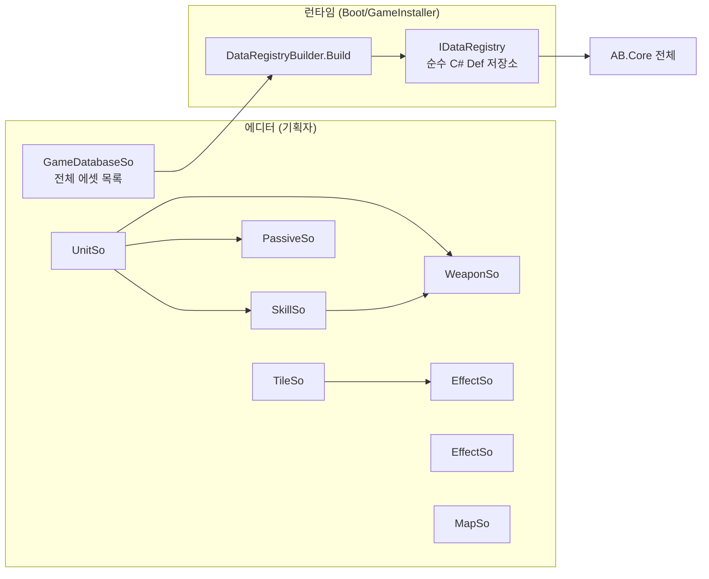

# 03 — 메타데이터 시스템: ScriptableObject → DataRegistry

> 선행 문서: [02-domain-model.md](02-domain-model.md)
> 소속 어셈블리: `AB.Data` (UnityEngine 사용 가능, AB.Core만 참조)
> **모든 에셋의 구체 수치는 [08-rules-reference.md](08-rules-reference.md) §16~§23에 정의되어 있다.**

---

## 1. 설계 원칙

1. **SO는 편집용, Def는 실행용.** 코어는 ScriptableObject를 모른다. 게임 시작 시
   `DataRegistryBuilder`가 SO 전체를 순수 C# `*Def`로 1회 변환한다.
2. **참조는 에셋 직접 참조.** SO끼리는 문자열 ID가 아니라 SO 필드 참조로 연결한다
   (에디터에서 깨진 참조 즉시 발견). 변환 시점에 `MetaId`로 평탄화된다.
3. **검증은 3중**: `OnValidate`(편집 중) → `GameDatabaseSo.ValidateAll`(Boot 씬) →
   에디터 테스트(09 문서). 잘못된 데이터는 게임 시작 전에 터뜨린다.



---

## 2. ScriptableObject 정의

> 직렬화 필드는 02 문서의 Def와 1:1 대응한다. 필드 의미 주석은 Def 쪽에 이미 있으므로
> 여기서는 에디터 관점 주석(검증 규칙)만 단다.

```csharp
namespace AB.Data.So
{
    /// <summary>모든 게임데이터 SO의 공통 베이스. metaId가 에셋의 전역 키.</summary>
    public abstract class GameDataSo : ScriptableObject
    {
        [Tooltip("전역 고유 ID. 예: t1, wpn_ta_melee_kb. 소문자+숫자+밑줄만.")]
        [SerializeField] private string metaId;
        public string MetaId => metaId;

        protected virtual void OnValidate()
        {
            // metaId 비어 있음 / 형식 위반 시 에러 로그
        }
    }

    [CreateAssetMenu(menuName = "AB/Unit")]
    public sealed class UnitSo : GameDataSo
    {
        [SerializeField] private string nameKey;
        [SerializeField] private UnitClass unitClass;
        [SerializeField, Min(1)] private int baseMovement;
        [SerializeField, Min(1)] private int baseHealth;
        [SerializeField, Min(0)] private int baseArmor;
        [SerializeField] private WeaponSo primaryWeapon;      // 필수
        [SerializeField] private SkillSo[] skills;             // 빈 배열 가능
        [SerializeField] private PassiveSo[] passives;
        [Header("연출")]
        [SerializeField] private Sprite portrait;              // Def로 변환되지 않음 (View 전용)
        [SerializeField] private GameObject viewPrefab;        // 3D 모델 프리팹 (확정) — Animator 필수: Idle/Move/Attack/Hit/Death (07 문서 UnitView)

        public UnitDef ToDef();   // 변환. viewPrefab/portrait는 제외
        public Sprite Portrait => portrait;
        public GameObject ViewPrefab => viewPrefab;
        // OnValidate: primaryWeapon null 금지, baseHealth>=1
    }

    [CreateAssetMenu(menuName = "AB/Weapon")]
    public sealed class WeaponSo : GameDataSo
    {
        [SerializeField] private AttackType attackType;
        [SerializeField] private RangeType rangeType;
        [SerializeField, Min(1)] private int minRange;
        [SerializeField, Min(1)] private int maxRange;
        [SerializeField, Min(0)] private int damage;
        [SerializeField] private AttackAttribute attribute;

        [Header("Area 전용")]
        [SerializeField, Min(0)] private int areaRadius;
        [SerializeField] private bool areaIncludesCenter = true;

        [Header("특수 메카닉 (사용 시 enable)")]
        [SerializeField] private bool hasKnockback;
        [SerializeField] private KnockbackField knockback;     // distance, direction, fixedDelta
        [SerializeField] private bool hasPull;
        [SerializeField] private PullField pull;               // landAdjacent, requiresClearPath
        [SerializeField] private bool hasRush;
        [SerializeField] private RushField rush;               // requiresClearPath
        [SerializeField] private bool adjacentTileAbsorb;

        public WeaponDef ToDef();
        // OnValidate: minRange<=maxRange, RangeType.Area면 areaRadius>=1,
        //             hasPull이면 damage==0 권장 경고(현 룰의 풀 무기는 데미지 0)
    }

    [CreateAssetMenu(menuName = "AB/Skill")]
    public sealed class SkillSo : GameDataSo
    {
        [SerializeField] private string nameKey;
        [SerializeField] private bool isActive;       // false = 보유형(방패)
        [SerializeField] private bool oneShot;
        [SerializeField] private WeaponSo weapon;     // isActive일 때 필수
        [Header("방패형 플래그")]
        [SerializeField] private bool blocksPenetration;
        [SerializeField] private bool absorbsOwnTile;
        public SkillDef ToDef();
        // OnValidate: isActive && weapon==null → 에러
    }

    [CreateAssetMenu(menuName = "AB/Passive")]
    public sealed class PassiveSo : GameDataSo
    {
        [SerializeField] private PassiveTrigger trigger;
        [SerializeField] private TileType triggerTile;        // OnTileEntryOf 전용
        [SerializeField] private PassiveActionField[] actions; // 순서 = 실행 순서 (룰 §13 Step 1)
        public PassiveDef ToDef();
    }

    [Serializable]
    public sealed class PassiveActionField
    {
        public PassiveActionKind kind;
        public TileType convertTo;    // ConvertEnteredTile 전용
        [Min(0)] public int healAmount; // HealSelf 전용
    }

    [CreateAssetMenu(menuName = "AB/Effect")]
    public sealed class EffectSo : GameDataSo
    {
        [SerializeField] private EffectType effectType;
        [SerializeField, Min(0)] private int damagePerTurn;
        [SerializeField, Min(0)] private int durationTurns;   // 0 = 영구
        [SerializeField] private bool blocksAllActions;
        [SerializeField] private bool alsoAffectsTile;
        [SerializeField] private bool clearsAllEffectsOnApply;
        [SerializeField, Min(1f)] private float incomingDamageMultiplier = 1f;
        [SerializeField] private EffectRemoveCondition[] removeConditions;
        [Header("연출")]
        [SerializeField] private Sprite icon;
        public EffectDef ToDef();
    }

    [CreateAssetMenu(menuName = "AB/Tile")]
    public sealed class TileSo : GameDataSo
    {
        [SerializeField] private TileType tileType;
        [SerializeField, Min(1)] private int moveCost = 1;
        [SerializeField] private bool impassable;
        [SerializeField] private bool cannotStop;
        [SerializeField, Min(0)] private int damagePerTurn;
        [SerializeField] private EffectSo appliesEffect;      // null 가능
        [SerializeField] private EffectType[] removesEffectTypes;
        [SerializeField] private bool clearsAllEffects;
        [SerializeField] private AttackAttribute attribute;   // fire 타일 ↔ Fire 등 (흡수용)
        [Header("연출")]
        [SerializeField] private GameObject tileVisual;       // 3D 타일 프리팹 (13 문서 — 3D 전환)
        public TileDef ToDef();
        // OnValidate: tileType 중복 에셋 금지 (TileType당 정확히 1개)
    }

    [CreateAssetMenu(menuName = "AB/Map")]
    public sealed class MapSo : GameDataSo
    {
        [SerializeField] private string nameKey;
        [SerializeField, Min(4)] private int gridRows = 16;
        [SerializeField, Min(4)] private int gridCols = 16;
        [SerializeField] private int playerCount = 2;          // 2 | 4
        [SerializeField] private int teamSize = 1;             // 1 | 2
        [SerializeField, Min(1)] private int maxUnitsPerPlayer = 6;
        [SerializeField] private SpawnPointsField[] spawnPoints;   // 플레이어 인덱스별
        [SerializeField] private TileOverrideField[] tileOverrides; // 비어 있으면 랜덤 지형
        public MapDef ToDef();
        // OnValidate: spawnPoints.Length==playerCount,
        //             각 spawnPoints[i].positions.Length>=maxUnitsPerPlayer,
        //             스폰 좌표 격자 범위 내·중복 없음
    }

    [Serializable] public sealed class SpawnPointsField { public Vector2Int[] positions; }
    [Serializable] public sealed class TileOverrideField { public Vector2Int position; public TileType type; }
}
```

---

## 3. GameDatabaseSo — 에셋 루트

```csharp
namespace AB.Data
{
    /// <summary>
    /// 프로젝트의 모든 게임데이터 에셋을 모은 단일 루트.
    /// Boot 씬이 이 에셋 하나만 로드하면 전체 데이터에 도달한다.
    /// </summary>
    [CreateAssetMenu(menuName = "AB/GameDatabase")]
    public sealed class GameDatabaseSo : ScriptableObject
    {
        [SerializeField] private UnitSo[] units;
        [SerializeField] private WeaponSo[] weapons;
        [SerializeField] private SkillSo[] skills;
        [SerializeField] private PassiveSo[] passives;
        [SerializeField] private EffectSo[] effects;     // 6종 전부
        [SerializeField] private TileSo[] tiles;         // TileType 10종 전부
        [SerializeField] private MapSo[] maps;

        public IReadOnlyList<UnitSo> Units => units;
        // ... 나머지 동일

        /// <summary>
        /// Boot 시 호출. 실패 항목을 전부 모아 한 번에 보고한다.
        /// 검증 내용:
        ///  - metaId 전역 중복 없음
        ///  - 모든 TileType/EffectType에 에셋 1개씩 존재
        ///  - Unit→Weapon/Skill/Passive 참조 null 없음
        ///  - Skill(isActive)→Weapon null 없음
        /// </summary>
        public IReadOnlyList<string> ValidateAll();
    }

    /// <summary>SO 묶음을 코어용 IDataRegistry로 변환하는 빌더.</summary>
    public static class DataRegistryBuilder
    {
        /// <exception cref="DataValidationException">ValidateAll 실패 시</exception>
        public static IDataRegistry Build(GameDatabaseSo database);
    }
}
```

`DataRegistryBuilder.Build`의 구현은 단순하다:
1. `ValidateAll()` 실행, 에러 있으면 예외.
2. 각 SO에 대해 `ToDef()` 호출, `Dictionary<MetaId, ...Def>` 구성.
3. `DataRegistry`(코어 인터페이스의 사전 기반 구현체, `AB.Data` 소속) 반환.

---

## 4. View 연결 데이터 (코어 비관통)

스프라이트/프리팹/사운드는 Def로 변환되지 않는다. Presentation이 `MetaId → 에셋` 조회가
필요하므로 별도 카탈로그를 둔다:

```csharp
namespace AB.Data
{
    /// <summary>Presentation 전용: MetaId/TileType → 시각 에셋 조회.</summary>
    public interface IViewCatalog
    {
        GameObject UnitPrefab(MetaId unitMetaId);
        Sprite UnitPortrait(MetaId unitMetaId);
        Sprite EffectIcon(MetaId effectId);
        GameObject TileVisual(TileType type);   // 3D 타일 프리팹 (13 문서 — 3D 전환)
    }
    // GameDatabaseSo 기반 구현체 ViewCatalog를 AB.Data에 둔다.
}
```

---

## 5. 필요한 에셋 목록 (초기 데이터)

> 각 에셋에 들어갈 정확한 수치는 `packages/metadata/data/*.json`을 단일 소스로 사용한다.
> 파일명 = metaId.

```
Assets/GameData/
├── Units/    packages/metadata/data/units.json
├── Weapons/  packages/metadata/data/weapons.json
├── Skills/   packages/metadata/data/skills.json
├── Passives/ packages/metadata/data/unit-passives.json
├── Effects/  effect_fire, effect_acid, effect_electric,
│             effect_freeze, effect_water, effect_sand    (6개)
├── Tiles/    tile_plain, tile_road, tile_mountain, tile_sand, tile_river,
│             tile_fire, tile_water, tile_acid, tile_electric, tile_ice (10개)
├── Maps/     map_1v1_6v6, map_2v2_6v6                    (2개)
└── GameDatabase.asset
```

---

## 6. MatchConfigSo — 매치 설정

```csharp
namespace AB.Data
{
    public enum AgentKind { LocalHuman, HeuristicAi, TacticalAi, Replay }

    /// <summary>
    /// MainMenu에서 작성되어 Game 씬으로 전달되는 매치 설정.
    /// 에디터 테스트용 프리셋 에셋으로도 만들 수 있도록 SO로 정의.
    /// </summary>
    [CreateAssetMenu(menuName = "AB/MatchConfig")]
    public sealed class MatchConfigSo : ScriptableObject
    {
        [SerializeField] private MapSo map;
        [SerializeField] private AgentKind[] agents;       // 길이 = map.playerCount
        [SerializeField] private bool useFixedSeed;
        [SerializeField] private ulong fixedSeed;
        [SerializeField] private string replayFilePath;    // Replay 에이전트용

        public MetaId MapId { get; }
        /// <summary>useFixedSeed면 fixedSeed, 아니면 암호학적 난수로 새 시드 (이후 리플레이에 기록).</summary>
        public ulong ResolveSeed();
    }
}
```
