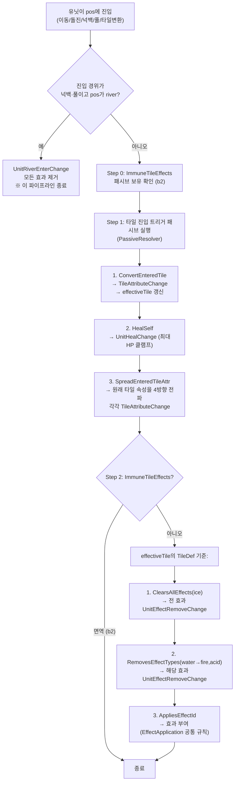
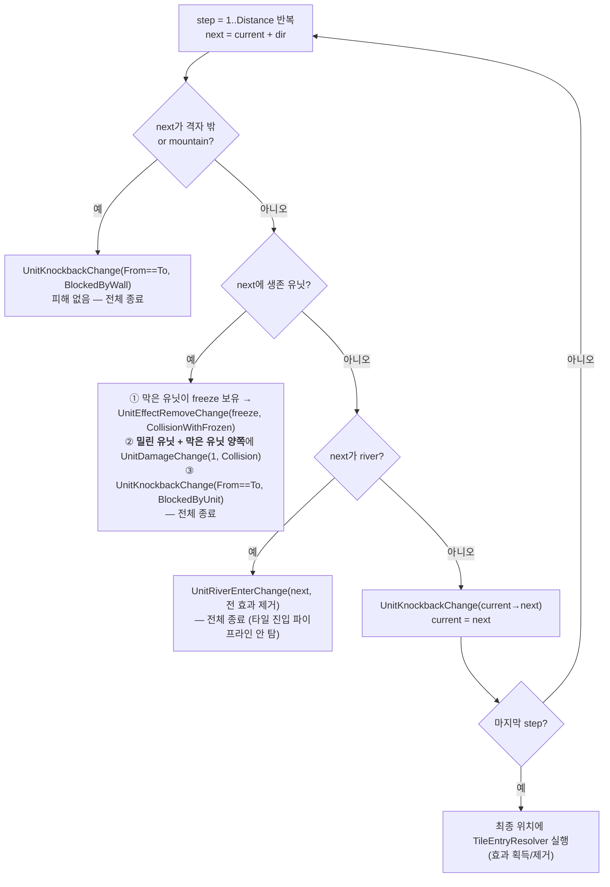
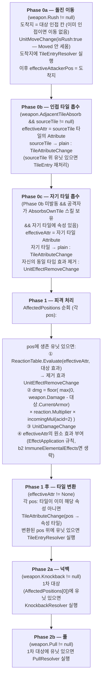
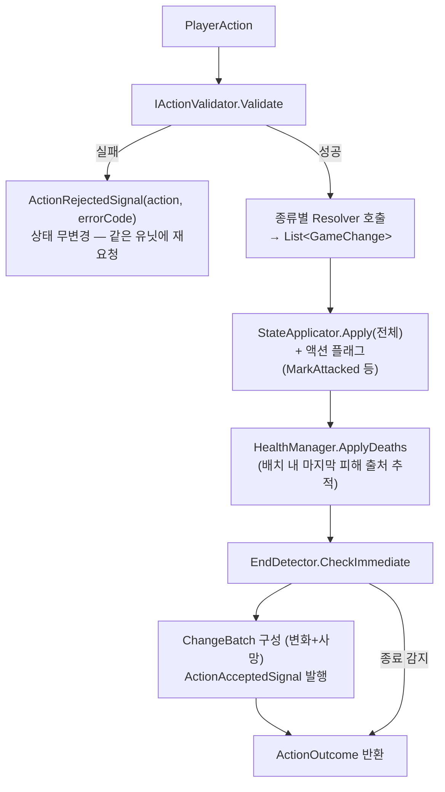

# 04 — 코어 엔진: Validator / Resolver / Manager 인터페이스와 처리 파이프라인

> 선행 문서: [02-domain-model.md](02-domain-model.md)
> 룰 번호(§n)는 전부 [08-rules-reference.md](08-rules-reference.md) 기준.
> **이 문서의 처리 순서는 규범(normative)이다. 구현이 순서를 바꾸면 룰 위반이다.**

---

## 0-a. 핵심 수치 카드 (08 문서 점프 없이 이 문서를 읽기 위한 요약)

| 항목 | 값 | | 항목 | 값 |
|---|---|---|---|---|
| 넉백 충돌 피해 | 1 | | fire/acid 효과 지속 | 3턴 (턴당 피해 1) |
| 강 밀림 피해 | 0 | | electric/freeze 지속 | 1턴 (감전 피해 1, 빙결 0) |
| acid 피격 배율 | ×2.0 (마지막에 곱) | | water/sand 효과 | 영구, 자발 이동 시 제거 |
| fire 타일 턴 피해 | 2 | | electric 타일 턴 피해 | 1 (**acid 타일·효과는 피해 0** — 받는 피해 ×2만) |
| sand/river 이동 비용 | 2 (그 외 1) | | mountain / river | 통과 불가 / 정지 불가 |
| 반응: Fire→freeze | ×0 + freeze 제거 | | 반응: Water/Ice→fire | ×1 / ×0 + fire 제거 |
| 턴당 액션 | 이동1 + 공격1 (공격이 턴 종료) | | oneShot 스킬 | 게임 전체 1회 |

> 수치의 출처와 전체 데이터는 [08-rules-reference.md](08-rules-reference.md).
> 구체 상황 대입 예시는 [10-worked-examples.md](10-worked-examples.md).

## 0. 역할 3분법 (반드시 지킬 것)

| 역할 | 입력 | 출력 | 부수효과 |
|---|---|---|---|
| **Validator** | 읽기 전용 상태 + 액션 | `ValidationResult` 계열 | 없음 (순수 함수) |
| **Resolver** | 읽기 전용 상태 + 액션 | `List<GameChange>` | 없음 (순수 함수) |
| **Manager / Applicator** | 상태 + GameChange | 변경된 상태 | 상태 변경 (유일) |

> **Resolver의 "시뮬레이션 커서" 패턴**: Resolver는 상태를 바꾸지 않으면서도
> "넉백 1스텝 후의 위치에서 다음 스텝을 판단"해야 한다. 이를 위해 Resolver 내부에서
> 로컬 변수(예: `currentPos`, `effectiveAttr`, 가상의 효과 목록)로 진행 상황을 추적한다.
> 상태 객체에는 절대 쓰지 않는다.

---

## 1. Validators

### 1-1. IMovementValidator — 이동 판정 (룰 §7)

```csharp
namespace AB.Core.Validators
{
    public interface IMovementValidator
    {
        /// <summary>
        /// 이동 가능 여부 + 최소 비용 경로(다익스트라). 룰 §7.
        /// 판정 순서(이 순서대로 검사, 첫 실패 코드 반환):
        ///  1. 유닛 생존?                      → UnitDead
        ///  2. 빙결(행동 차단 효과)?            → MoveFrozen
        ///  3. 이미 이동?(ActionsUsed.Moved)   → MoveAlreadyMoved
        ///  4. 목적지 격자 안?                  → MoveOutOfRange
        ///  5. 목적지에 생존 유닛? 또는 정지 불가 타일(river)? → MoveBlockedUnit
        ///  6. 목적지가 impassable(mountain)?  → MoveBlockedMountain
        ///  7. 다익스트라: MovementPoints 내 경로 존재? → MoveNoPath
        /// </summary>
        MoveValidation Validate(UnitState unit, GridPos destination, GameState state);

        /// <summary>이동 가능한 모든 좌표 (UI 하이라이트·AI 후보 생성용).</summary>
        IReadOnlyList<GridPos> GetReachableTiles(UnitState unit, GameState state);
    }
}
```

**다익스트라 명세 (룰 §7.1–7.3):**
- 이웃: 4방향 직교 (`GridPos.CardinalDirections` 순서 고정).
- 간선 비용: 진입하는 타일의 `TileDef.MoveCost` (plain/road/fire/water/acid/electric/ice=1, sand/river=2).
- 통과 불가 노드: `Impassable`(mountain), **생존 유닛이 서 있는 칸** (룰 §7.1 — 경유도 불가).
- 정지 불가 노드: `CannotStop`(river) — **경유는 허용, 목적지로는 불허**.
- 동률 경로 결정성: 우선순위 큐의 tie-break는 (비용, row, col) 사전순으로 고정한다 (결정론 D-04).
- A*가 아닌 이유: ① 비용 2 타일 존재로 BFS 불가 ② `GetReachableTiles`가 전 도달 칸을
  요구하므로 1회 전개 결과를 그대로 재사용 ③ 16×16(256노드)에서 휴리스틱 이득 없음.

**의사코드 (규범 — Validate와 GetReachableTiles가 공유하는 단일 탐색):**

```
// ── 내부 공용: 유닛 기준 1회 전개. budget = unit.MovementPoints ──────────────
DijkstraExpand(unit, state) → (dist: Map<GridPos,int>, prev: Map<GridPos,GridPos>)

  start  = unit.Position
  budget = unit.MovementPoints
  dist   = { start: 0 };  prev = { }
  pq     = 최소힙, 정렬 키 = (cost, pos.Row, pos.Col)     // tie-break 고정 (D-04)
  pq.Push((0, start))

  while pq 비어있지 않음:
      (cost, cur) = pq.Pop()
      if cost > dist[cur]: continue                        // 스테일 엔트리 스킵

      for dir in GridPos.CardinalDirections:               // 상→하→좌→우 순서 고정
          next = cur.Add(dir)
          if !state.Map.InBounds(next):              continue
          tile = registry.GetTile(state.Map.TileAt(next))
          if tile.Impassable:                        continue   // mountain
          if state.UnitAt(next) != null:             continue   // 생존 유닛 = 장애물 (경유 불가)

          newCost = cost + tile.MoveCost
          if newCost > budget:                       continue   // 이동력 초과 가지치기
          if !dist.Contains(next) || newCost < dist[next]:
              dist[next] = newCost
              prev[next] = cur
              pq.Push((newCost, next))
          // 동률(newCost == dist[next])은 갱신하지 않는다:
          // pq 정렬이 (cost,row,col)이라 먼저 정착한 경로가 사전순 최소 — 결정 경로 유일화

  return (dist, prev)

// ── Validate(unit, destination, state) ───────────────────────────────────────
  1~6단계 사전 검사 (위 XML 주석의 순서; 실패 시 해당 에러코드로 즉시 반환)
  (dist, prev) = DijkstraExpand(unit, state)
  if !dist.Contains(destination): return Fail(MoveNoPath)
  // 정지 불가(river) 목적지는 5단계에서 이미 걸러짐 — dist에는 경유용으로 존재할 수 있음
  path = ReconstructPath(prev, start, destination)
  return Ok(path, cost: dist[destination])

// ── ReconstructPath: prev를 역추적 → 출발 포함 전방向 경로 ──────────────────
ReconstructPath(prev, start, dest):
  path = [dest]
  while path.Last != start: path.Add(prev[path.Last])
  return path.Reverse()        // [start, ..., dest] — UnitMoveChange.Path로 그대로 전달

// ── GetReachableTiles(unit, state) ───────────────────────────────────────────
  사전 검사 1~3 실패 시 빈 목록 (사망/빙결/이동완료 유닛은 하이라이트 없음)
  (dist, _) = DijkstraExpand(unit, state)
  result = dist.Keys
           − start                                          // 제자리 제외
           − { p | TileAt(p).CannotStop }                   // river: 경유만, 목적지 불가
  return result를 (row, col) 사전순 정렬                     // 출력 순서도 결정적으로
```

구현 메모:
- `dist`에 river 칸이 들어 있는 것은 정상이다 (경유 비용 계산에 필요). **목적지 필터에서만 제외**한다.
- 유닛 점유 칸은 전개 단계에서 아예 막히므로 dist에 등장하지 않는다 — 목적지 검사 5단계와 이중 방어.
- C#에서 최소힙은 `PriorityQueue<GridPos,(int,int,int)>` (Unity의 .NET에 없으면 `SortedSet` + 비교자, 256노드라 성능 무관).

### 1-2. IAttackValidator — 공격 판정 (룰 §8)

```csharp
namespace AB.Core.Validators
{
    public interface IAttackValidator
    {
        /// <summary>
        /// weapon으로 target을 공격 가능한지 판정 + 피격 좌표 계산.
        /// 판정 순서:
        ///  1. 유닛 생존?                                 → UnitDead
        ///  2. 빙결?                                      → AttackFrozen
        ///  3. 이미 공격?(ActionsUsed.Attacked)            → AttackAlreadyAttacked
        ///  4. target 격자 안?                             → AttackInvalidTarget
        ///  5. 직교 직선?(IsOrthogonalTo, 자기 자신 제외)    → AttackOutOfRange
        ///  6. minRange ≤ 직교거리 ≤ maxRange?             → AttackOutOfRange
        ///  7. AttackType 추가 제약:
        ///     - Melee/Ranged: 없음 (룰 §8.2 — 원거리는 LOS 없음 확정)
        ///     - Artillery: 공격자~대상 사이(양 끝 제외)에 장애물(생존 유닛 or mountain) ≥1 → 없으면 AttackNoLos
        ///  8. Rush(룰 §8.4): 공격자~대상 사이 전 칸이 비어 있어야 함(유닛/산 없음) → 아니면 AttackNoLos
        ///     - 단, 공격자가 이미 대상에 인접하면 경로 검사 생략(이동 없음)
        ///  9. Pull(룰 §8.5/§10.2): 대상~공격자 인접 칸 사이 경로가 비어 있어야 함 → 아니면 AttackNoLos
        /// 성공 시 AffectedPositions = AffectedPositionCalculator 결과.
        /// </summary>
        AttackValidation Validate(UnitState attacker, WeaponDef weapon, GridPos target,
                                  GameState state);

        /// <summary>공격 가능한 모든 대상 좌표 (UI/AI용).</summary>
        IReadOnlyList<GridPos> GetAttackableTargets(UnitState attacker, WeaponDef weapon,
                                                    GameState state);
    }
}
```

**직선 스캔 보조 함수 의사코드** (AttackValidator 5~9단계가 사용; 탐색 아님 — 단순 순회):

```
// 직교 거리. 직선이 아니면 -1 (5단계에서 이미 걸러지지만 방어적으로)
OrthoDistance(a, b):
  if a.Row == b.Row: return |a.Col − b.Col|
  if a.Col == b.Col: return |a.Row − b.Row|
  return -1

// a→b 사이의 칸들 (양 끝 제외). 항상 a에서 b 방향으로 순서대로.
LineBetween(a, b):
  dir = a.DirectionTo(b)            // 단위 벡터, 예: (0,+1)
  cells = []
  p = a.Add(dir)
  while p != b: cells.Add(p); p = p.Add(dir)
  return cells

// rush/pull 경로 검사 (8~9단계): 사이 전 칸에 생존 유닛·산이 없어야 함
IsLineClear(a, b, state):
  for p in LineBetween(a, b):
      if state.UnitAt(p) != null: return false
      if registry.GetTile(state.Map.TileAt(p)).Impassable: return false
  return true

// artillery 장애물 카운트 (7단계): 사이에 생존 유닛 or 산 ≥ 1 필요
HasArtilleryObstacle(a, b, state):
  for p in LineBetween(a, b):
      if state.UnitAt(p) != null: return true
      if registry.GetTile(state.Map.TileAt(p)).Impassable: return true
  return false
```

> rush의 "이미 인접이면 경로 검사 생략"은 `OrthoDistance == 1`일 때 `LineBetween`이
> 빈 목록이 되므로 자연스럽게 충족된다 — 별도 분기 불필요.

### 1-3. IAffectedPositionCalculator — 피격 범위 (룰 §8.3, §8.6)

```csharp
namespace AB.Core.Validators
{
    /// <summary>RangeType별 피격 좌표 계산. AttackValidator/AttackResolver 공용.</summary>
    public interface IAffectedPositionCalculator
    {
        /// <summary>
        /// 반환 목록의 [0]은 항상 1차 대상(target). 넉백/풀은 [0]에만 적용된다(룰 §14 Phase 2).
        ///
        /// Single   : [target]
        /// Penetrate: target부터 공격 방향으로 격자 끝까지 진행하며 추가.
        ///            진행 중 만나는 각 좌표를 포함하되,
        ///            - 방패(BlocksPenetration 스킬 보유) 생존 유닛을 만나면
        ///              그 좌표까지 포함하고 **그 뒤는 중단** (룰 §8.3).
        ///            - mountain을 만나면 그 좌표 미포함하고 중단.
        /// Area     : target 기준 맨해튼 거리 ≤ AreaRadius 좌표 전부 (격자 내),
        ///            AreaIncludesCenter==false면 target 제외.
        ///            순서: 거리 오름차순 → (row, col) 사전순 (결정론).
        /// </summary>
        IReadOnlyList<GridPos> Calculate(GridPos attackerPos, GridPos target,
                                         WeaponDef weapon, GameState state);
    }
}
```

> **주의(관통 범위)**: Penetrate는 "target 뒤쪽 직선 전체"가 기본이며 사거리(maxRange)는
> 1차 대상 선정에만 적용된다. 뒤쪽 전파는 격자 끝/산/방패에서만 끊긴다.

**의사코드:**

```
Calculate(attackerPos, target, weapon, state):
  switch weapon.RangeType:

  case Single:
      return [target]

  case Penetrate:
      result = [target]
      dir = attackerPos.DirectionTo(target)            // 공격 진행 방향
      // target 자체가 방패 유닛이면 거기서 끝 (target은 항상 포함 — 방패도 피해는 받음)
      if IsShieldUnit(state.UnitAt(target)): return result
      p = target.Add(dir)
      while state.Map.InBounds(p):
          if registry.GetTile(state.Map.TileAt(p)).Impassable:
              break                                    // 산: 그 칸 미포함, 중단
          result.Add(p)                                // 유닛 유무와 무관하게 좌표는 포함
          if IsShieldUnit(state.UnitAt(p)):
              break                                    // 방패: 그 칸 포함 후 중단 (§8.3)
          p = p.Add(dir)
      return result

  case Area:
      result = [];  r = weapon.AreaRadius
      // 거리 오름차순 → (row,col) 사전순 — 결정적 순서 (D-04)
      for d in 0..r:
          for p in { 격자 내 좌표 | target.ManhattanTo(p) == d } 를 (row,col) 정렬:
              if d == 0 && !weapon.AreaIncludesCenter: continue
              result.Add(p)
      return result

IsShieldUnit(u): u != null && u.Alive
                 && u의 스킬 중 BlocksPenetration == true 존재   // skill_shield_defend
```

> Penetrate가 빈 칸 좌표도 포함하는 이유: Phase 1후 **타일 변환**은 유닛 유무와 무관하게
> 피격 좌표 전체에 적용되기 때문 (§14). 피해는 유닛이 있는 칸에서만 발생.

### 1-4. IActionValidator — 액션 단위 종합 판정

```csharp
namespace AB.Core.Validators
{
    /// <summary>
    /// PlayerAction 1건의 종합 판정. ActionProcessor 진입 게이트.
    /// 공통 선행 검사:
    ///  - Phase가 액션 종류와 일치? (DraftPlace↔Draft, 그 외↔Battle) → InvalidAction
    ///  - action.PlayerId == 현재 턴 슬롯의 플레이어? (Pass 포함)     → NotYourTurn
    ///  - 유닛 액션이면 해당 유닛이 현재 슬롯의 유닛?                  → NotYourTurn
    /// 종류별:
    ///  - Move       → IMovementValidator.Validate
    ///  - Attack     → IAttackValidator.Validate(기본 무기)
    ///  - Skill      → 유닛이 스킬 보유? → SkillUnknown
    ///                 액티브 스킬? oneShot 사용 이력 없음? → SkillAlreadyUsed
    ///                 ActionsUsed.Attacked == false? → AttackAlreadyAttacked
    ///                 이후 IAttackValidator.Validate(스킬 무기)
    ///  - Rest       → 빙결(행동 차단 효과) 아님? → RestFrozen
    ///                 ActionsUsed.Attacked == false? → RestAlreadyActed (이동 여부는 무관 — 이동 후 휴식 가능)
    ///                 (그 외 전제조건 없음 — 상태이상/피해 없어도 사용 가능. 공격 대신이며 사용 시 턴 종료)
    ///  - Pass       → 항상 OK
    /// </summary>
    public interface IActionValidator
    {
        ValidationResult Validate(PlayerAction action, GameState state);
        /// <summary>공격 계열 액션의 피격 좌표 (Resolver 전달용). 비공격이면 빈 목록.</summary>
        AttackValidation ValidateAttackLike(PlayerAction action, GameState state);
    }
}
```

---

## 2. Resolvers

### 2-1. ITileEntryResolver — 타일 진입 처리 (룰 §13) ★ 공유 파이프라인

이동/돌진/넉백/풀/타일 변환 직후 등 **유닛이 어떤 경위로든 타일 위에 "있게 되는" 모든 경우**에 호출되는 공통 파이프라인. (예외: 강 진입은 `UnitRiverEnterChange`로 별도 처리 — 이 파이프라인을 타지 않는다.)

```csharp
namespace AB.Core.Resolvers
{
    public interface ITileEntryResolver
    {
        /// <summary>
        /// unit이 pos 타일에 진입(또는 그 위에서 타일이 변환)했을 때의 변화 계산.
        /// simulatedEffects: 같은 액션 처리 중 아직 상태에 적용되지 않은 효과 변화를
        /// 반영한 가상 효과 목록 (Resolver 시뮬레이션 커서). null이면 state의 현재 값 사용.
        /// </summary>
        List<GameChange> Resolve(UnitState unit, GridPos pos, GameState state,
                                 IReadOnlyList<EffectInstance> simulatedEffects = null);
    }
}
```

**처리 순서 (규범):**



세부 규칙:
- `effectiveTile`: Step 1의 `ConvertEnteredTile`로 변환됐으면 **변환 후 타입** 기준으로 Step 2 진행 (룰 §13). → b1이 fire 타일 진입 시 plain으로 변환 후 회복하므로 화염 효과를 받지 않는다 (룰 부록-2).
- `SpreadEnteredTileAttr`은 **원래(변환 전) 타일 속성**을 전파한다 (룰 §19 b2). 이미 같은 속성인 인접 타일은 변환하지 않음. 격자 밖 제외. 전파 순서는 `CardinalDirections` 고정.
- **전파된 타일 위의 유닛 처리**: 전파로 변환된 인접 타일 위에 생존 유닛이 있으면, 그 유닛에 대해 본 파이프라인을 재귀 호출한다 (타일 변환 후 진입 처리 — 룰 §9.2 준용). 재귀 깊이는 전파가 다시 전파를 일으키는 경우(b2가 인접에 또 있음)뿐이므로 자연 종료된다. 동일 (유닛, 타일타입) 쌍에 대한 중복 처리는 방문 집합으로 차단한다.

**EffectApplication 공통 규칙** (Step 2-3, 그리고 공격 속성에 의한 효과 부여에서도 동일 사용):

```
applyEffect(unit, effectDef, simulatedEffects):
  1. 이미 같은 EffectType 보유 → 아무것도 안 함 (중복 부여 금지, 룰 §11.4)
  2. effectDef.ClearsAllEffectsOnApply (freeze):
       기존 효과 전부에 대해 UnitEffectRemoveChange 생성 (룰 §11.3)
  3. UnitEffectAddChange 생성 (TurnsRemaining = DurationTurns, 0이면 null=영구)
  4. effectDef.AlsoAffectsTile (acid):
       유닛이 선 타일이 해당 속성이 아니면 TileAttributeChange 생성 (룰 §11.2)
       ※ 이 변환은 추가 타일 진입 처리를 트리거하지 않는다 (유닛은 이미 acid 효과 보유
          → 중복 부여 금지에 걸려 무한루프가 없지만, 명시적으로 트리거 안 함으로 규정)
  5. ImmuneElementalEffects 패시브(b2) 보유 시: 공격발 원소 효과 부여를 1~4 전체 생략
```

### 2-2. IPassiveResolver — 패시브 실행 (룰 §19)

```csharp
namespace AB.Core.Resolvers
{
    public interface IPassiveResolver
    {
        /// <summary>유닛이 always_on 패시브 액션을 보유하는지. (면역 검사용 — Validator/EffectManager 공용)</summary>
        bool HasAlwaysOnAction(UnitState unit, PassiveActionKind kind, GameState state);

        /// <summary>
        /// 타일 진입 트리거 패시브 실행. TileEntryResolver Step 1에서 호출.
        /// 발동 조건:
        ///  - OnTileEntryOf: enteredTile == PassiveDef.TriggerTile
        ///  - OnTileEntryAnyAttribute: enteredTile이 Plain/Road가 아님
        /// 반환: 변화 목록 + 변환 후 effectiveTile (out).
        /// 한 유닛이 여러 패시브를 보유하면 UnitDef.PassiveIds 순서대로 실행.
        /// </summary>
        List<GameChange> ResolveTileEntry(UnitState unit, GridPos pos, TileType enteredTile,
                                          GameState state, out TileType effectiveTile);
    }
}
```

### 2-3. IElementalReactionTable — 원소 반응 (룰 §9.3, §21)

```csharp
namespace AB.Core.Resolvers
{
    public readonly struct ReactionResult
    {
        /// <summary>데미지 배율 (반응 누적 곱). 기본 1.0.</summary>
        public float Multiplier { get; }
        /// <summary>반응으로 제거될 대상 효과 타입들.</summary>
        public IReadOnlyList<EffectType> RemovedEffects { get; }
    }

    /// <summary>
    /// 반응 테이블 (룰 §21):
    ///   Fire  → 대상에 Freeze: 배율 ×0, Freeze 제거
    ///   Water → 대상에 Fire  : 배율 ×1, Fire 제거
    ///   Ice   → 대상에 Fire  : 배율 ×0, Fire 제거
    /// 복수 해당 시 전부 순서대로 적용 (배율은 곱, 현 테이블에선 동시 해당 없음).
    /// 배율 0이어도 효과 제거는 발생한다.
    /// </summary>
    public interface IElementalReactionTable
    {
        ReactionResult Evaluate(AttackAttribute attackAttr,
                                IReadOnlyList<EffectInstance> targetEffects);
    }
}
```

### 2-4. IKnockbackResolver — 넉백 (룰 §10.1)

```csharp
namespace AB.Core.Resolvers
{
    public interface IKnockbackResolver
    {
        /// <summary>
        /// target을 spec에 따라 밀어낸 결과 계산.
        /// direction:
        ///   Away  → attackerPos→targetPos 단위 방향 (직교 보장됨)
        ///   Fixed → spec.FixedDelta
        /// spec.Distance 만큼 1칸씩 아래 순서로 판정, 막히면 즉시 종료:
        /// </summary>
        List<GameChange> Resolve(UnitState target, GridPos attackerPos,
                                 KnockbackSpec spec, GameState state);
    }
}
```



> 충돌 피해는 `GameConstants.KnockbackCollisionDamage`(=1), 강 진입 피해는 `RiverPushDamage`(=0).
> **충돌 시 밀린 유닛과 막은 유닛 양쪽이 각각 1 피해를 받는다.** 빙결이 풀리는 쪽은 **막은 유닛**이며
> (룰 §10.1-2, §11.3), freeze 제거는 그 유닛의 피해 적용과 별개로 함께 발생한다.
> 양쪽 피해로 둘 다 HP≤0이 될 수 있으며, 사망 전환은 액션 후 HealthManager가 일괄 처리한다.
> 타일 진입 처리는 **최종 정착 위치에서 1회만** 실행한다 (중간 경유 칸은 효과 없음 — 넉백은 "스텝 이동"이지만 타일 효과는 정착지 기준).

### 2-5. IPullResolver — 풀 (룰 §10.2)

```csharp
namespace AB.Core.Resolvers
{
    public interface IPullResolver
    {
        /// <summary>
        /// target을 attacker 인접 칸(공격 직선상 attacker 바로 옆)으로 끌어옴.
        /// destination = attackerPos + DirectionTo(targetPos).
        /// 경로 검증은 Validator가 이미 수행 (실패 시 액션 거부됨).
        /// 변화: UnitPullChange → 목적지가 river면 UnitRiverEnterChange,
        ///       아니면 TileEntryResolver 실행. 피해 없음.
        /// 이미 인접(거리 1)이면 변화 없음(빈 목록).
        /// </summary>
        List<GameChange> Resolve(UnitState target, GridPos attackerPos, GameState state);
    }
}
```

### 2-6. IMovementResolver — 이동 (룰 §7)

```csharp
namespace AB.Core.Resolvers
{
    public interface IMovementResolver
    {
        /// <summary>
        /// 검증 완료된 이동의 변화 계산:
        ///  1. UnitMoveChange(from, to, path, isRush:false)
        ///     — 적용 시 ActionsUsed.Moved=true, MovementPoints -= cost
        ///  2. 자발적 이동이므로 OnMove 제거 조건 효과(water, sand) 제거
        ///     → 보유 시 UnitEffectRemoveChange(OnMove)   (룰 §11.1)
        ///  3. 목적지에 TileEntryResolver 실행 (경유 칸은 효과 없음 — 룰 §7.1)
        /// </summary>
        List<GameChange> Resolve(UnitState unit, MoveValidation validated, GameState state);
    }
}
```

### 2-7. IAttackResolver — 공격 (룰 §8, §14) ★ 최대 파이프라인

```csharp
namespace AB.Core.Resolvers
{
    public interface IAttackResolver
    {
        /// <summary>
        /// 검증 완료된 공격/스킬의 변화 계산. weapon은 기본 무기 또는 스킬 무기.
        /// sourceTile: AttackAction.SourceTile (r1 흡수용, null 가능).
        /// 처리 순서는 아래 플로차트 — 절대 변경 금지.
        /// </summary>
        List<GameChange> Resolve(UnitState attacker, WeaponDef weapon, GridPos target,
                                 GridPos? sourceTile, GameState state);
    }
}
```



세부 규칙:
- `effectiveAttr` 초기값 = `weapon.Attribute`. Phase 0b/0c에서 덮어쓸 수 있다.
- **속성→효과 매핑** (Phase 1-④): Fire→effect_fire, Water→effect_water, Acid→effect_acid, Electric→effect_electric, Ice→effect_freeze, Sand→effect_sand. `IDataRegistry.GetEffectByType` 사용.
  - 단 Water 속성 공격은 효과 부여가 아니라 반응(Fire 제거)만 한다 — water 타일과 달리 **유닛에게 water 효과를 부여하지 않는다**. 부여 여부는 `EffectDef` 존재가 아니라 다음 표를 따른다:

| effectiveAttr | 대상 유닛에 부여하는 효과 | 비고 |
|---|---|---|
| None | 없음 | |
| Fire | effect_fire | |
| Water | **없음** | 반응으로 fire 제거만. 실제 water 무기/타일 값은 `packages/metadata/data/weapons.json`과 `tiles.json` 참조 |
| Acid | effect_acid | |
| Electric | effect_electric | |
| Ice | effect_freeze | |
| Sand | effect_sand | |

- **Phase 1 피해와 사망**: Resolver는 `UnitDamageChange`만 만든다. 사망 전환(`UnitDeathChange`)은 `HealthManager.ApplyDeaths`가 액션 적용 후 일괄 수행한다 (룰 §15와 일관).
- **Phase 2 넉백/풀 대상이 이미 죽을 만큼 피해를 입었어도** (HP≤0이지만 아직 ApplyDeaths 전) 넉백/풀은 그대로 계산한다 — 기존 엔진과 동일한 동작. 사망 판정은 액션 단위 후처리.
- 스킬 공격(`SkillAction`)도 동일 파이프라인. 차이는 적용 시 `ActionsUsed.SkillUsed=true` + `UsedOneShotSkills`에 기록되는 것뿐 (StateApplicator 참조).

### 2-8. IEffectResolver — 턴 시작 tick (룰 §11.5, §15)

```csharp
namespace AB.Core.Resolvers
{
    public interface IEffectResolver
    {
        /// <summary>
        /// 유닛 1기의 턴 시작 tick 변화 계산:
        ///  1. 각 활성 효과(목록 순서대로):
        ///     a. DamagePerTurn > 0 → UnitDamageChange(Source: Effect)
        ///     b. TurnsRemaining != null → 1 감소한 값이 0이면
        ///        UnitEffectRemoveChange(TurnsExpired)
        ///        (감소 자체는 StateApplicator가 tick 배치 적용 시 수행 — 아래 주의)
        ///  2. 유닛이 선 타일의 DamagePerTurn > 0이고
        ///     ImmuneTileDamage 패시브 없음 → UnitDamageChange(Source: Tile)
        /// </summary>
        List<GameChange> ResolveTurnStartTick(UnitState unit, GameState state);
    }
}
```

> **턴 감소의 표현**: `TurnsRemaining` 감소는 별도 GameChange가 없다.
> `EffectManager.ProcessTurnStart`가 tick 배치를 적용할 때 StateApplicator의
> 전용 진입점(`ApplyEffectTick`)으로 감소를 수행하고, 0이 된 효과는 Resolver가 만든
> `UnitEffectRemoveChange`로 제거된다. (연출에 필요한 것은 피해와 제거뿐이므로 충분)

---

## 3. StateApplicator — 유일한 상태 변경 지점

```csharp
namespace AB.Core.Managers
{
    /// <summary>
    /// GameChange를 GameState에 적용한다. 프로젝트 전체에서 상태를 변경하는 유일한 클래스.
    /// 적용은 동기·즉시이며 실패하면 예외 (Resolver가 만든 변화는 항상 적용 가능해야 한다
    /// — 적용 불가 변화가 만들어졌다는 것은 Resolver 버그).
    /// </summary>
    public interface IStateApplicator
    {
        void Apply(GameState state, GameChange change);
        void Apply(GameState state, IReadOnlyList<GameChange> changes); // 순서대로
        /// <summary>턴 시작 tick 전용: 효과 TurnsRemaining 1 감소 (제거는 별도 change).</summary>
        void ApplyEffectTickDecrement(GameState state, UnitId unitId);
    }
}
```

**적용 의미표 (전체 18종):**

| ChangeKind | 상태 변경 내용 |
|---|---|
| UnitMove | `Position=To`; `IsRushMovement==false`면 `ActionsUsed.Moved=true`, `MovementPoints -= 경로비용` |
| UnitDamage | `CurrentHealth -= Amount` (사망 전환은 하지 않음 — HealthManager 소관) |
| UnitHeal | `CurrentHealth += Amount` (Resolver가 이미 최대 HP 클램프) |
| UnitEffectAdd | `Effects`에 EffectInstance 추가 |
| UnitEffectRemove | `Effects`에서 해당 EffectId 제거 |
| UnitDeath | `Alive=false` (보드 점유 해제는 `UnitAt`이 Alive만 보므로 자동) |
| UnitKnockback | `From!=To`면 `Position=To` (Moved 안 세움) |
| UnitRiverEnter | `Position=Position`; `Effects.Clear()` |
| UnitRiverExit | 위치 갱신만 |
| UnitPull | `Position=To` (Moved 안 세움) |
| UnitActionsReset | `ActionsUsed.ResetForRound()` |
| UnitMovementRestore | `MovementPoints = 값` |
| UnitSpawn | UnitState 생성·등록 (Units 리스트 끝에 추가 — 순서 결정성) |
| TileAttributeChange | `Map.Tiles[pos] = To` (To==Plain이면 키 제거) |
| TileEffectTick | (예약 — 현재 no-op) |
| TurnAdvance | `CurrentTurnIndex = ToIndex` |
| RoundAdvance | `Round = To` |
| PhaseChange | `Phase = To` |

추가 규약:
- `SkillAction` 적용 시 ActionProcessor가 Applicator의 보조 진입점을 호출한다:
  `MarkSkillUsed(state, unitId, skillId)` → `ActionsUsed.SkillUsed=true; ActionsUsed.Attacked=true; UsedOneShotSkills.Add(skillId)`.
- `AttackAction` 적용 완료 시 `MarkAttacked(state, unitId)` → `ActionsUsed.Attacked=true`.
- `RestAction`: 별도 플래그 없음 — **턴 종료 액션**이라 사용 즉시 슬롯이 끝난다(공격/패스와 동일,
  05 문서 §2-2). 변화 산출은 ActionProcessor가 직접 구성:
  `UnitHealChange(unitId, 1, 최대HP 클램프)` + 유닛의 **모든 활성 효과**에 대해
  `UnitEffectRemoveChange(EffectRemoveCondition.Rest)`. (freeze는 RestFrozen으로 이미 차단되어
  실제로는 목록에 없음.) 회복·제거가 연출 대상이므로 일반 GameChange로 표현한다.

> 이렇게 "액션 플래그"는 GameChange가 아니라 ActionProcessor가 액션 종류에 따라
> 명시 호출한다. 이유: 플래그는 연출이 필요 없고, 변화 스트림을 순수 "보드 사건"으로 유지.

---

## 4. Managers

### 4-1. IHealthManager — 사망 일괄 판정 (룰 §15)

```csharp
namespace AB.Core.Managers
{
    public interface IHealthManager
    {
        /// <summary>
        /// HP ≤ 0인 생존 유닛 전부를 사망 처리.
        /// 순회는 state.Units 리스트 순서 (결정론 D-04).
        /// 반환: 발행된 UnitDeathChange 목록 (적용까지 완료된 상태).
        /// KilledBy: 마지막으로 해당 유닛에게 적용된 UnitDamageChange.Source
        /// (ActionProcessor가 배치 내 추적해 전달).
        /// </summary>
        List<GameChange> ApplyDeaths(GameState state,
                                     IReadOnlyDictionary<UnitId, DamageSource> lastDamageSource);
    }
}
```

### 4-2. IEffectManager — 턴 시작 처리 (룰 §15)

```csharp
namespace AB.Core.Managers
{
    public interface IEffectManager
    {
        /// <summary>
        /// 슬롯 턴 시작 시: 해당 플레이어의 모든 생존 유닛에 대해
        /// (소유 리스트 순서대로) EffectResolver.ResolveTurnStartTick → 적용 →
        /// ApplyEffectTickDecrement. 전 유닛 tick 완료 후 사망 판정은 호출측(GameLoop)이
        /// HealthManager로 일괄 수행한다 (룰 §15 "한꺼번에").
        /// 반환: 발행 변화 전체 (ChangeBatch 구성용).
        /// </summary>
        List<GameChange> ProcessTurnStart(PlayerId playerId, GameState state);
    }
}
```

### 4-3. IDraftManager — 드래프트 (룰 §3)

```csharp
namespace AB.Core.Managers
{
    /// <summary>플레이어 1명의 드래프트 제출물.</summary>
    public sealed class DraftSubmission
    {
        public PlayerId PlayerId { get; }
        /// <summary>(unitMetaId, 배치 좌표) 목록. 최대 MaxUnitsPerPlayer.</summary>
        public IReadOnlyList<(MetaId metaId, GridPos pos)> Placements { get; }
    }

    public interface IDraftManager
    {
        /// <summary>
        /// 제출물 1건 검증 (룰 §3.2~3.3):
        ///  - 좌표가 본인 스폰 포인트? → DraftInvalidSpawn
        ///  - 좌표 중복/기존 유닛 점유? → DraftPositionOccupied
        ///  - 같은 metaId 중복? → DraftDuplicateMeta
        ///  - 슬롯 수 초과? → DraftSlotsFull
        /// </summary>
        ValidationResult Validate(DraftSubmission submission, GameState state);

        /// <summary>검증된 제출물을 UnitSpawnChange 목록으로 변환·적용.</summary>
        List<GameChange> ApplySubmission(DraftSubmission submission, GameState state);

        /// <summary>
        /// 타임아웃/미제출 보정 (룰 §3.4): 각 플레이어의 미배치 슬롯에 대해
        /// 풀에서 랜덤 유닛(IRandomSource)을 빈 스폰 포인트에 배치. 이후 Phase→Battle.
        /// </summary>
        List<GameChange> ApplyTimeoutAutoFill(GameState state);
    }
}
```

### 4-4. ITurnOrderBuilder — 턴 순서 생성 (룰 §5)

```csharp
namespace AB.Core.Managers
{
    /// <summary>플레이어 1명의 유닛 순서 제출물.</summary>
    public sealed class UnitOrderSubmission
    {
        public PlayerId PlayerId { get; }
        public IReadOnlyList<UnitId> OrderedUnitIds { get; }
    }

    public interface ITurnOrderBuilder
    {
        /// <summary>
        /// 제출물 보정 (룰 §5.1): 사망 유닛 제거, 누락 생존 유닛은 기존 생존 순서로 뒤에 추가.
        /// 미제출(null)이면 기존 생존 순서 그대로.
        /// </summary>
        IReadOnlyList<UnitId> Normalize(PlayerId player, UnitOrderSubmission submission,
                                        GameState state);

        /// <summary>
        /// 턴 순서 확정 (룰 §5.2~5.3):
        /// [플레이어/팀 순서]
        ///  1. Priority 합 낮은 쪽 선공.
        ///  2. 동률: 라운드 1 또는 LastFirstMover 없음 → IRandomSource.NextBool 동전.
        ///           라운드 2+ → 직전 선공(LastFirstMover)이 후공 (교대).
        /// [인터리브]
        ///  1v1: P1U0, P2U0, P1U1, P2U1, ... (짧은 쪽 먼저 소진)
        ///  2v2: 팀 순서·팀 내 플레이어 순서 모두 Priority 합 → 
        ///       T0P0U0, T1P0U0, T0P1U0, T1P1U0, T0P0U1, ...
        /// 부수효과: state.LastFirstMover 갱신은 호출측(GameLoop)이 수행.
        /// </summary>
        IReadOnlyList<TurnSlot> Build(IReadOnlyDictionary<PlayerId, IReadOnlyList<UnitId>> orders,
                                      GameState state, out PlayerId firstMover);
    }
}
```

### 4-5. IRoundManager — 라운드 (룰 §4)

```csharp
namespace AB.Core.Managers
{
    public interface IRoundManager
    {
        /// <summary>
        /// 라운드 시작 (룰 §4.2): 모든 생존 유닛에
        /// UnitActionsResetChange + UnitMovementRestoreChange(BaseMovement) 발행·적용.
        /// </summary>
        List<GameChange> StartRound(GameState state);

        /// <summary>라운드 종료 (룰 §4.3): RoundAdvanceChange(round+1) 발행·적용.</summary>
        List<GameChange> EndRound(GameState state);
    }
}
```

### 4-6. IEndDetector — 종료 판정 (룰 §24)

```csharp
namespace AB.Core.Loop
{
    public interface IEndDetector
    {
        /// <summary>
        /// 즉시 종료 검사 (매 sub-action 후 호출):
        ///  - 항복자 존재 → 상대(팀) 승리 (Surrender)
        ///  - 어느 팀의 생존 유닛 0 → 상대 팀 승리 (AllUnitsDead)
        ///    (1v1은 팀=플레이어; 양쪽 다 0이면 무승부 — 동시 전멸 엣지)
        /// 종료 아니면 null.
        /// </summary>
        GameResult CheckImmediate(GameState state);

        /// <summary>
        /// 라운드 한계 검사 (룰 §24.2): round > MaxRounds일 때
        /// 팀별 생존 유닛 수 비교 → 다승 팀 승리, 동률 무승부.
        /// </summary>
        GameResult CheckRoundLimit(GameState state);
    }
}
```

---

## 5. ActionProcessor — 액션 처리 파이프라인

```csharp
namespace AB.Core.Loop
{
    public sealed class ActionOutcome
    {
        public bool Accepted { get; }
        public RuleErrorCode ErrorCode { get; }          // 거부 시
        public ChangeBatch Batch { get; }                // 승인 시 (사망 포함 전체 변화)
        public GameResult EndResult { get; }             // 이 액션으로 게임이 끝났으면
    }

    /// <summary>
    /// 액션 1건의 전체 파이프라인: 검증 → 변화 계산 → 적용 → 사망 판정 → 종료 판정 → 시그널.
    /// </summary>
    public interface IActionProcessor
    {
        ActionOutcome Process(PlayerAction action, GameState state);
    }
}
```



---

## 6. GameLogger / 리플레이 (Replay/)

```csharp
namespace AB.Core.Replay
{
    /// <summary>
    /// 리플레이 파일 = 시드 + 매치 설정 + 승인된 액션 시퀀스 (+ 검증용 배치 해시).
    /// 결정론(D-05) 덕분에 액션만 재생하면 전체 게임이 재구성된다.
    /// </summary>
    public sealed class ReplayData
    {
        public ulong Seed { get; }
        public MetaId MapId { get; }
        public IReadOnlyList<PlayerSetup> Players { get; }      // 에이전트 종류 제외, 팀/우선순위만
        public IReadOnlyList<RecordedAction> Actions { get; }   // 드래프트·순서 제출 포함
        public IReadOnlyList<long> BatchHashes { get; }         // 선택: 시퀀스별 FNV-1a 해시
    }

    public sealed class RecordedAction
    {
        public long Sequence { get; }
        /// <summary>액션 또는 제출물(드래프트/유닛순서)의 직렬화 형태.</summary>
        public string Json { get; }
    }

    /// <summary>SignalBus를 구독해 ReplayData를 축적. 코어 소속(Unity 비의존).</summary>
    public interface IGameLogger
    {
        void Attach(ISignalBus bus);
        ReplayData Export();
    }
}
```

`ReplayAgent`(코어 소속 `IPlayerAgent` 구현)는 `ReplayData.Actions`를 순서대로 반환한다.
드래프트/유닛 순서 제출도 동일하게 기록·재생한다.
