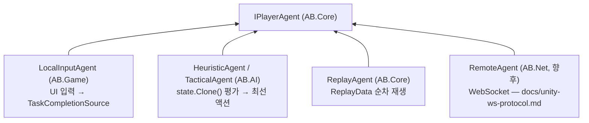
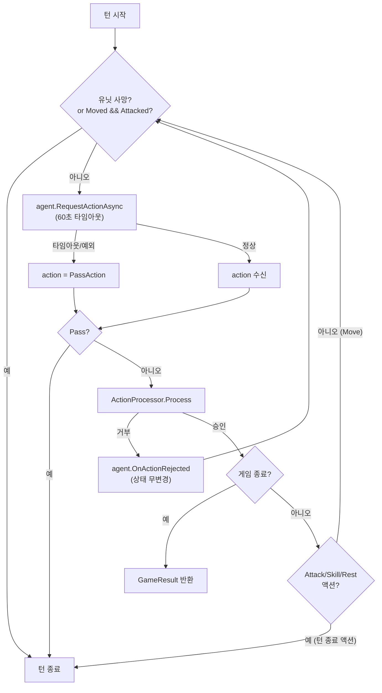
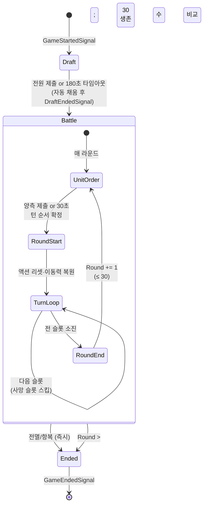

# 05 — 게임 흐름: GameLoop, 페이즈, IPlayerAgent, 타임아웃

> 선행 문서: [04-core-engine.md](04-core-engine.md)
> 룰 근거: [08-rules-reference.md](08-rules-reference.md) §2~§6, §24

---

## 1. IPlayerAgent — 모든 플레이어의 단일 인터페이스 (P-06)

```csharp
namespace AB.Core.Agents
{
    /// <summary>
    /// 에이전트에게 액션을 요청할 때 넘기는 문맥. 상태는 읽기 전용 뷰.
    /// </summary>
    public sealed class ActionRequest
    {
        public IReadOnlyGameState State { get; }
        /// <summary>현재 턴 슬롯 (이 유닛으로만 행동 가능).</summary>
        public TurnSlot Slot { get; }
        /// <summary>이번 멀티-액션 루프에서 남은 가능 액션 종류 (UI 버튼 활성화/AI 후보용).</summary>
        public IReadOnlyList<ActionKind> AvailableKinds { get; }
        public TimeSpan Timeout { get; }
    }

    public sealed class DraftRequest
    {
        public IReadOnlyGameState State { get; }
        /// <summary>이 플레이어가 고를 수 있는 유닛 풀 (1v1: 개인 풀, 2v2: 팀 공유 풀).</summary>
        public IReadOnlyList<MetaId> Pool { get; }
        public IReadOnlyList<GridPos> MySpawnPoints { get; }
        public int MaxUnits { get; }
        public TimeSpan Timeout { get; }
    }

    public sealed class UnitOrderRequest
    {
        public IReadOnlyGameState State { get; }
        /// <summary>현재 생존 유닛의 기본 순서 (이대로 제출해도 됨).</summary>
        public IReadOnlyList<UnitId> DefaultOrder { get; }
        public int Round { get; }
        public TimeSpan Timeout { get; }
    }

    /// <summary>
    /// 플레이어 의사결정 주체. 엔진은 구현체가 인간/AI/리플레이/원격인지 모른다.
    /// 모든 메서드는 ct 취소 시 OperationCanceledException을 던져야 한다
    /// (타임아웃 폴백은 호출측 책임 — 01 문서 §4 표준 패턴).
    /// </summary>
    public interface IPlayerAgent
    {
        PlayerId PlayerId { get; }

        /// <summary>드래프트 배치 제출 (룰 §3, 타임아웃 180초).</summary>
        Task<DraftSubmission> RequestDraftAsync(DraftRequest request, CancellationToken ct);

        /// <summary>유닛 행동 순서 제출 (룰 §5, 타임아웃 30초).</summary>
        Task<UnitOrderSubmission> RequestUnitOrderAsync(UnitOrderRequest request, CancellationToken ct);

        /// <summary>멀티-액션 루프 내 액션 1건 (룰 §6, 타임아웃 60초).</summary>
        Task<PlayerAction> RequestActionAsync(ActionRequest request, CancellationToken ct);

        /// <summary>
        /// 직전 액션이 거부됐음을 통지 (직후 같은 요청이 다시 온다).
        /// AI는 같은 액션 반복 제출을 피해야 한다.
        /// </summary>
        void OnActionRejected(PlayerAction action, RuleErrorCode code);
    }
}
```

### 구현체 4종



**LocalInputAgent 동작 규약** (07 문서의 입력 컨트롤러와 연결):
- `RequestActionAsync` 호출 시 `TaskCompletionSource<PlayerAction>` 생성, UI에 "내 턴" 활성화 신호.
- 플레이어가 보드/버튼으로 액션을 확정하면 TCS 완료.
- `ct` 취소(타임아웃) 시 UI 비활성화. 폴백(Pass)은 TurnController가 만든다.

**AIAgent 동작 규약**:
- 원본 상태 변경 금지. 탐색이 필요하면 `Clone()` 위에서 자체 Resolver 호출(코어 재사용).
- 응답 지연 연출용 최소 think time은 **Presentation에서** 처리 (코어/AI는 즉시 반환).

---

## 2. GameLoop — 최상위 오케스트레이터

```csharp
namespace AB.Core.Loop
{
    public interface IGameLoop
    {
        /// <summary>
        /// 게임 1판 전체 실행. 시그널은 진행 중 계속 발행되고,
        /// 완료 시 GameResult 반환. ct 취소 시 OperationCanceledException.
        /// </summary>
        Task<GameResult> RunAsync(GameSetup setup, CancellationToken ct);
    }

    /// <summary>게임 1판의 초기 조건.</summary>
    public sealed class GameSetup
    {
        public MetaId MapId { get; }
        /// <summary>플레이어 인덱스 순서대로. 길이 = MapDef.PlayerCount.</summary>
        public IReadOnlyList<IPlayerAgent> Agents { get; }
        public IReadOnlyList<PlayerSetup> Players { get; }   // 팀, 우선순위
    }

    public sealed class PlayerSetup
    {
        public PlayerId Id { get; }
        public TeamId Team { get; }
        public int Priority { get; }    // 기본 GameConstants.DefaultPlayerPriority
    }
}
```

### 2-1. 전체 흐름 (규범 의사코드)

```
RunAsync(setup, ct):
  state = CreateInitialState(setup)            // 맵 로드, 랜덤 지형 생성(§23), Phase=Draft
  Publish GameStartedSignal(state)

  ── 드래프트 페이즈 (§3) ──
  Publish DraftStartedSignal
  tasks = 각 agent.RequestDraftAsync(req, 180s 타임아웃 토큰)   // 동시(병렬) 대기
  submissions = await Task.WhenAll(tasks)       // 개별 타임아웃은 null로 수렴
  for each submission (플레이어 인덱스 순):
      if 유효 → DraftManager.ApplySubmission
      (무효/누락 슬롯은 다음 단계에서 자동 보정)
  changes = DraftManager.ApplyTimeoutAutoFill(state)   // 미배치 자동 채움 + Phase→Battle
  Publish DraftEndedSignal(batch)

  ── 전투 페이즈 루프 ──
  loop:
      // 라운드 한계 (§4.1, §24.2): Round가 31이 되는 순간 판정
      if state.Round > MaxRounds:
          result = EndDetector.CheckRoundLimit(state); break

      // 유닛 순서 드래프트 (§5) — 양측 동시, 30초
      Publish UnitOrderPhaseStartedSignal(round)
      orderTasks = 각 agent.RequestUnitOrderAsync(...)
      orders[p] = TurnOrderBuilder.Normalize(p, await 결과 or null, state)
      state.TurnOrder = TurnOrderBuilder.Build(orders, state, out firstMover)
      state.LastFirstMover = firstMover

      // 라운드 시작 (§4.2)
      RoundManager.StartRound(state)            // 액션 리셋 + 이동력 복원
      Publish RoundStartedSignal(round, batch)

      // 턴 루프 (§6.1)
      for slotIndex in 0..TurnOrder.Count-1:
          state.CurrentTurnIndex = slotIndex
          slot = TurnOrder[slotIndex]
          if !state.GetUnit(slot.UnitId).Alive: continue       // 사망 슬롯 스킵

          // 턴 시작 처리 (§15): 슬롯 플레이어의 전 생존 유닛 tick → 일괄 사망 판정
          tickChanges = EffectManager.ProcessTurnStart(slot.PlayerId, state)
          deaths = HealthManager.ApplyDeaths(state, tick 피해 출처)
          Publish TurnStartedSignal(slot, batch(tick+deaths))
          result = EndDetector.CheckImmediate(state); if result: goto END
          if !state.GetUnit(slot.UnitId).Alive: continue       // tick으로 본인 사망

          // 멀티-액션 루프 (§6.2)
          result = await RunTurnAsync(slot, state, ct); if result: goto END
          Publish TurnEndedSignal(slot)

      RoundManager.EndRound(state)               // Round += 1
      Publish RoundEndedSignal

  END:
  state.Result = result; state.Phase = Ended
  Publish GameEndedSignal(result)
  return result
```

### 2-2. 멀티-액션 루프 (TurnController, 룰 §6.2)

```csharp
namespace AB.Core.Loop
{
    /// <summary>슬롯 1개의 멀티-액션 루프. GameLoop 내부 구성요소.</summary>
    public interface ITurnController
    {
        /// <summary>게임이 끝났으면 GameResult, 아니면 null.</summary>
        Task<GameResult> RunTurnAsync(TurnSlot slot, GameState state, CancellationToken ct);
    }
}
```



핵심 룰 재확인 (§6.4):
- 이동 1회 + 공격 1회. **이동→공격 가능, 공격→이동 불가** (공격이 턴을 끝내므로 자동 충족).
- 스킬 = 공격 취급 (Attacked=true, 턴 종료, oneShot은 게임당 1회).
- **휴식 = 공격 대신** (아직 공격 안 했을 때만, **이동 후 가능**, 즉시 턴 종료). 체력 1 회복 + 모든 상태이상 제거.
- 거부된 액션은 루프를 끝내지 않고 재요청한다.

> **턴 종료 액션**은 Attack · Skill · Rest · Pass 넷이다. Move만 턴을 잇는다.

### 2-3. 항복 / 중단

- **항복**: UI의 항복 버튼 → `GameSessionRunner.Surrender(playerId)` →
  `state.Players[p].Surrendered = true` (Applicator 보조 진입점) → 다음 `EndDetector.CheckImmediate`에서 종료.
  진행 중인 `RequestActionAsync`가 있으면 취소하여 즉시 판정. (멀티-액션 루프 진입 전에도 매 액션 후 검사되므로 1액션 내 반영)
- **세션 중단** (씬 이탈): 세션 토큰 취소 → 루프가 `OperationCanceledException`으로 탈출, 결과 없음.
- **연결 끊김** (§24.3): RemoteAgent 도입 시 Disconnect 사유로 즉시 상대 승리. 로컬 빌드에서는 해당 없음 — 확장점만 명시.

---

## 3. 초기 상태 생성 (CreateInitialState)

```
CreateInitialState(setup):
  mapDef = registry.GetMap(setup.MapId)
  tiles = mapDef.TileOverrides 가 비어 있으면 TerrainGenerator.Generate(mapDef, random)
  state = GameState(mapId, Round=1, Phase=Draft, players, units=[], MapState(tiles))
```

### TerrainGenerator — 랜덤 지형 (룰 §23)

```csharp
namespace AB.Core.Managers
{
    /// <summary>
    /// 랜덤 지형 생성 (룰 §23):
    ///  - 산악 3개 × 양측 (스폰 영역 제외 랜덤)
    ///  - 물 3개 × 양측 (스폰 영역 제외, 연속 3칸 이상이면 river로 승격)
    ///  - 원소 타일 3개 전체 (fire/acid/electric/ice 중 IRandomSource로 선택)
    /// "양측": 맵을 좌우(또는 상하) 절반으로 나눠 각 절반에 배치 — 공정성.
    /// 모든 무작위는 IRandomSource만 사용 (결정론 D-01).
    /// </summary>
    public interface ITerrainGenerator
    {
        IReadOnlyDictionary<GridPos, TileType> Generate(MapDef map, IRandomSource random);
    }
}
```

---

## 4. GameSessionRunner — Unity 측 구동 (AB.Game)

```csharp
namespace AB.Game
{
    /// <summary>
    /// GameLoop를 Unity 생명주기에 연결한다.
    ///  - Awake 시점에 GameInstaller가 생성 (01 문서)
    ///  - RunAsync: 메인 스레드 async로 루프 실행, 예외는 에러 패널로
    ///  - OnDestroy: CancellationTokenSource.Cancel()
    /// </summary>
    public sealed class GameSessionRunner
    {
        public GameSessionRunner(GameContext ctx, IReadOnlyList<IPlayerAgent> agents, MetaId mapId);
        public Task<GameResult> RunAsync(CancellationToken ct);
        /// <summary>항복 처리 (UI에서 호출).</summary>
        public void Surrender(PlayerId playerId);
        /// <summary>현재 상태 읽기 전용 노출 (Presentation 바인딩용).</summary>
        public IReadOnlyGameState State { get; }
    }
}
```

---

## 5. 페이즈 상태도



---

## 6. 타임아웃 일람 (룰 §25)

| 대기 | 시간 | 타임아웃 폴백 | 폴백 생성자 |
|---|---|---|---|
| 드래프트 제출 | 180초 | 미배치 슬롯 랜덤 자동 배치 | `DraftManager.ApplyTimeoutAutoFill` |
| 유닛 순서 제출 | 30초 | 기존 생존 순서 사용 | `TurnOrderBuilder.Normalize(null)` |
| 액션 요청 | 60초 | `PassAction` | `TurnController` |

> 모든 타임아웃은 01 문서 §4의 표준 패턴(연결 토큰 + `CancelAfter`)으로 구현한다.
> 폴백 발생도 일반 액션과 동일하게 로그/리플레이에 기록된다 (리플레이 재현성).
