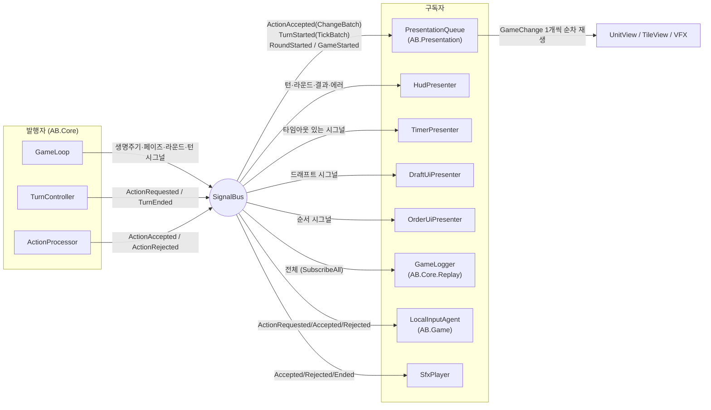

# 06 — 이벤트 시스템: SignalBus, 시그널 정의, 발행–구독 매트릭스

> 선행 문서: [05-game-flow.md](05-game-flow.md)
> 소속: `AB.Core.Signals` (버스·시그널 정의), 구독자는 각 어셈블리

---

## 1. ISignalBus

기존 TS의 문자열 키 EventBus를 **타입 기반**으로 재설계한다.
시그널 타입 자체가 키이므로 오타/캐스팅 사고가 없다.

```csharp
namespace AB.Core.Signals
{
    public interface ISignalBus
    {
        /// <summary>
        /// 시그널 발행. 구독자 콜백은 발행 스레드(메인)에서 '등록 순서대로 동기' 실행 (T-04).
        /// 콜백 안에서 다시 Publish 가능하지만 재귀 깊이 8 초과 시 예외 (무한 발행 가드).
        /// </summary>
        void Publish<T>(T signal) where T : class, IGameSignal;

        /// <summary>구독. 반환된 IDisposable.Dispose()로 해지. 구독자는 해지 책임을 진다.</summary>
        IDisposable Subscribe<T>(Action<T> handler) where T : class, IGameSignal;

        /// <summary>모든 시그널 수신 (로거/리플레이 전용).</summary>
        IDisposable SubscribeAll(Action<IGameSignal> handler);
    }

    /// <summary>마커 인터페이스. 모든 시그널은 불변 객체.</summary>
    public interface IGameSignal { }
}
```

**규약:**
- 시그널은 **사후 통지**다. 발행 시점에 상태는 이미 갱신 완료. 구독자가 게임 진행에 영향을 줄 수 없다 (모든 페이로드는 읽기 전용 타입).
- 구독자 콜백에서 무거운 작업 금지 — 큐 적재/플래그 설정만 하고 실제 작업은 자기 프레임에서.
- 코어 내부 모듈끼리는 시그널로 통신하지 않는다 (코어 내부는 명시적 호출 — 흐름 추적성). 시그널은 **코어 → 외부(표현/로그/UI)** 단방향 통지 전용.

---

## 2. 시그널 정의 (전체)

```csharp
namespace AB.Core.Signals
{
    // ── 게임 생명주기 ──────────────────────────────────────────────
    public sealed class GameStartedSignal : IGameSignal
    {
        public IReadOnlyGameState State { get; }
    }

    public sealed class GameEndedSignal : IGameSignal
    {
        public GameResult Result { get; }
        public IReadOnlyGameState State { get; }
    }

    // ── 드래프트 ──────────────────────────────────────────────────
    public sealed class DraftStartedSignal : IGameSignal
    {
        public TimeSpan Timeout { get; }                  // 타이머 UI용
    }

    /// <summary>한 플레이어의 배치가 반영됨 (자동 채움 포함).</summary>
    public sealed class DraftPlacementAppliedSignal : IGameSignal
    {
        public PlayerId PlayerId { get; }
        public ChangeBatch Batch { get; }                 // UnitSpawnChange들
    }

    public sealed class DraftEndedSignal : IGameSignal
    {
        public IReadOnlyGameState State { get; }
    }

    // ── 라운드 / 유닛 순서 ─────────────────────────────────────────
    public sealed class UnitOrderPhaseStartedSignal : IGameSignal
    {
        public int Round { get; }
        public TimeSpan Timeout { get; }
    }

    public sealed class TurnOrderConfirmedSignal : IGameSignal
    {
        public int Round { get; }
        public IReadOnlyList<TurnSlot> TurnOrder { get; }
        public PlayerId FirstMover { get; }
    }

    public sealed class RoundStartedSignal : IGameSignal
    {
        public int Round { get; }
        public ChangeBatch Batch { get; }                 // 리셋/이동력 복원
    }

    public sealed class RoundEndedSignal : IGameSignal
    {
        public int Round { get; }
    }

    // ── 턴 ────────────────────────────────────────────────────────
    public sealed class TurnStartedSignal : IGameSignal
    {
        public TurnSlot Slot { get; }
        public int TurnIndex { get; }
        /// <summary>턴 시작 tick + 그로 인한 사망 (룰 §15). 비어 있을 수 있음.</summary>
        public ChangeBatch TickBatch { get; }
    }

    /// <summary>에이전트에게 액션 요청이 나갔음 (타이머 UI 시작용).</summary>
    public sealed class ActionRequestedSignal : IGameSignal
    {
        public TurnSlot Slot { get; }
        public TimeSpan Timeout { get; }
    }

    public sealed class TurnEndedSignal : IGameSignal
    {
        public TurnSlot Slot { get; }
        public int TurnIndex { get; }
    }

    // ── 액션 ──────────────────────────────────────────────────────
    public sealed class ActionAcceptedSignal : IGameSignal
    {
        public PlayerAction Action { get; }
        /// <summary>이 액션의 전체 변화 (사망 포함). 연출 재생의 원본.</summary>
        public ChangeBatch Batch { get; }
        public IReadOnlyGameState StateAfter { get; }
    }

    public sealed class ActionRejectedSignal : IGameSignal
    {
        public PlayerAction Action { get; }
        public RuleErrorCode ErrorCode { get; }
    }
}
```

> **개별 unit.moved / unit.died 시그널을 두지 않는 이유**: 기존 TS는 이벤트와 변경이
> 이원화되어 있었다. 재설계에서는 보드에서 일어나는 모든 일이 `ChangeBatch` 안의
> `GameChange`로 일원화된다. 구독자는 배치를 순회하며 관심 있는 `ChangeKind`만 처리한다.
> → 발행 지점 1곳, 순서 보장, 연출·로그·리플레이가 같은 데이터를 본다.

---

## 3. 발행–구독 매트릭스

### 3-1. 발행자

| 시그널 | 발행자 | 발행 시점 |
|---|---|---|
| GameStartedSignal | GameLoop | 초기 상태 생성 직후 |
| DraftStartedSignal | GameLoop | 드래프트 요청 전 |
| DraftPlacementAppliedSignal | GameLoop | 제출물 적용/자동 채움마다 |
| DraftEndedSignal | GameLoop | Phase→Battle 직후 |
| UnitOrderPhaseStartedSignal | GameLoop | 순서 요청 전 |
| TurnOrderConfirmedSignal | GameLoop | TurnOrderBuilder.Build 직후 |
| RoundStartedSignal | GameLoop | StartRound 적용 직후 |
| RoundEndedSignal | GameLoop | EndRound 적용 직후 |
| TurnStartedSignal | GameLoop | 턴 시작 tick·사망 적용 직후 |
| ActionRequestedSignal | TurnController | RequestActionAsync 직전 |
| ActionAcceptedSignal | ActionProcessor | 적용·사망·종료판정 완료 직후 |
| ActionRejectedSignal | ActionProcessor | 검증 실패 즉시 |
| TurnEndedSignal | TurnController | 멀티-액션 루프 탈출 직후 |
| GameEndedSignal | GameLoop | 결과 확정 직후 |

### 3-2. 구독자 매트릭스

✔ = 구독, (✔) = 선택적 구독

| 시그널 \ 구독자 | PresentationQueue | HudPresenter | TimerPresenter | DraftUiPresenter | OrderUiPresenter | GameLogger | LocalInputAgent | SfxPlayer |
|---|---|---|---|---|---|---|---|---|
| GameStarted | ✔ 초기 보드 구축 | ✔ | | | | ✔ | | |
| DraftStarted | | | ✔ 180s | ✔ 패널 열기 | | ✔ | | |
| DraftPlacementApplied | ✔ 스폰 연출 | | | ✔ 슬롯 갱신 | | ✔ | | (✔) |
| DraftEnded | | ✔ | ✔ 정지 | ✔ 패널 닫기 | | ✔ | | |
| UnitOrderPhaseStarted | | | ✔ 30s | | ✔ 패널 열기 | ✔ | | |
| TurnOrderConfirmed | | ✔ 순서 바 | | | ✔ 패널 닫기 | ✔ | | |
| RoundStarted | ✔ (배지 연출) | ✔ 라운드 표시 | | | | ✔ | | (✔) |
| RoundEnded | | ✔ | | | | ✔ | | |
| TurnStarted | ✔ tick 피해 연출 | ✔ 현재 유닛 강조 | | | | ✔ | | (✔) |
| ActionRequested | | ✔ "내 턴" 배너 | ✔ 60s | | | ✔ | ✔ 입력 활성화 | |
| ActionAccepted | ✔ **핵심: 배치 재생** | ✔ HP/효과 갱신 예약 | ✔ 정지 | | | ✔ | ✔ 입력 잠금 | ✔ |
| ActionRejected | | ✔ 에러 토스트 | | | | ✔ | ✔ 재입력 허용 | ✔ 에러음 |
| TurnEnded | | ✔ | ✔ 정지 | | | ✔ | ✔ 입력 잠금 | |
| GameEnded | ✔ 결과 연출 | ✔ 결과 패널 | ✔ 전체 정지 | | | ✔ | ✔ 전체 잠금 | ✔ |

### 3-3. 발행–구독 그래프



---

## 4. ChangeKind → 구독자 관심 매핑

PresentationQueue가 배치를 풀어 재생할 때의 분기표 (07 문서에서 프리젠터별 상세):

| ChangeKind | 주 시각 효과 | 부 효과 |
|---|---|---|
| UnitMove | 경로 따라 이동 트윈 (Path 사용) | 발소리 |
| UnitDamage | 피격 플래시 + 데미지 숫자 | HP바 갱신 |
| UnitHeal | 회복 이펙트 + 숫자 | HP바 갱신 |
| UnitEffectAdd | 효과 아이콘 부착 + 상태 VFX 시작 | |
| UnitEffectRemove | 아이콘 제거 + VFX 정지 | |
| UnitDeath | 사망 연출 후 비활성화 | 그리드 점유 해제 |
| UnitKnockback | 밀려나는 트윈 / 막힘 진동 | 충돌음 |
| UnitRiverEnter | 물보라 + 전 효과 아이콘 제거 | |
| UnitRiverExit | (보조 연출) | |
| UnitPull | 끌려오는 트윈 | |
| UnitActionsReset / UnitMovementRestore | 없음 (무음 적용) | HUD 갱신 |
| UnitSpawn | 스폰 연출 + UnitView 생성 | |
| TileAttributeChange | 타일 스왑 연출 (확산/변환 VFX) | |
| TurnAdvance / RoundAdvance / PhaseChange | 없음 (배너는 별도 시그널로) | |

---

## 5. 스레딩·순서 보장 요약

1. 모든 발행은 메인 스레드 (T-01~T-04). 구독 콜백도 동기 실행.
2. 한 시그널의 구독자 실행 순서 = 구독 등록 순서. **구독자 간 의존 금지** (순서에 기대지 말 것). 단 GameLogger는 `SubscribeAll`이며 다른 구독자와 독립.
3. `ChangeBatch.Sequence`는 게임 전체 단조 증가 — Presentation이 배치를 큐에 쌓아도 재생 순서가 보존된다.
4. 시그널 발행은 게임 진행을 **블록하지 않는다** — 코어는 연출 완료를 기다리지 않는다. 사람 대 사람/사람 대 AI 모두 다음 입력 대기(에이전트 await)가 자연스러운 동기화 지점이 된다.
   - 단, 연출이 입력보다 늦게 끝나는 화면 혼란을 막기 위해 LocalInputAgent는 "PresentationQueue가 비었음" 조건을 입력 활성화에 AND 조건으로 건다 (07 문서 §5).
