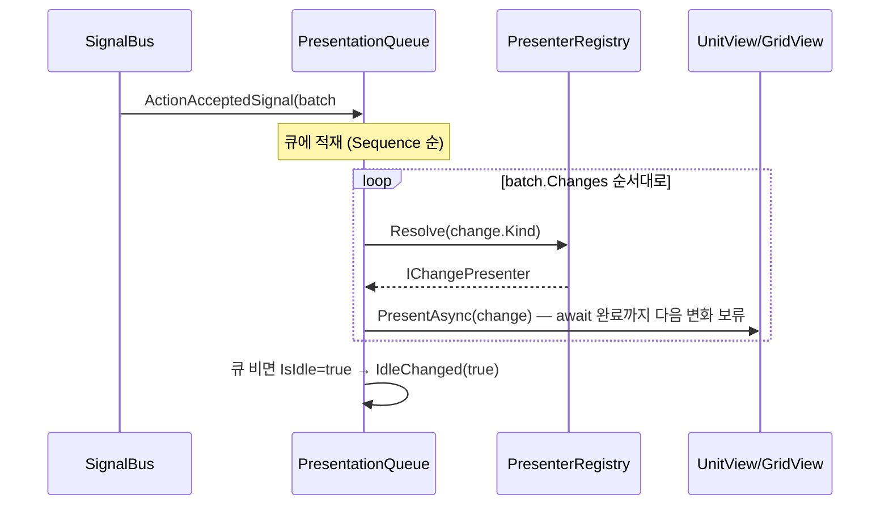
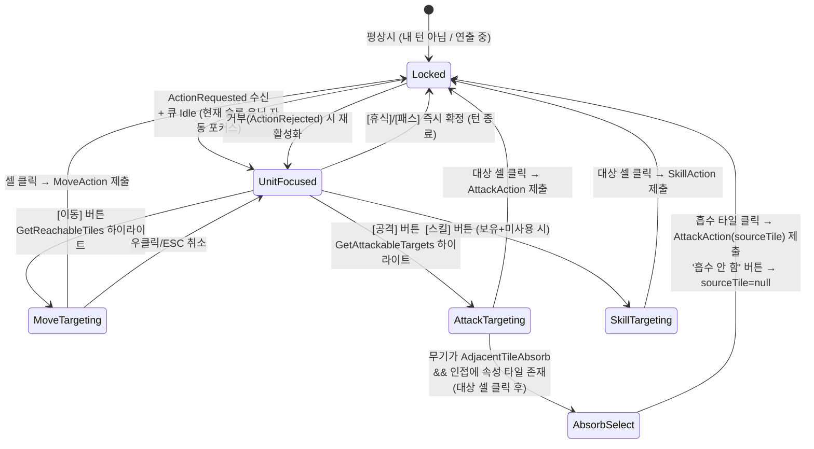

# 07 — 프레젠테이션: 씬 구성, View, 연출 큐, 입력/UI

> 선행 문서: [06-events.md](06-events.md)
> 소속 어셈블리: `AB.Presentation` (AB.Core만 참조; 에셋 조회는 AB.Data의 `IViewCatalog`를
> 인터페이스로 주입받음 — Presentation은 Data의 구체 타입을 모른다)

---

## 1. 원칙

| ID | 원칙 |
|---|---|
| V-01 | **표현은 상태를 절대 바꾸지 않는다.** `IReadOnlyGameState`와 시그널만 본다. |
| V-02 | **룰 판단을 자체 구현하지 않는다.** "이동 가능 칸"은 `IMovementValidator.GetReachableTiles`, "공격 가능 칸"은 `IAttackValidator.GetAttackableTargets`에 질의. (코어 Validator는 순수 함수이므로 Presentation에서 호출해도 안전) |
| V-03 | **연출은 ChangeBatch 순서를 보존한다.** 배치 내 변화를 동시에 재생하지 않는다 (병렬 연출은 명시 화이트리스트만). |
| V-04 | **코어는 연출을 기다리지 않는다.** 입력 활성화 쪽에서 큐 소진을 조건으로 건다. |

---

## 2. Game 씬 오브젝트 구성

> **3D 전환 (2026-06-13 확정)**: XCOM 스타일 카메라 도입으로 보드를 3D(XZ 평면)로 구성한다.
> 카메라/조작/킬캠/가림 처리 전체 사양은 [13-camera-design.md](13-camera-design.md).
> 본 문서의 View 인터페이스 시그니처는 불변 — 내부 구현(타일맵→프리팹)만 바뀐다.

```
Game (Scene)
├── GameInstaller            # AB.Game — 조립 루트 (01 문서)
├── Board/                   # 3D 보드 (XZ 평면, 13 문서)
│   ├── BoardRoot            # 타일 프리팹 인스턴스 풀 (IViewCatalog.TileVisual)
│   ├── GridView             # 타일 스왑 + 좌표 변환 (IBoardLayout)
│   ├── HighlightDecals      # 이동/공격 범위 하이라이트 (데칼/메시 오버레이 풀)
│   └── Units/               # UnitView 인스턴스 부모 (3D 모델 — 확정)
├── PresentationQueue        # 연출 재생기
├── Input/
│   ├── BoardInputController # XZ 평면 레이캐스트 픽킹 → 셀 클릭/호버 의도 생성
│   └── TargetingController  # 액션별 타겟 선택 상태기계
├── CameraRig                # XCOM 카메라 (팬/회전/줌 리그 + vcamTactical/vcamKill — 13 문서)
└── UI (Canvas)
    ├── HudPresenter         # 라운드/턴 순서 바/현재 유닛 패널
    ├── ActionBarPresenter   # 이동/공격/스킬/휴식/패스 버튼
    ├── TimerPresenter       # 드래프트 180s / 순서 30s / 액션 60s
    ├── DraftUiPresenter     # 드래프트 패널
    ├── OrderUiPresenter     # 유닛 순서 제출 패널
    ├── ToastPresenter       # ActionRejected 에러 표시
    └── ResultPresenter      # 게임 결과 오버레이
```

### 좌표 변환

```csharp
namespace AB.Presentation.Views
{
    /// <summary>
    /// GridPos ↔ 월드 좌표 변환의 유일한 창구. 다른 곳에서 변환 계산 금지.
    /// 3D 전환(13 문서): 보드는 XZ 평면 — (x = col×cellSize, y = 0, z = row×cellSize).
    /// 마우스 픽킹은 XZ 평면 레이캐스트 후 TryWorldToCell.
    /// </summary>
    public interface IBoardLayout
    {
        Vector3 CellToWorld(GridPos pos);          // 셀 중심 (y=0)
        bool TryWorldToCell(Vector3 world, out GridPos pos);
    }
}
```

---

## 3. PresentationQueue — 연출 재생기 (핵심)

```csharp
namespace AB.Presentation.Playback
{
    /// <summary>
    /// ActionAcceptedSignal / TurnStartedSignal / RoundStartedSignal /
    /// DraftPlacementAppliedSignal의 ChangeBatch를 Sequence 순서대로 큐에 쌓고,
    /// GameChange 1개씩 IChangePresenter에 위임해 순차 재생하는 MonoBehaviour.
    /// </summary>
    public sealed class PresentationQueue : MonoBehaviour
    {
        /// <summary>큐가 비어 있고 재생 중이 아님 — 입력 활성화 조건 (V-04).</summary>
        public bool IsIdle { get; }
        /// <summary>IsIdle 전환 통지 (LocalInputAgent가 구독).</summary>
        public event Action<bool> IdleChanged;

        public void Bind(ISignalBus bus, IReadOnlyGameState state);
        /// <summary>연출 스킵 (배속/관전): 남은 변화를 즉시 최종 상태로 반영.</summary>
        public void FastForward();
    }

    /// <summary>
    /// ChangeKind 1종(또는 군)의 연출 담당. 재생은 코루틴/Awaitable 1개로 표현.
    /// 구현체는 PresenterRegistry에 ChangeKind별로 등록한다.
    /// </summary>
    public interface IChangePresenter
    {
        bool CanPresent(GameChange change);
        /// <summary>연출 완료까지의 비동기. 즉시 완료 가능(무연출 변화).</summary>
        Task PresentAsync(GameChange change, PresentationContext ctx, CancellationToken ct);
    }

    /// <summary>프리젠터가 쓰는 공용 문맥.</summary>
    public sealed class PresentationContext
    {
        public IReadOnlyGameState State { get; }       // 주의: 이미 '최종' 상태 (연출보다 앞서 있음)
        public IUnitViewRegistry Units { get; }        // UnitId → UnitView
        public GridView Grid { get; }
        public IViewCatalog Catalog { get; }
        /// <summary>카메라 연출 창구. 폴로우/킬캠 정책은 13 문서 §4~§6.</summary>
        public ICameraDirector Camera { get; }
    }
}
```

**프리젠터 구현 목록** (06 문서 §4 매핑표 구현):

| 클래스 | 담당 ChangeKind | 연출 요지 |
|---|---|---|
| `MovePresenter` | UnitMove | `Path`를 따라 셀 단위 트윈 (러시면 더 빠른 속도) |
| `DamagePresenter` | UnitDamage | 피격 플래시, 데미지 숫자, HP바. Amount==0이면 "무효" 표시 (반응 배율 0 / 아머 차단) |
| `HealPresenter` | UnitHeal | 회복 숫자 |
| `EffectAddPresenter` | UnitEffectAdd | 아이콘 추가 + 루프 VFX 시작 |
| `EffectRemovePresenter` | UnitEffectRemove | 아이콘 제거 + VFX 정지 |
| `DeathPresenter` | UnitDeath | 사망 애니메이션 → View 비활성화 |
| `KnockbackPresenter` | UnitKnockback | 1스텝 밀림 트윈. `BlockedByUnit/Wall`이면 진동+충돌 이펙트 |
| `RiverPresenter` | UnitRiverEnter/Exit | 물보라 + 전 아이콘 일괄 제거 |
| `PullPresenter` | UnitPull | 끌림 트윈 |
| `SpawnPresenter` | UnitSpawn | UnitView 생성(Catalog.UnitPrefab) + 등장 연출 |
| `TileChangePresenter` | TileAttributeChange | 타일맵 스왑 + 변환 VFX |
| `SilentPresenter` | 나머지 전부 | 무연출 즉시 완료 (HUD는 시그널로 별도 갱신) |



---

## 4. View 컴포넌트

```csharp
namespace AB.Presentation.Views
{
    /// <summary>
    /// 유닛 1기의 시각 표현. 상태를 캐시하지 않는다 — 표시값은 호출 시 주입.
    /// 3D 모델 확정(13 문서): 프리팹은 Animator 필수, 최소 스테이트 = Idle / Move / Attack / Hit / Death.
    /// 방향 전환: 모델은 Y축 회전으로 바라보는 방향을 표현 — 프리젠터가 연출 전 FaceAsync 호출
    /// (Move: 경로 다음 칸 방향, Attack/Skill: 대상 방향, Knockback: 방향 전환 없음 — 밀리는 건 등져도 됨).
    /// </summary>
    public sealed class UnitView : MonoBehaviour
    {
        public UnitId UnitId { get; private set; }
        public void Init(UnitId id, MetaId metaId, PlayerId owner, IViewCatalog catalog);

        /// <summary>대상 칸을 바라보도록 Y축 회전 트윈 (~0.15s, unscaled).</summary>
        public Task FaceAsync(GridPos target, CancellationToken ct);
        public Task PlayMoveAsync(IReadOnlyList<Vector3> waypoints, float speed, CancellationToken ct);
        public Task PlayHitAsync(int amount, CancellationToken ct);     // amount 0 = 무효 연출
        public Task PlayDeathAsync(CancellationToken ct);
        public void SetHp(int current, int max);
        public void SetEffectIcons(IReadOnlyList<MetaId> effectIds);    // 전체 갱신 방식 (증분 X — 단순함 우선)
        public void SetTeamColor(Color c);
        public void SetActedState(bool moved, bool attacked);           // 행동 소진 시 회색 처리
    }

    /// <summary>UnitId → UnitView 등록부. SpawnPresenter가 등록, DeathPresenter가 해제하지 않음(사망 후에도 로그 클릭 등으로 참조 가능, 씬 종료 시 일괄 파괴).</summary>
    public interface IUnitViewRegistry
    {
        UnitView Get(UnitId id);
        void Register(UnitView view);
    }

    /// <summary>타일맵 갱신 창구.</summary>
    public sealed class GridView : MonoBehaviour, IBoardLayout
    {
        public void BuildInitial(IReadOnlyGameState state, IViewCatalog catalog); // GameStarted 시
        public void SetTile(GridPos pos, TileType type);
        public void Highlight(IReadOnlyList<GridPos> cells, HighlightKind kind);  // Move/Attack/Target/Spawn
        public void ClearHighlights();
    }

    public enum HighlightKind { MoveRange, AttackRange, TargetConfirm, SpawnPoint, AbsorbSource }
}
```

---

## 5. 입력 — TargetingController 상태기계

LocalInputAgent(AB.Game)가 `RequestActionAsync`를 받으면 입력 계층을 활성화한다.
입력 활성 조건: `요청 수신 && PresentationQueue.IsIdle` (V-04).



```csharp
namespace AB.Presentation.Input
{
    /// <summary>확정된 액션 의도를 게임 레이어로 전달하는 콜백. LocalInputAgent가 구현.</summary>
    public interface IActionIntentSink
    {
        void SubmitAction(PlayerAction action);
    }

    public sealed class TargetingController : MonoBehaviour
    {
        /// <summary>요청 시작 — request 내용으로 사용 가능 버튼 구성.</summary>
        public void BeginRequest(ActionRequest request, IActionIntentSink sink,
                                 GameContext ctx /* Validator 질의용 */);
        public void EndRequest();   // 제출/타임아웃/거부 후 잠금
    }
}
```

**액션 버튼 활성 규칙** (HUD ActionBar — 전부 Validator/상태 질의로 결정):

| 버튼 | 활성 조건 |
|---|---|
| 이동 | `!ActionsUsed.Moved && !빙결 && GetReachableTiles().Count > 0` |
| 공격 | `!ActionsUsed.Attacked && !빙결 && GetAttackableTargets(기본무기).Count > 0` |
| 스킬 | 액티브 스킬 보유 `&& !UsedOneShotSkills.Contains(skill) && !ActionsUsed.Attacked && 대상 존재` |
| 휴식 | `!빙결 && !ActionsUsed.Attacked` (이동 후에도 가능 — 공격 대신, 체력 1 회복 + 모든 상태이상 제거, 턴 종료) |
| 패스 | 항상 |

---

## 6. 드래프트 / 유닛 순서 UI

### DraftUiPresenter
- `DraftStartedSignal` 수신 → 패널 표시: 좌측 풀(유닛 카드), 보드에 내 스폰 포인트 하이라이트(`HighlightKind.SpawnPoint`).
- 카드 선택 → 스폰 셀 클릭 → 배치 슬롯에 누적. 전 슬롯 채우면 [확정] 활성화.
- [확정] → `DraftSubmission` 구성 → LocalInputAgent의 드래프트 TCS 완료.
- 검증 실패 항목(중복 metaId 등)은 제출 전에 UI에서 1차 차단하되, 최종 판정은 항상 코어(`DraftManager.Validate`)가 한다.

### OrderUiPresenter
- `UnitOrderPhaseStartedSignal` 수신 → 내 생존 유닛 리스트(드래그 정렬) 표시, 30초 타이머.
- [확정] 또는 타임아웃 → `UnitOrderSubmission` (타임아웃이면 미제출 → 코어가 기본 순서 적용).
- `TurnOrderConfirmedSignal` 수신 → 확정된 전체 인터리브 순서를 HUD 순서 바에 표시.

---

## 7. HUD 구성

| 프리젠터 | 표시 내용 | 갱신 시그널 |
|---|---|---|
| RoundBanner | "Round N / 30" | RoundStartedSignal |
| TurnOrderBar | 인터리브 순서 아이콘 행, 현재 슬롯 강조, 사망 유닛 회색 | TurnOrderConfirmedSignal, TurnStarted, ActionAccepted(사망 반영) |
| UnitPanel | 선택/현재 유닛: 초상화, HP, 아머, 이동력, 효과 목록(남은 턴), 무기 요약 | TurnStarted, ActionAccepted, 선택 변경 |
| ActionBar | §5 버튼 5종 | ActionRequested, ActionAccepted |
| Timer | 남은 초 (행동/드래프트/순서) | ActionRequested, DraftStarted, UnitOrderPhaseStarted → 로컬 카운트다운, Accepted/Ended 시 정지 |
| Toast | 거부 사유 (RuleErrorCode → i18n 문자열) | ActionRejectedSignal |
| ResultPanel | 승자/사유/통계 | GameEndedSignal |

> **HP/효과의 HUD 갱신 타이밍 주의**: 코어 상태는 연출보다 앞서 있다 (V-04).
> UnitPanel·HP바는 시그널 즉시가 아니라 **해당 변화의 프리젠터가 재생되는 시점**에 갱신한다
> (DamagePresenter가 `SetHp` 호출). 시그널 즉시 갱신은 라운드/턴 배너처럼 보드와 무관한 것만.

---

## 8. i18n

```csharp
namespace AB.Presentation
{
    /// <summary>표시 문자열 조회. 키는 메타데이터 nameKey / RuleErrorCode 매핑 테이블.</summary>
    public interface ILocalization
    {
        string Get(string key);
        string Get(RuleErrorCode code);   // "error.move.frozen" 형태 키로 변환
    }
}
```

- 테이블 에셋: `Assets/GameData/Text/ko.asset`, `en.asset` (`LocalizationTableSo` — key/value 배열).
- 코어는 문자열을 만들지 않는다. 코어가 주는 것은 항상 키/코드 (P-07 승계).
