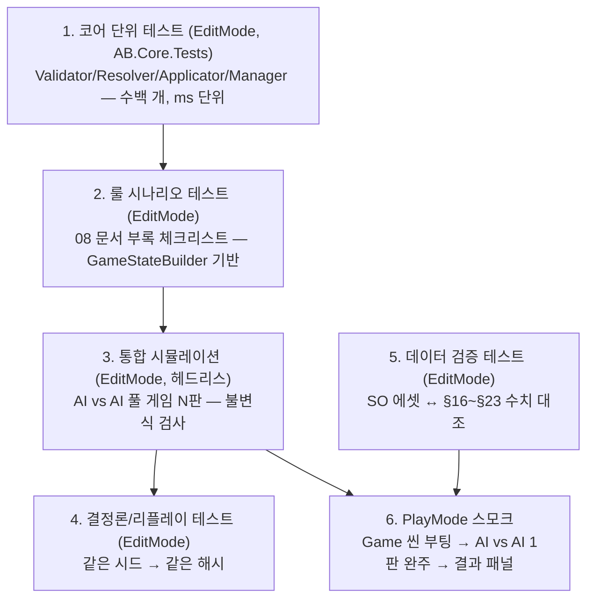

# 09 — 테스트 전략 및 구현 로드맵

> 선행 문서: 전체. 특히 [04-core-engine.md](04-core-engine.md), [08-rules-reference.md](08-rules-reference.md)

---

## 1. 테스트 전략

### 1-1. 테스트 계층



| 계층 | 커버리지 목표 |
|---|---|
| Validator / Resolver / StateApplicator / EndDetector | **100%** (전 분기) |
| Manager / TurnOrderBuilder / DraftManager | 90%+ |
| GameLoop / TurnController | 시나리오·통합으로 커버 |
| Presentation | PlayMode 스모크 + 수동 |

### 1-2. GameStateBuilder — 테스트 픽스처

```csharp
namespace AB.Core.Tests
{
    /// <summary>
    /// 임의 상황을 1~2줄로 구성하는 빌더. 모든 룰 테스트의 출발점.
    /// 내부적으로 StateApplicator를 통해 구성한다 (생성 경로도 본 코드와 동일).
    /// </summary>
    public sealed class GameStateBuilder
    {
        public static GameStateBuilder Create(int rows = 11, int cols = 11, ulong seed = 1);
        public GameStateBuilder WithPlayers(int count, int teamSize = 1);
        public GameStateBuilder WithUnit(string unitId, string metaId, int playerIndex,
                                         int row, int col,
                                         Action<UnitMutator> setup = null); // HP/효과/플래그 조작
        public GameStateBuilder WithTile(int row, int col, TileType type);
        public GameStateBuilder WithRound(int round);
        public GameStateBuilder WithTurnOrder(params string[] unitIds);
        public (GameState state, GameContext ctx) Build();   // 실제 레지스트리(테스트 데이터) 사용
    }
}
```

### 1-3. 필수 시나리오 테스트 목록 (08 문서 부록 1:1 + α)

| # | 시나리오 | 검증 포인트 |
|---|---|---|
| S-01 | b2가 fire 타일 진입 | 전파 4방향 TileAttributeChange 발생, b2에 효과/피해 없음 |
| S-02 | b1이 fire 타일 진입 | 타일 plain 변환 + HP1 회복, fire 효과 미부여 |
| S-03 | 관통 사격이 방패(t1) 적중 | t1 피해 O, 뒤 유닛 피해 X |
| S-04 | freeze 부여 시 fire 보유 | fire 제거 후 freeze 부여 (순서 포함) |
| S-05 | 넉백으로 river 진입 | UnitRiverEnter, 전 효과 제거, §13 미발동 |
| S-06 | Fire 공격 → freeze 대상 | 피해 0, freeze 제거 |
| S-07 | acid 보유 대상에 2뎀 공격 (아머 1) | floor((2−1)×1×2.0)=2 |
| S-08 | 돌진 도착 칸이 acid 타일 | 도착 시 acid 효과, Moved=false 유지 |
| S-09 | 넉백 충돌 (막는 쪽 freeze) | 막는 쪽 freeze 해제, **밀린 쪽·막는 쪽 양쪽 1 피해**, 이동 없음 |
| S-10 | 빙결 유닛의 이동/공격 시도 | MoveFrozen / AttackFrozen 거부 |
| S-11 | r1 sourceTile 흡수 공격 | sourceTile→plain, 대상에 흡수 속성 효과+타일 변환 |
| S-12 | t1 자기 타일(fire) 흡수 공격 | 자기 타일 plain, 자기 fire 효과 제거, 공격이 fire 속성 |
| S-13 | t2 풀: 경로 막힘 | AttackNoLos 거부 |
| S-14 | artillery 장애물 없음 | AttackNoLos 거부 (유닛/산 1개 있으면 허용) |
| S-15 | river 목적지 이동 | MoveBlockedUnit 거부; 통과 경로는 비용 2/칸 허용 |
| S-16 | 턴 시작 tick: fire(잔여1)+acid 보유, fire 타일 위 | 효과 피해 1(fire만; **acid 0**) + 타일 피해 2 = 총 3, fire 만료 제거, 일괄 사망 판정 |
| S-17 | 인터리브: 3유닛 vs 2유닛 | P1U0,P2U0,P1U1,P2U1,P1U2 |
| S-18 | 선공 교대: R1 동전 → R2 교대 | LastFirstMover 반영 |
| S-19 | 유닛 순서 제출 보정 | 사망 제거 + 누락 뒤에 추가 |
| S-20 | 30라운드 초과 | 생존 수 비교 / 동률 무승부 |
| S-21 | 휴식 | 체력 1 회복(최대 클램프) + 전 상태이상 제거, 즉시 턴 종료. **이동 후 휴식 허용**, 이미 공격했으면 RestAlreadyActed, 빙결이면 RestFrozen |
| S-26 | 산성 무피해 검증 | acid 효과·acid 타일 모두 턴 시작 tick에서 피해 0, 받는 피해만 ×2 |
| S-22 | 드래프트 중복 metaId / 타임아웃 자동 배치 | DraftDuplicateMeta / 풀에서 랜덤 채움 |
| S-23 | water 속성 공격 | fire 제거(배율 1), water 효과 미부여, 타일 water 변환 |
| S-24 | ice 타일 진입 | 전 효과 제거 → freeze 부여 순서 |
| S-25 | 동시 전멸 (마지막 유닛 상호 사망) | 무승부 처리 |

### 1-4. 통합/결정론 테스트

```
IT-01: HeuristicAgent vs HeuristicAgent — 100판 헤드리스 완주.
       매 액션 후 불변식 검사:
        - 모든 생존 유닛 HP ∈ [1, BaseHealth]
        - 좌표 중복 점유 없음 / 격자 밖 없음 / mountain·river 위 정지 유닛 없음(강 진입 직후 제외)
        - TurnsRemaining ≥ 1 (0이면 이미 제거됐어야 함)
IT-02: 같은 시드 2회 실행 → 전 ChangeBatch 해시 동일 (D-05).
IT-03: IT-01 로그를 ReplayAgent로 재생 → 결과·해시 동일.
DT-01: GameDatabase 에셋 값 == 08 문서 §16~§23 테이블 (코드화된 기대값 대조).
```

---

## 2. 구현 로드맵

> 각 단계는 "완료 = 테스트 녹색"으로 정의. 선행 단계 없이는 다음 단계 착수 금지.
> 괄호는 1인 기준 예상 규모.

```mermaid
gantt
    dateFormat X
    axisFormat %s
    section 코어
    M1 도메인+상수+레지스트리      :m1, 0, 3
    M2 상태+Applicator            :m2, after m1, 3
    M3 Validators                 :m3, after m2, 4
    M4 Resolvers (타일진입→공격)   :m4, after m3, 6
    M5 Managers+EndDetector       :m5, after m4, 3
    M6 GameLoop+Agents+시그널      :m6, after m5, 4
    section 데이터/AI
    M7 SO+DataRegistry+에셋        :m7, after m1, 3
    M8 HeuristicAgent+통합테스트   :m8, after m6, 3
    section Unity
    M9 보드 표현+연출 큐           :m9, after m7, 5
    M10 입력+HUD+드래프트 UI       :m10, after m9, 5
    M11 결정론/리플레이+폴리시      :m11, after m8, 3
```



| 마일스톤 | 산출물 | 완료 기준 |
|---|---|---|
| **M1** 도메인 기반 | GridPos/Ids/Enums/GameConstants/RuleErrorCode, IDataRegistry+테스트용 인메모리 구현 | 도메인 단위 테스트 |
| **M2** 상태 | GameState 일족, GameChange 18종, StateApplicator, Clone | 적용 의미표(04 §3) 전 케이스 테스트 |
| **M3** 판정 | Movement/Attack/Action Validator, AffectedPositionCalculator | 판정 순서·에러코드 전 분기 테스트 (S-10, S-13~15 포함) |
| **M4** 처리 | TileEntry/Passive/Reaction/Knockback/Pull/Movement/Attack/Effect Resolver | 시나리오 S-01~S-12, S-16, S-23, S-24 |
| **M5** 관리 | Health/Effect/Draft/Round Manager, TurnOrderBuilder, EndDetector, TerrainGenerator | S-17~S-20, S-22, S-25 |
| **M6** 루프 | SignalBus, ActionProcessor, TurnController, GameLoop, GameLogger, ReplayAgent | 스크립트 에이전트로 풀 게임 1판 완주 |
| **M7** 데이터 | SO 7종, GameDatabaseSo, DataRegistryBuilder, 에셋 28개 | DT-01 |
| **M8** AI | HeuristicAgent (유효 액션 무작위 + 기초 평가) | IT-01 100판 무실패 |
| **M9** 표현 | GridView/UnitView/PresentationQueue/프리젠터 12종 | AI vs AI 관전 모드에서 전 연출 재생 |
| **M10** 입력/UI | Targeting 상태기계, ActionBar, HUD, 드래프트/순서 UI, 타이머, 토스트 | 인간 vs AI 1판 완주 (PlayMode 스모크) |
| **M11** 마감 | 리플레이 저장/재생, 결정론 검증, FastForward, 결과 화면 | IT-02, IT-03 |

### 구현 시 주의 (사람 개발자용 함정 목록)

1. **처리 순서는 문서가 법이다.** §13/§14/§15의 순서를 "동작은 같아 보이게" 바꾸지 말 것 — S-02, S-04, S-07이 순서 의존이다.
2. **Resolver에서 상태를 건드리지 말 것.** 넉백 다단계·관통 다중 피격은 반드시 로컬 시뮬레이션 커서로 (04 §0).
3. **Dictionary 순회 의존 금지** — 유닛 순회는 항상 `List` 순서 (D-04).
4. **`floor`는 단계마다.** 반응 배율 적용 후 floor, acid ×2 후 다시 floor (§8.9).
5. **rush 이동은 Moved를 세우지 않는다.** `UnitMoveChange.IsRushMovement` 플래그 분기 누락 주의.
6. **freeze의 이중 규칙**: 부여 시 전체 제거(§11.3) + 충돌 시 '막는 쪽'이 해제(§10.1-2). 방향 혼동 주의.
7. **water 속성 공격은 효과를 부여하지 않는다** (§9.3 표). water **타일**과 다르다.
8. **연출과 상태의 시차**: HUD를 시그널 즉시 갱신하면 화면이 미래를 보여준다 — 07 §7 주의 참조.
