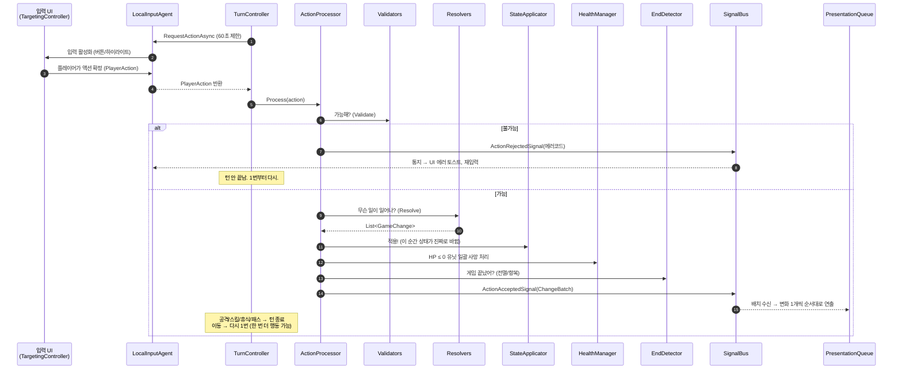
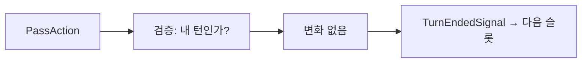
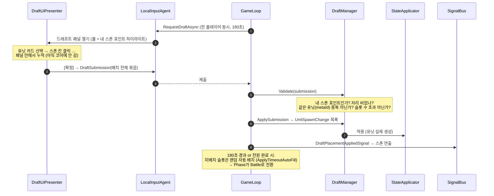
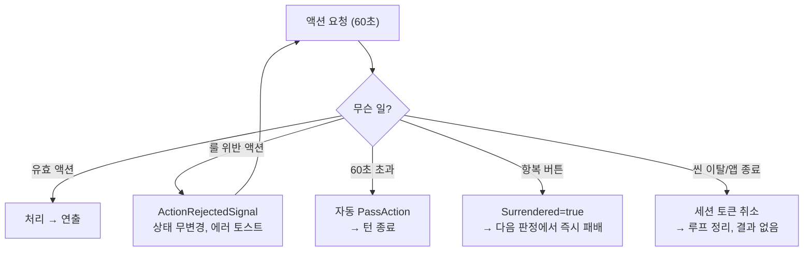

# 11 — 액션 처리 흐름 가이드 (초보 개발자용)

> **대상 독자**: 이 프로젝트에 처음 합류한 개발자. 아키텍처 문서를 다 읽지 않아도
> "플레이어가 버튼을 누르면 무슨 일이 어떤 순서로 일어나는가"를 이 문서 하나로 이해할 수 있게 한다.
> 깊은 정의가 필요하면 각 단계에 걸린 링크를 따라가면 된다.
>
> 선행 지식: C# async/await 기초만 있으면 된다.

---

## 0. 딱 5개만 알고 시작하자

| 용어 | 한 줄 설명 |
|---|---|
| **PlayerAction** | 플레이어가 제출하는 "하고 싶은 일" 1건. 이동/공격/스킬/휴식/패스/드래프트배치 6종. ([정의](02-domain-model.md)) |
| **Validator** | "그거 룰상 가능해?"만 판단. **아무것도 바꾸지 않는다.** |
| **Resolver** | "가능하다면 무슨 일이 일어나?"를 **GameChange 목록**으로 계산. 역시 아무것도 바꾸지 않는다. |
| **GameChange** | 보드에서 일어나는 원자적 사건 1건 (이동했다/피해 입었다/타일이 변했다 …). 18종. |
| **StateApplicator** | GameChange를 실제 상태(GameState)에 반영하는 **유일한** 곳. |

핵심 그림 한 장:

```
입력 → [검증 Validator] → [계산 Resolver] → [적용 Applicator] → [통지 Signal] → [연출 Presentation]
        가능해?            뭐가 일어나?       진짜로 바꿈          외부에 알림      화면에 재생
```

**왜 이렇게 쪼개나?** 검증·계산이 상태를 안 바꾸기 때문에 (1) 테스트가 쉽고 (2) AI가 "이 수를 두면 어떻게 되지?"를 안전하게 시뮬레이션할 수 있고 (3) 버그가 나면 "계산이 틀렸나, 적용이 틀렸나"를 분리해서 추적할 수 있다.

---

## 1. 모든 액션이 거치는 공통 길

전투 중 액션(이동/공격/스킬/휴식/패스)은 전부 아래 길을 지난다.
(드래프트 배치만 별도 경로 — [§7](#7-draftplace--드래프트-배치-별도-경로) 참조.)



### 단계별로 무슨 클래스가 뭘 하나

| # | 단계 | 담당 | 핵심 포인트 |
|---|---|---|---|
| 1 | 액션 요청 | `TurnController` ([05](05-game-flow.md)) | 60초 타이머 시작. 타임아웃이면 자동으로 `PassAction` 처리 |
| 2~4 | 입력 수집 | `LocalInputAgent`, `TargetingController` ([07](07-presentation.md)) | AI라면 이 구간이 `HeuristicAgent`의 탐색으로 대체된다. **엔진은 차이를 모른다** |
| 5 | 처리 시작 | `ActionProcessor` ([04 §5](04-core-engine.md)) | 여기부터 코어. Unity 코드 없음 |
| 6 | 검증 | `ActionValidator` → 종류별 Validator | 실패하면 **상태 무변경**, 에러코드만 반환 |
| 7~8 | 계산 | 종류별 Resolver | 결과를 GameChange 목록으로. **아직 아무것도 안 바뀜** |
| 9 | 적용 | `StateApplicator` | 프로젝트에서 상태를 바꾸는 유일한 지점 |
| 10 | 사망 판정 | `HealthManager.ApplyDeaths` | 피해는 Resolver가, 사망 전환은 여기서 **일괄** |
| 11 | 종료 판정 | `EndDetector` | 전멸/항복 체크. 매 액션 후 항상 |
| 12 | 통지 | `SignalBus` ([06](06-events.md)) | 코어는 누가 듣는지 모른다 |
| 13 | 연출 | `PresentationQueue` ([07](07-presentation.md)) | 변화를 **순서대로** 재생. 상태는 이미 최신 (연출이 늦게 따라감) |

> **초보 함정 #1**: "연출이 끝나야 다음 턴이 시작되는 거 아닌가요?" — 아니다.
> 코어는 연출을 기다리지 않는다. 다음 입력 활성화 조건에 "연출 큐 비었음"이 걸려 있어서
> 사람 눈에는 자연스럽게 순서대로 보일 뿐이다 ([06 §5](06-events.md)).

---

## 2. Move — 이동

**시나리오**: 내 r1(이동력 2)을 두 칸 옆 모래 타일로 옮긴다.

### 2-1. 입력 (Presentation)

1. 내 턴 시작 → `ActionRequestedSignal` → ActionBar 활성화.
2. [이동] 버튼 클릭 → `TargetingController`가 `IMovementValidator.GetReachableTiles(r1)` 호출
   → 갈 수 있는 칸들 하이라이트. (UI가 직접 "갈 수 있나"를 계산하지 않는다 — **항상 Validator에 질의**)
3. 모래 칸 클릭 → `MoveAction { UnitId: r1, Destination: (3,2) }` 생성 → Agent에 제출.

### 2-2. 검증 (MovementValidator — [04 §1-1](04-core-engine.md))

아래 순서대로 검사. **첫 실패에서 멈추고 그 에러코드를 반환**:

```
1. 살아 있나?                 → UnitDead
2. 빙결인가?                  → MoveFrozen
3. 이번 턴 이미 이동했나?       → MoveAlreadyMoved
4. 목적지가 격자 안인가?        → MoveOutOfRange
5. 목적지에 유닛? 강(정지불가)?  → MoveBlockedUnit
6. 목적지가 산?               → MoveBlockedMountain
7. 다익스트라로 이동력 내 경로 있나? → MoveNoPath
```

통과하면 `MoveValidation`에 **경로와 비용**이 담겨 나온다 (모래 진입 비용 2).

### 2-3. 계산 (MovementResolver)

```
변화 ① UnitMoveChange(r1, (3,0)→(3,2), path, isRush:false)
변화 ② (water/sand 효과 보유 시) UnitEffectRemoveChange — "이동하면 씻겨 나가는" 효과
변화 ③ 타일 진입 처리(TileEntryResolver) 결과:
        모래 타일 → UnitEffectAddChange(r1, effect_sand, 영구)
```

> 타일 진입 처리는 이동뿐 아니라 돌진/넉백/풀에서도 똑같이 재사용되는 공통 파이프라인이다.
> 흐름도: [04 §2-1](04-core-engine.md). 수치 예제: [10 예제 4·5·10](10-worked-examples.md).

### 2-4. 적용 → 이후

- Applicator: 위치 갱신, `Moved=true`, `MovementPoints 2→0`, 효과 추가.
- 사망 판정: 이동은 즉시 피해가 없어 보통 무사망 (타일 피해는 **턴 시작**에만 발생).
- 연출: 경로 따라 걷는 트윈 → 모래 효과 아이콘 부착.
- **턴은 끝나지 않는다.** TurnController가 다시 액션을 요청 → 이동 후 공격 가능.

---

## 3. Attack — 공격 (가장 복잡한 액션)

**시나리오**: f1이 3칸 떨어진 적에게 돌진 공격 (`wpn_fighter_rush_kb`: 돌진+넉백).

### 3-1. 입력

[공격] 버튼 → `GetAttackableTargets` 하이라이트 → 대상 클릭 → `AttackAction { UnitId, Target }`.
(r1처럼 무기에 `AdjacentTileAbsorb`가 있으면 대상 클릭 후 "흡수할 인접 타일" 선택 단계가 하나 더 — [07 §5](07-presentation.md) 상태기계.)

### 3-2. 검증 (AttackValidator)

```
1. 살아 있나 / 2. 빙결? / 3. 이미 공격?
4. 대상이 격자 안?
5. 같은 행 또는 같은 열인가? (대각선 절대 불가)     → AttackOutOfRange
6. minRange ≤ 거리 ≤ maxRange?
7. 무기 타입 추가 검사:
   - artillery: 중간에 장애물(유닛/산) 1개 이상 필요
   - rush: 대상까지 가는 길이 전부 비어 있어야 함
   - pull: 끌고 올 길이 비어 있어야 함
```

통과 시 `AffectedPositions` 계산: 단일이면 대상 1칸, **관통이면 대상 + 그 뒤 직선 전체**
(방패 유닛을 만나면 거기서 끊김), 범위면 반경 내 전부. `[0]`이 항상 1차 대상.

### 3-3. 계산 (AttackResolver) — 6단계 파이프라인

순서가 룰이다. **절대 바꾸면 안 된다** ([04 §2-7](04-core-engine.md) 흐름도):

```
Phase 0a  돌진: 대상 옆까지 이동 (이동 액션 소모 X), 도착 칸의 타일 효과 받음
Phase 0b  인접 타일 흡수 (r1 전용): 지정한 타일의 속성을 뺏어 내 공격 속성으로
Phase 0c  자기 타일 흡수 (방패 유닛): 내가 선 타일의 속성을 뺏어 공격 속성으로
Phase 1   피격 좌표마다: 원소 반응 → 데미지 계산 → 피해 → 원소 효과 부여
Phase 1후 속성 공격이면 피격 타일을 그 속성 타일로 변환 (위에 유닛 있으면 타일 진입 처리)
Phase 2a  넉백 (1차 대상만): 1칸씩 밀며 벽/유닛/강 판정
Phase 2b  풀 (1차 대상만): 공격자 옆으로 끌어옴
```

데미지 공식 (외우자):

```
dmg = max(0, 무기피해 − 대상아머)
dmg = floor(dmg × 원소반응배율)        ← Fire→빙결: 0배,  Water/Ice→화염: 1배/0배
dmg = floor(dmg × 산성배율)            ← 대상이 acid 보유 시 ×2.0
```

> 숫자를 넣어 끝까지 따라간 예제: [10 예제 1·2·6](10-worked-examples.md).
> 특히 **예제 6**이 이 시나리오(돌진→타일진입→피해→넉백→강) 그대로다.

### 3-4. 적용 → 이후

- 사망 판정이 여기서 자주 발생: 배치 안에서 마지막 피해 출처를 추적해 `UnitDeathChange.KilledBy`에 기록.
- `MarkAttacked` 호출로 `Attacked=true`.
- **공격은 무조건 턴 종료.** TurnController가 루프를 빠져나간다.

> **초보 함정 #2**: HP가 0이 됐는데 넉백이 계속 실행된다? — 정상이다.
> 사망 전환은 액션 처리의 **맨 끝에서 일괄**이다. "죽은 채로 강에 밀려 빠지는" 연출이 룰상 맞다.

---

## 4. Skill — 스킬 (= 무기만 다른 공격)

**시나리오**: t2가 게임당 1회 풀 스킬(`skill_t2_pull`)로 3칸 거리 적을 끌어온다.

공격과의 차이 **3가지만** 기억하면 된다:

| 항목 | Attack | Skill |
|---|---|---|
| 사용 무기 | 유닛의 기본 무기 | `SkillDef.WeaponId`의 무기 |
| 사전 검사 추가 | — | 스킬 보유? + `UsedOneShotSkills`에 없나? (게임 전체 1회) |
| 적용 시 기록 | `Attacked=true` | `Attacked=true` + `SkillUsed=true` + `UsedOneShotSkills.Add` |

나머지(검증→Resolver 파이프라인→턴 종료)는 §3과 **완전히 동일한 코드 경로**를 탄다.
풀 무기는 피해 0이므로 Phase 1에서 피해 0, Phase 2b에서 끌어오기 + 도착 칸 타일 진입 처리만 발생.

> 주의: `skill_shield_defend`는 "사용하는" 스킬이 아니다. 보유만으로 관통을 막고(피격 계산에서),
> 공격 시 자기 타일을 흡수한다(Phase 0c에서). **SkillAction으로 제출되는 일이 없다.**

---

## 5. Rest — 휴식 (회복 + 정화)

**시나리오**: 안전한 칸으로 한 칸 물러난 뒤, 화염·산성을 털어내며 숨을 고른다.

```
검증: 빙결 아님? → RestFrozen (빙결이면 아무 행동 불가)
      이번 턴 아직 공격 안 했나? → RestAlreadyActed   ← 휴식은 '공격 대신' (이동 후엔 OK)
      (그 외 전제조건 없음 — 멀쩡한 유닛도 사용 가능)
계산: UnitHealChange(+1, 최대HP 클램프)
    + 자신의 모든 활성 상태이상에 대해 UnitEffectRemoveChange(Rest) 한 건씩
적용: 회복 + 전 상태이상 제거
이후: 즉시 턴 종료 (공격/패스와 같은 '턴 종료 액션')
```

연출: 회복 이펙트 + 모든 효과 아이콘 일괄 제거.

> **소화에서 휴식으로 바뀐 점**: 옛 '소화'는 화염만 끄고 이동을 소모했지만,
> **휴식**은 ① 화염뿐 아니라 **모든 상태이상**을 제거하고 ② 체력 1을 회복하며 ③ **공격을 대신한다**
> (이동은 먼저 해도 되고, 사용 시 턴 종료). 단 빙결은 행동 차단이라 휴식으로 풀 수 없다(1턴 뒤 자동 해제).

---

## 6. Pass — 패스

가장 짧은 경로. 검증은 "내 턴 맞나"만, **GameChange 0건**, 배치도 없다.
TurnController가 즉시 턴을 종료한다. 타임아웃(60초)의 자동 폴백도 이 PassAction이다 —
즉 "아무것도 안 하고 시간을 보내면" 코드상으로는 패스를 제출한 것과 완전히 같다.



---

## 7. DraftPlace — 드래프트 배치 (별도 경로!)

**드래프트는 §1의 공통 길을 타지 않는다.** 전투는 "한 명씩 차례로"지만 드래프트는
"전원이 동시에 180초 안에"이기 때문이다 ([05 §2-1](05-game-flow.md)).



초보용 요점:
- UI에서 한 칸씩 놓는 건 **UI 로컬 상태**다. 코어에는 [확정] 시 **묶음(DraftSubmission)으로 한 번에** 간다.
- `DraftPlaceAction` 타입은 배치 1건을 표현하는 형식으로, 리플레이 기록·원격 동기화에서 개별 항목으로 쓰인다. 로컬 흐름에서는 등장하지 않는다.
- 검증 실패 항목은 UI에서 1차로 막지만 (중복 카드 비활성화 등), **최종 판정은 항상 코어**가 한다. UI 검사는 편의일 뿐 신뢰 경계가 아니다.

---

## 8. 액션은 아니지만 알아야 하는 흐름 2개

### 8-1. 유닛 순서 제출 (매 라운드 시작 전)

- `RequestUnitOrderAsync`로 양측 **동시에** 자기 유닛 순서를 제출 (30초).
- 미제출/타임아웃 → 기존 생존 순서 그대로 사용. 제출했어도 죽은 유닛은 빼고, 빠뜨린 생존 유닛은 뒤에 붙여 보정(`Normalize`).
- 양측 순서를 **교차(인터리브)**로 섞어 이번 라운드의 턴 순서를 확정. 선공은 동전 → 다음 라운드부터 교대.
- 숫자 예제: [10 예제 3](10-worked-examples.md).

### 8-2. 턴 시작 자동 처리 (입력 없이 일어나는 일)

슬롯 턴이 시작되면 플레이어 입력 **전에** 자동으로:

```
슬롯 플레이어의 모든 생존 유닛에 대해:
  ① 효과 tick: 화염/감전 피해(산성은 피해 없음), 남은 턴 감소, 0이면 제거
  ② 타일 피해: 불/감전 타일 위면 추가 피해 (산성 타일은 피해 없음; b2는 전부 면제)
→ 전부 끝난 뒤 사망 일괄 판정
→ TurnStartedSignal(tick 배치) → 연출 재생
```

여기서 현재 슬롯 유닛이 죽으면 입력 요청 없이 슬롯이 끝난다. 수치 예제: [10 예제 9](10-worked-examples.md).

---

## 9. 거부와 타임아웃 — 실패 경로 정리



| 상황 | 상태 변화 | 턴 | 기록(리플레이) |
|---|---|---|---|
| 거부 | 없음 | 계속 (재입력) | 거부도 로그에 남음 (배치는 없음) |
| 타임아웃 | Pass와 동일 | 종료 | **Pass로 기록** — 재생 시 동일 결과 |
| 항복 | Surrendered 플래그 | 즉시 종료 수순 | 기록됨 |

> **초보 함정 #3**: 거부됐을 때 클라이언트에서 "아마 됐겠지"하고 화면을 먼저 바꾸면 안 된다.
> 화면은 오직 `ActionAcceptedSignal`의 ChangeBatch로만 바뀐다. 거부 시그널에는 보드 변화가 0건이다.

---

## 10. 자주 묻는 질문 (FAQ)

**Q1. Validator와 Resolver를 왜 합치면 안 되나요? 어차피 둘 다 같은 룰을 보는데.**
A. UI는 "가능한 칸 하이라이트"를 위해 검증만 수백 번 호출한다 (Resolver 불필요).
AI는 "이 수의 결과"를 위해 계산만 시뮬레이션한다. 합치면 양쪽 다 무거워지고, 무엇보다
"판정은 맞는데 결과가 틀린" 버그와 "판정부터 틀린" 버그를 분리할 수 없게 된다.

**Q2. Resolver가 상태를 안 바꾸는데, 넉백 2칸처럼 "1칸 민 다음의 위치"는 어떻게 아나요?**
A. Resolver 안에서 지역 변수로 가상의 현재 위치를 추적한다 (`currentPos` 커서).
상태 객체는 끝까지 읽기만 한다. [04 §0](04-core-engine.md)의 "시뮬레이션 커서" 패턴.

**Q3. 왜 사망 처리를 피해 직후가 아니라 맨 끝에 하나요?**
A. 룰이 그렇다 (§15 — 턴 시작 tick은 "전 유닛 처리 후 일괄 판정"). 액션 처리도 같은 원칙을
써야 "피해 → 넉백 → 강 추락 → 사망" 같은 연쇄가 자연스럽게 표현된다. 일관성이 곧 단순함.

**Q4. 연출 도중에 상태를 읽으면 "미래"가 보인다는데, 그럼 HP바는 언제 갱신하나요?**
A. 시그널 수신 즉시가 아니라, **그 피해의 프리젠터가 재생되는 순간** `SetHp`를 호출한다.
([07 §7](07-presentation.md) 주의 박스). 라운드 번호처럼 보드와 무관한 표시는 즉시 갱신해도 된다.

**Q5. AI 턴도 이 문서의 흐름과 같나요?**
A. 완전히 같다. §1 그림에서 `LocalInputAgent` 자리에 `HeuristicAgent`가 들어갈 뿐이다.
엔진(TurnController부터 아래)은 단 한 줄도 분기하지 않는다. 이것이 `IPlayerAgent`의 존재 이유.

**Q6. 새 액션(예: "아이템 사용")을 추가하려면 어디를 고치나요?**
A. 체크리스트: ① `ActionKind`/`PlayerAction` 서브클래스(02) ② `ActionValidator`에 검증 분기(04)
③ 전용 Resolver 또는 기존 Resolver 재사용(04) ④ 필요 시 새 GameChange + Applicator 의미표(04 §3)
⑤ 프리젠터(07) ⑥ 시나리오 테스트(09). 이 순서대로 위에서 아래로.

---

## 11. 한 장 요약 — 액션별 비교표

| | 검증 핵심 | 만들어지는 변화 | 턴 종료? | 소모 플래그 |
|---|---|---|---|---|
| **Move** | 빙결/중복/경로(다익스트라) | 이동 + (이동시 제거 효과) + 타일 진입 | ✗ | Moved |
| **Attack** | 빙결/중복/직선/사거리/무기별 LOS | 0a~2b 파이프라인 전체 | **✓ 항상** | Attacked |
| **Skill** | Attack + 보유/1회 검사 | Attack과 동일 (스킬 무기로) | **✓ 항상** | Attacked, SkillUsed(+영구 기록) |
| **Rest** | 비빙결 + 미공격 (이동 후 가능) | 체력+1 + 전 상태이상 제거 | **✓ 항상** | (턴 종료, 별도 플래그 없음) |
| **Pass** | 내 턴인가 | 없음 | **✓ 즉시** | — |
| **DraftPlace** | 스폰/점유/중복/슬롯 (별도 경로) | UnitSpawn | (페이즈 다름) | — |
