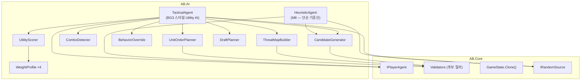
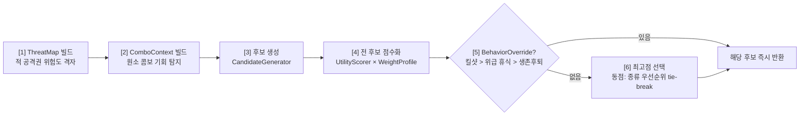

# 12 — AI 플레이어 설계: HeuristicAgent / TacticalAgent

> 선행 문서: [05-game-flow.md](05-game-flow.md) §1 (IPlayerAgent 계약)
> 소속 어셈블리: `AB.AI` (순수 C#, `AB.Core`만 참조 — Unity 없이 콘솔에서 구동 가능)
> 기존 자산: TS `packages/ai/src/tactical/` (BG3/DOS2 스타일 Utility AI)을 분석해
> 본 문서의 포팅 명세로 재기술했다. 가중치 수치는 기존 값을 그대로 승계한다.

---

## 1. 설계 원칙

| ID | 원칙 | 내용 |
|---|---|---|
| A-01 | **계약 단일** | AI는 `IPlayerAgent` 구현체일 뿐. 엔진은 인간과 구분하지 않는다 (P-06) |
| A-02 | **룰 중복 구현 금지** | 후보 생성은 코어 Validator(`GetReachableTiles`/`GetAttackableTargets`), 결과 예측은 코어 공식/Resolver 재사용. AI 안에 "룰 사본"을 만들지 않는다 |
| A-03 | **원본 불변** | 수읽기는 `state.Clone()` 위에서만. 원본 GameState에 쓰기 금지 |
| A-04 | **결정론** | AI 내부 무작위는 **주입받은 `IRandomSource`만** 사용. 동점 해소는 명시적 tie-break 규칙. → 같은 시드 = 같은 게임 (IT-02 성립 조건) |
| A-05 | **시간 예산** | 액션 결정 < 200ms (탐색 없는 유틸리티 방식으로 달성). "생각하는 척" 지연은 Presentation 책임 — AI는 즉시 반환 |
| A-06 | **설명 가능성** | 모든 점수는 `Breakdown`(항목별 기여)을 남긴다. 디버그 오버레이/밸런싱에 사용 |

## 2. 구조



두 에이전트 모두 `CandidateGenerator`를 공유한다. 차이는 **선택 방법**뿐:
Heuristic = 거의 무작위(기준선·테스트용), Tactical = 가중 유틸리티 점수(실전용).

---

## 3. 공통 기반

### 3-1. 후보 모델

```csharp
namespace AB.AI
{
    /// <summary>AI가 고려하는 행동 후보 1건. PlayerAction보다 풍부한 평가용 정보 포함.</summary>
    public abstract class ActionCandidate
    {
        /// <summary>이 후보를 실제 제출용 PlayerAction으로 변환.</summary>
        public abstract PlayerAction ToAction(PlayerId playerId, UnitId unitId);
    }

    public sealed class AttackCandidate : ActionCandidate
    {
        public GridPos Target { get; }
        public GridPos? SourceTile { get; }              // r1 흡수 후보 (null = 흡수 안 함)
        /// <summary>AffectedPositions 위의 적 유닛들 (관통/범위 추가 피격 포함).</summary>
        public IReadOnlyList<UnitState> AffectedEnemies { get; }
    }

    public sealed class MoveCandidate : ActionCandidate
    {
        public GridPos Destination { get; }
    }

    /// <summary>
    /// "이동 후 공격" 복합 후보. 평가는 한 덩어리로 하되, 제출은 Move 먼저 —
    /// 멀티-액션 루프가 이동 후 다시 액션을 요청하므로 (룰 §6.2) 두 번에 걸쳐 자연 실행된다.
    /// 두 번째 요청에서 TacticalAgent는 파이프라인을 다시 돌리며, 정상적으로는
    /// 동일 target의 AttackCandidate가 최고점이 된다 (계획 고정 캐시를 두지 않는 단순 설계 —
    /// 이동 결과로 더 좋은 수가 생겼다면 그걸 택하는 게 맞다).
    /// </summary>
    public sealed class MoveAttackCandidate : ActionCandidate
    {
        public GridPos Destination { get; }
        public GridPos Target { get; }
        public GridPos? SourceTile { get; }
        public IReadOnlyList<UnitState> AffectedEnemies { get; }
        // ToAction은 MoveAction을 반환한다 (위 주석 참조)
    }

    public sealed class SkillCandidate : ActionCandidate    // t2 풀 등 액티브 스킬
    {
        public MetaId SkillId { get; }
        public GridPos Target { get; }
    }

    public sealed class RestCandidate : ActionCandidate { }   // 체력 1 회복 + 전 상태이상 제거 (공격 대신, 이동 후 가능)
    public sealed class PassCandidate : ActionCandidate { }
}
```

### 3-2. ICandidateGenerator

```csharp
namespace AB.AI
{
    /// <summary>
    /// 현재 슬롯 유닛의 가능한 후보 전부 생성. 생성 규칙:
    ///  1. 공격 후보 (Attacked==false):
    ///     GetAttackableTargets 각 좌표 → Validate → AffectedEnemies ≥ 1인 것만
    ///     (적이 안 맞는 공격은 후보에서 제외 — 단, 타일 깔기용 속성 공격은
    ///      ComboSetup 가치가 있으므로 wComboSetup>0 프로파일에서는 빈 타일 대상도 허용)
    ///     r1 무기(AdjacentTileAbsorb): 인접 속성 타일이 있으면 (sourceTile 지정/미지정) 양쪽 후보 생성
    ///  2. 이동 후보 (Moved==false): GetReachableTiles 전부
    ///  3. 이동+공격 후보 (둘 다 false):
    ///     각 도달 칸에 대해 Clone 상태에서 유닛을 가상 이동 → GetAttackableTargets
    ///     → (목적지, 대상) 쌍 중복 제거 후 후보화
    ///  4. 스킬 후보: 보유 액티브 스킬 × 유효 대상 (oneShot 사용 이력 제외)
    ///  5. 휴식 후보: !빙결 && !Attacked (이동 후에도 생성; 전제조건 없음, 보통 상태이상/저체력일 때만 가치 있음)
    ///     — 이동 후 휴식이므로 MoveRest 형태(이동 목적지 + 휴식)도 후보화 가능 (안전 칸으로 빠진 뒤 정비)
    ///  6. 패스: 항상 1개 (폴백 보장 — 후보 목록이 절대 비지 않는다)
    /// 순서: 위 1~6 생성 순서 고정 + 각 단계 내부는 좌표 (row,col) 사전순 (A-04).
    /// </summary>
    public interface ICandidateGenerator
    {
        IReadOnlyList<ActionCandidate> Generate(UnitState unit, GameState state);
    }
}
```

> **기존 TS 대비 보강 2건**: ① 스킬 후보 누락(기존 TS는 skill 미생성 — t2 풀을 안 씀) 추가
> ② r1 sourceTile 흡수 후보 추가. 포팅 시 누락 금지.

### 3-3. IDamageEstimator — 데미지 예측 (코어 공식 재사용)

```csharp
namespace AB.AI
{
    /// <summary>
    /// 후보 평가용 데미지 예측. 코어의 §8.9 공식(아머→반응 배율→acid ×2, 단계별 floor)을
    /// 그대로 호출한다 (AttackResolver에서 공식 부분을 정적 함수로 분리해 공유).
    /// 기존 TS의 "damage−armor만 계산" 근사보다 정확 — 반응 배율 0(빙결에 화염 등)을
    /// 모르고 헛공격하는 버그가 사라진다.
    /// </summary>
    public interface IDamageEstimator
    {
        int Estimate(UnitState attacker, WeaponDef weapon, AttackAttribute effectiveAttr,
                     UnitState target);
        /// <summary>이 공격으로 대상이 죽는가.</summary>
        bool IsLethal(UnitState attacker, WeaponDef weapon, AttackAttribute effectiveAttr,
                      UnitState target);
    }
}
```

---

## 4. HeuristicAgent — 기준선 (마일스톤 M8)

```csharp
namespace AB.AI
{
    /// <summary>
    /// 최소 동작 AI. 목적: ① 통합 테스트(IT-01)의 게임 완주 보장 ② Tactical의 성능 비교 기준선.
    /// 정책:
    ///  - 드래프트: 풀 앞에서부터 순서대로, 스폰 포인트 앞에서부터 배치
    ///  - 유닛 순서: 기본 순서 그대로 제출
    ///  - 액션: 후보 중 공격 가능하면 (피해 기대값 최대) 공격, 없으면
    ///          가장 가까운 적 방향으로 접근하는 이동, 그것도 없으면 패스.
    ///          동점은 IRandomSource로 선택 (주입 시드라 재현 가능).
    /// </summary>
    public sealed class HeuristicAgent : IPlayerAgent
    {
        public HeuristicAgent(PlayerId id, GameContext ctx, IRandomSource random);
        // IPlayerAgent 4메서드 구현
    }
}
```

---

## 5. TacticalAgent — Utility AI (실전용, 기존 TS 포팅)

Dave Mark의 Utility AI (GDC 2012): 탐색 없이 **후보별 가중합 점수 → 최고점 선택**. <200ms 보장.

### 5-1. 액션 결정 파이프라인 (RequestActionAsync)



### 5-2. ThreatMap — 위험도 격자

```csharp
namespace AB.AI.Tactical
{
    /// <summary>
    /// 적 공격권 기반 위험도 [0,1] 격자.
    /// 빌드 규칙 (기존 TS 승계):
    ///  - 각 적의 현재 위치 GetAttackableTargets → 해당 칸 +1.0
    ///  - 적이 아직 미이동이면: 인접 빈 칸 최대 8곳으로 가상 이동(Clone) 후
    ///    GetAttackableTargets → 해당 칸 +0.5  (1수 앞 근사)
    ///  - 전체를 최댓값으로 정규화 → [0,1]
    /// </summary>
    public interface IThreatMapBuilder
    {
        ThreatMap Build(IReadOnlyList<UnitState> enemies, GameState state);
    }

    public sealed class ThreatMap
    {
        public float DangerAt(GridPos pos);      // 0 = 안전, 1 = 최고 위험
    }
}
```

### 5-3. ComboContext — 원소 콤보 탐지

```csharp
namespace AB.AI.Tactical
{
    /// <summary>
    /// 즉시 콤보: 적의 현재 효과/타일과 내 공격 속성의 시너지 → 보너스 피해 환산.
    /// 셋업 기회: 내 속성 공격으로 타일/효과를 깔면 아군 무기가 활용 가능한 조합.
    /// </summary>
    public interface IComboDetector
    {
        ComboContext Build(UnitState myUnit, IReadOnlyList<UnitState> enemies,
                           IReadOnlyList<UnitState> allies, GameState state);
    }

    public sealed class ComboContext
    {
        /// <summary>적 UnitId → 즉시 콤보 보너스 피해 (점수 환산용 가상치).</summary>
        public IReadOnlyDictionary<UnitId, int> ImmediateCombo { get; }
        /// <summary>적 UnitId → 셋업 기회 존재 (아군 속성과의 조합).</summary>
        public IReadOnlyCollection<UnitId> SetupOpportunities { get; }
    }
}
```

**콤보 테이블은 재설계 룰 기준으로 재정의한다** — 기존 TS 테이블에는 현 룰에 없는
항목(chainShock 등)이 섞여 있어 그대로 포팅 금지. 현 룰(§21 반응 + 산성 배율)에서 유효한 조합:

| 셋업 (선공) | 트리거 (후속) | 효과 | 보너스 환산 |
|---|---|---|---|
| acid 부여 (acid 속성 공격/타일) | 아무 공격 | 피격 피해 ×2 | `예상피해 × 1` (2배가 되므로) |
| freeze 부여 (ice 속성/타일) | — | 1턴 행동 불가 | 고정 +2 |
| 적을 fire/electric 타일 위로 넉백·풀 | 턴 시작 타일 피해 | 1~2 지속 피해 | 타일 DamagePerTurn 값 (acid 타일은 0이라 제외) |
| (역방향 주의) fire 보유 적에 water/ice 공격 | — | fire 제거 = **아군에 손해** | 페널티로 반영 (배율 0/1 + 제거) |

### 5-4. UtilityScorer — 점수 공식 (규범)

```
Attack / MoveAttack 후보:
  + wDamage      × Σ EstimateDamage(각 피격 적)        // IDamageEstimator — 반응·acid 포함
  + wKillBonus   × (IsLethal인 적 수)
  + wFocusFire   × Σ (1 − 적 HP비율)
  + wMultiHit    × max(0, 피격 적 수 − 1) × 기본피해
  + wComboExploit× ImmediateCombo[1차 대상]            // 있으면
  + wComboSetup                                        // 셋업 기회 있으면
  + wSkillBonus                                        // SkillCandidate일 때
  (MoveAttack 추가) − wThreatPenalty × ThreatMap.DangerAt(목적지)

Move 후보:
  + wApproach    × (목적지 기준 거리 ≤ 사거리+여유 인 적 수)
  + wRetreat     × (HP비율 < wSurvivalThreshold 일 때, 최근접 적과의 거리 증가량)
  − wThreatPenalty × DangerAt(목적지)
  − wAllyProximity × (목적지 인접 아군 수)              // 관통/범위 한 줄 서기 방지

Rest: + wRestBase × (제거되는 상태이상 수 + (HP 손실 시 1))   // 멀쩡하면 0에 수렴 → 낭비 휴식 억제
Pass:       − wPassPenalty
```

**동점 tie-break (A-04)**: 점수 동일 시 종류 우선순위 `Attack > MoveAttack > Skill > Rest > Move > Pass`,
그래도 동점이면 대상/목적지 (row, col) 사전순.

### 5-5. WeightProfile — 가중치 4종 (기존 값 승계, 규범 수치)

```csharp
public sealed class WeightProfile
{
    public string Name;
    public float WDamage, WKillBonus, WFocusFire, WComboSetup, WComboExploit, WMultiHit;
    public float WApproach, WRetreat, WRolePosition, WThreatPenalty, WAllyProximity;
    public float WRestBase, WPassPenalty, WSkillBonus;
    public float WSurvivalThreshold;   // 이 HP 비율 미만이면 후퇴 로직 활성화
}
```

| 가중치 | aggressive | defensive | balanced | test† |
|---|---|---|---|---|
| wDamage | 3.0 | 1.5 | 2.0 | 2 |
| wKillBonus | 5.0 | 3.0 | 4.0 | 100 |
| wFocusFire | 2.0 | 1.0 | 1.5 | 10 |
| wComboSetup | 0.5 | 2.0 | 1.5 | 0 |
| wComboExploit | 4.0 | 2.5 | 3.0 | 0 |
| wMultiHit | 1.5 | 1.0 | 1.2 | 0 |
| wApproach | 2.0 | 0.5 | 1.2 | 1 |
| wRetreat | 0.3 | 2.5 | 1.2 | 0 |
| wRolePosition | 0.5 | 2.0 | 1.5 | 0 |
| wThreatPenalty | 0.5 | 3.0 | 1.5 | 0 |
| wAllyProximity | 0.2 | 0.8 | 0.5 | 0 |
| wRestBase | 1.0 | 3.0 | 2.0 | 50 |
| wPassPenalty | 2.0 | 0.5 | 1.0 | 5 |
| wSkillBonus | 3.0 | 1.5 | 2.0 | 0 |
| wSurvivalThreshold | 0.15 | 0.40 | 0.30 | 0 |

† test: **정수 가중치 + 콤보/위협 0** — 부동소수 오차·불확실성 제거한 결정론 테스트 전용.
프로파일은 `MatchConfigSo`(03 문서)에서 선택. 데이터이므로 SO 에셋화 가능 (`WeightProfileSo`).

### 5-6. BehaviorOverride — 점수 무시 즉각 행동 (우선순위 순)

```
1. KillShot     : IsLethal인 Attack/MoveAttack 후보 존재 → 그 중 킬 수 최다 후보 즉시 선택
2. EmergencyRest: 위급(예: 화염 보유로 다음 턴 사망 위험 or 상태이상 다수) && Rest 후보 존재
                  → 즉시 휴식 (체력 1 회복 + 전 상태이상 제거). 단 KillShot이 우선.
3. SurvivalRetreat: HP비율 < wSurvivalThreshold && 적에게서 멀어지는 Move 후보 존재
                   → 후퇴 점수 최대 Move 선택
없으면 null → 일반 점수 선택으로
```

> 왜 점수에 안 녹이고 오버라이드로 두나: 가중치 튜닝과 무관하게 **절대 놓치면 안 되는 행동**
> (킬 기회를 두고 안전 이동을 고르는 류의 바보짓)을 구조적으로 차단. 디버그도 쉬움.

### 5-7. UnitOrderPlanner — 유닛 순서 제출 (RequestUnitOrderAsync)

```
각 생존 유닛 점수 = (즉시 공격 가능 적 수) × 100
                 + (이동력+사거리 내 적 수) × 10
정렬: 점수 내림차순 → 클래스 우선순위 (fighter/brute=1, ranger=2, tanker=3) 오름차순
     → UnitId 사전순 (결정론)
```

의도: 킬각 잡힌 딜러가 먼저 움직여 적 유닛을 줄인 뒤 나머지가 움직인다 (인터리브에서 선턴 가치 극대화).

### 5-8. DraftPlanner — 드래프트 제출 (RequestDraftAsync)

기존 TS는 "풀 첫 유닛" 수준이라 새로 정의한다:

```
1. 구성 규칙: 탱커 ≥ 1 (t1/t2), 원거리 ≥ 1 (r1/r2), 나머지는 풀 순서
2. 배치 규칙: 탱커를 적 방향 최전방 스폰 포인트에, 원거리를 최후방에,
   나머지는 남은 칸 (스폰 포인트를 적 평균 위치와의 거리로 정렬)
3. 모든 선택은 위 규칙으로 유일 결정 — 무작위 없음
```

---

## 6. 결정론 규약 (A-04 상세)

1. `AgentFactory`(AB.Game)는 에이전트 생성 시 **`ctx.Random`에서 파생한 `IRandomSource`를 주입**한다
   (코어 RNG와 스트림 분리: `random.Fork(playerIndex)` — 같은 시드면 같은 파생).
   `IRandomSource`에 `Fork(int)` 메서드를 추가한다 ([01 문서 §5](01-architecture.md) 인터페이스 개정).
2. 후보 생성·순회·정렬 순서 전부 고정 (각 절에 명시된 사전순 규칙).
3. float 가중합은 같은 입력·같은 연산 순서면 같은 결과 — 순회 순서 고정으로 충분.
   e2e 검증이 필요한 테스트는 `test` 프로파일(정수) 사용.
4. `Task.Run` 병렬화를 하더라도 **후보 분할·병합 순서는 인덱스 기준 고정** (스레드 완료 순서 의존 금지).

## 7. 성능 예산

| 항목 | 추정 | 비고 |
|---|---|---|
| 후보 수 | 이동 ≤ ~25 (이동력 3) + 이동×공격 ≤ ~50 + 공격 ≤ ~8 | 16×16, 유닛 6기 기준 |
| ThreatMap | 적 6기 × (1 + 8 가상이동) × GetAttackableTargets | 가장 비쌈 — 슬롯당 1회 캐시 |
| 총 시간 | « 200ms (탐색 없음, 전부 O(후보 수)) | Clone은 이동×공격 후보당 1회가 아니라 **가상 위치 덮어쓰기 1회 재사용**으로 절약 |

## 8. 확장 슬롯 (현 범위 밖, 자리만)

- **MctsAgent**: 기존 TS `mcts-adapter.ts` 참조. `Clone()` + ActionProcessor 전체 실행으로
  플레이아웃. Utility AI가 평가 함수/플레이아웃 정책으로 재사용된다. 시간 예산 정책 필요.
- **RL**: `IPlayerAgent` 뒤에 정책 네트워크. 헤드리스 시뮬레이션(G-07)이 학습 환경.

## 9. 테스트

| ID | 내용 |
|---|---|
| AI-01 | CandidateGenerator: 상황별 후보 집합 정확성 (스킬/흡수 후보 포함 — §3-2 보강 2건 회귀) |
| AI-02 | UtilityScorer: 수치 고정 입력 → Breakdown 항목별 기대값 |
| AI-03 | BehaviorOverride: 킬샷/위급 휴식/후퇴 각 발동·비발동 경계 |
| AI-04 | UnitOrderPlanner: 점수·tie-break 결정성 |
| AI-05 | Tactical vs Heuristic 100판 → Tactical 승률 ≥ 70% (기준선 우위 회귀 가드) |
| AI-06 | 같은 시드 Tactical vs Tactical 2회 → 동일 액션 시퀀스 (A-04) |
| AI-07 | 전 프로파일 × 100판 헤드리스 완주, 불변식 위반 0 (IT-01 확장) |
