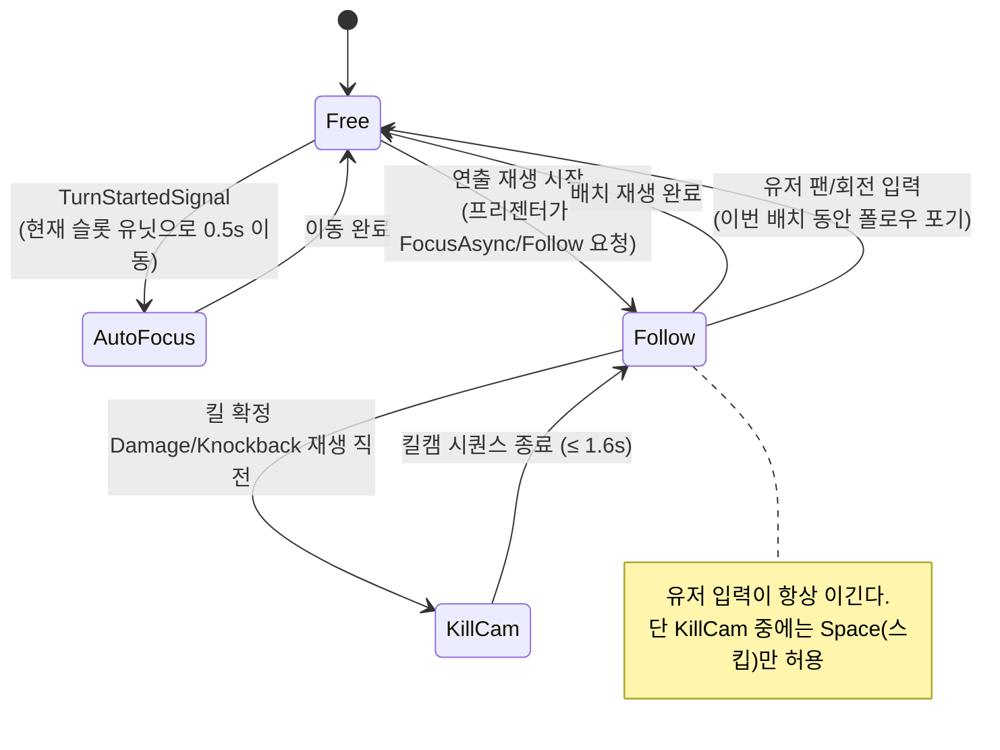

# 13 — 카메라 설계: XCOM 스타일 전술 카메라 + UI/UX

> 선행 문서: [07-presentation.md](07-presentation.md)
> 소속: `AB.Presentation.Camera` (CameraDirector), Cinemachine 3.x 사용
>
> **확정된 결정 (2026-06-13 사용자 확인):**
> 1. **보드를 3D로 전환한다** — 90° 스냅 회전 포함 풀 XCOM 카메라. 07/03/01 문서의 2D 전제는 본 문서 기준으로 개정됨.
> 2. **액션 캠(킬캠)은 킬/마무리 일격에만** 발동. 옵션으로 끌 수 있다.

---

## 1. 좌표 전제 (3D 전환)

- 보드는 **XZ 평면**: `GridPos(row, col)` → 월드 `(x = col × cellSize, y = 0, z = row × cellSize)`.
  변환은 기존대로 `IBoardLayout`이 유일 창구 (시그니처 불변 — 내부 구현만 3D).
- 유닛/타일은 **3D 모델 프리팹으로 확정** (2026-06-13 결정). 빌보드 스프라이트 안 폐기 — 4방향 회전 시 모델이 자연 대응.
- **코어(AB.Core)는 변경 0건.** 그리드/룰은 2D 논리 좌표 그대로다. 3D는 표현 문제일 뿐.

## 2. 카메라 리그 구조

```
CameraRig (Transform)            ← 팬 대상: XZ 위치만 가짐, 보드 경계 클램프
└── YawPivot                     ← 90° 스냅 회전 (yaw: 45/135/225/315°)
    └── Boom                     ← pitch 고정 50°, 줌 = 카메라-피벗 거리
        └── CinemachineCamera "vcamTactical"   (priority 10)
CinemachineCamera "vcamKill"     (priority 0→20, 킬캠 시 활성)   ← 독립 배치
```

| 파라미터 | 값 | 비고 |
|---|---|---|
| 투영 | Perspective, **FOV 35°** | 낮은 FOV = 약한 원근, XCOM 질감 |
| pitch | 고정 **50°** | 회전/줌과 무관하게 불변 |
| yaw 기본 | **45°** (보드 모서리 정면) | 스냅: 45 → 135 → 225 → 315 |
| 줌 (Boom 거리) | 3단: **Close 8 / Standard 14 / Far 22** | Far에서 16×16 전체가 화면에 들어오도록 cellSize와 함께 튜닝 |
| 팬 클램프 | Rig 위치를 보드 AABB + 2셀 여유로 clamp | 회전 상태와 무관 (Rig는 월드 기준) |
| 블렌드 | vcam 전환 0.4s EaseInOut | 킬캠 진입/복귀 |

## 3. 유저 조작 사양

| 입력 | 동작 | 비고 |
|---|---|---|
| WASD / 방향키 | 팬 (카메라 yaw 기준 방향) | 속도 12 units/s × 줌 비율 |
| MMB 드래그 | 팬 | 드래그 중 커서 변경 |
| 마우스 화면 가장자리 | 엣지 스크롤 | **기본 off** (옵션, 창모드 오작동 잦음) |
| Q / E | yaw 90° 스냅 회전 (0.3s 트윈) | 회전 중 입력 큐잉 1회 |
| 휠 | 줌 단계 이동 (Close↔Standard↔Far) | 0.25s 트윈 |
| T | 현재 턴 유닛으로 카메라 복귀 | XCOM의 "선택 유닛 복귀" |
| Space | 연출 스킵 (PresentationQueue.FastForward) | 킬캠도 즉시 종료 |
| 우클릭/ESC | (카메라 아님 — 타게팅 취소, 07 §5) | 충돌 없음 확인됨 |

**회전과 게임 룰 무관 보장**: 회전은 표현일 뿐, GridPos·방향(상하좌우)·룰은 불변.
단, 팬 입력(WASD)은 **카메라 yaw 기준**으로 매핑한다 — 회전 후 W가 "화면 위"가 되도록.

## 4. 자동 카메라 — 상태기계



**우선순위 원칙**: `유저 입력 > KillCam > Follow > AutoFocus`. 유저가 카메라를 만지면
그 배치가 끝날 때까지 자동 추적을 재개하지 않는다 (XCOM 동일 — 다음 액션부터 재개).

### ChangeKind별 폴로우 정책 (프리젠터 → CameraDirector 요청 표)

| ChangeKind | 카메라 동작 |
|---|---|
| UnitMove (자발/rush) | 시작 전 출발지로 `FocusAsync`, 재생 중 유닛 `Follow` |
| UnitDamage / Heal | 대상이 화면 밖이면 `FocusAsync(대상)`, 안이면 유지 |
| UnitKnockback / Pull | 1차 대상 `Follow` (밀려나는 방향 추적) |
| UnitRiverEnter | `FocusAsync(강 지점)` + 0.2s 홀드 |
| UnitDeath | 킬캠 대상이면 KillCam이 이미 잡고 있음. 아니면 `FocusAsync` + 0.3s 홀드 |
| TileAttributeChange (전파 다발) | 변환 영역 전체 `FrameArea(positions)` — 셀 단위 점프 금지 (멀미) |
| UnitSpawn (드래프트) | 내 스폰만 `FocusAsync`, 상대 스폰은 화면 밖이면 무시 |
| 그 외 (플래그/턴/라운드) | 카메라 무동작 |

원거리 공격(공격자↔피격점 거리 > 화면): **공격자 0.3s → 피격점으로 팬** 2컷. 관통은 피격 라인 전체를 `FrameArea`.

## 5. 킬캠 (확정: 킬/마무리 일격만)

### 발동 판정 — 배치 lookahead

사망은 일괄 판정이라 Damage 재생 시점엔 "이게 킬인지" 모른다. 해결:
**PresentationQueue가 배치 수신 시 전체를 선스캔**해 `UnitDeathChange`가 존재하면,
그 유닛에게 마지막 피해를 준 `UnitDamageChange`(또는 충돌 Knockback)에 **킬 마킹**을 달아
프리젠터에 전달한다. (배치는 통째로 도착하므로 lookahead 비용 0)

### 시퀀스 (총 ≤ 1.6s, Space로 즉시 스킵)

```
1. vcamKill 활성 (블렌드 0.4s): 공격자→대상 축의 측면 3/4 앵글, 거리 6, pitch 35°
2. 타격 연출 재생 + 타임스케일 0.4 (0.5s)     ← 슬로모는 연출 전용 — 코어는 이미 끝났음
3. 사망 연출 시작과 함께 타임스케일 복귀
4. vcamTactical 복귀 (블렌드 0.4s), Follow 상태로
```

제약:
- **한 배치에 킬이 여럿**(관통 다중킬): 킬캠 1회만 — 마지막 킬 기준. 연속 킬캠 금지 (템포).
- AI vs AI 관전 + 배속 중: 킬캠 자동 비활성.
- 설정에서 off 가능 (§7).
- 턴 시작 tick 사망(화상사 등): 킬캠 **없음** — 공격 주체가 없는 죽음은 FocusAsync+홀드만.

## 6. CameraDirector 인터페이스

```csharp
namespace AB.Presentation.Cameras
{
    /// <summary>
    /// 카메라 연출의 유일한 창구. 프리젠터/입력/HUD 어디서든 카메라를 직접 만지지 않는다.
    /// 모든 메서드는 메인 스레드. Async 메서드는 트윈 완료 시 반환 (ct 취소 = 즉시 최종값).
    /// </summary>
    public interface ICameraDirector
    {
        // ── 자동 연출 (프리젠터 호출) ──
        /// <summary>지점이 화면 안이면 즉시 완료, 밖이면 팬 이동.</summary>
        Task FocusAsync(GridPos pos, CancellationToken ct);
        /// <summary>대상 Transform 추적 시작/종료 (이동/넉백 트윈 추적).</summary>
        void Follow(Transform target);
        void StopFollow();
        /// <summary>여러 좌표가 모두 들어오도록 줌/팬 (관통 라인, 전파 영역).</summary>
        Task FrameAreaAsync(IReadOnlyList<GridPos> positions, CancellationToken ct);
        /// <summary>킬캠 시퀀스 전체 (§5). killCam 옵션 off면 FocusAsync로 강등.</summary>
        Task PlayKillCamAsync(Transform attacker, Transform victim, CancellationToken ct);

        // ── 유저 조작 (입력 컨트롤러 호출) ──
        void Pan(Vector2 screenDir, float deltaTime);     // yaw 보정된 이동
        Task RotateAsync(bool clockwise, CancellationToken ct);  // 90° 스냅
        void ZoomStep(int delta);                          // -1/+1 단계
        Task ReturnToCurrentUnitAsync(CancellationToken ct);     // T 키

        /// <summary>유저가 개입했음을 통지 → Follow/AutoFocus 이번 배치 동안 포기.</summary>
        void NotifyUserOverride();

        /// <summary>현재 yaw 스냅 인덱스 (0~3). 나침반 UI/입력 매핑용.</summary>
        int YawIndex { get; }
        event Action<int> YawChanged;
    }
}
```

**프리젠터 통합**: 각 `IChangePresenter.PresentAsync` 첫 줄에서 §4 정책표에 따라
`ctx.Camera.FocusAsync(...)`를 await — 카메라 도착 후 연출 시작. 연출 순서 보장(V-03)이
카메라 컷 순서도 보장한다. `PresentationContext.Camera` 타입을 `ICameraDirector`로 확정.

## 7. UI/UX

### 7-1. 화면 요소 (3D 전환에 따른 추가)

| 요소 | 사양 |
|---|---|
| **셀 커서** | 호버 셀에 3D 데칼 쿼드 (팀 컬러). 마우스 → 보드 picking은 XZ 평면 레이캐스트 (`IBoardLayout.TryWorldToCell`) |
| **범위 하이라이트** | 기존 HighlightKind 5종을 데칼/메시 오버레이로. 이동=파랑, 공격=빨강, 흡수=보라 등 (DESIGN.md 팔레트 연동) |
| **나침반** | 화면 우하단, 현재 yaw 표시 + 클릭으로 회전 (Q/E 동일). 회전 시 0.3s 동안 하이라이트도 함께 회전 (어긋남 금지) |
| **가림 처리 ①** | 포커스 유닛/현재 턴 유닛이 지형(산)·타 유닛에 가리면 **실루엣 아웃라인** (X-ray 셰이더, 팀 컬러) |
| **가림 처리 ②** | 카메라↔포커스 지점 사이의 키 큰 타일(산)은 **디더 페이드 40%** |
| **HP/효과 월드 UI** | 유닛 머리 위 빌보드 (HP바 + 효과 아이콘 — 07 §4 `SetEffectIcons`의 3D 구현). Far 줌에서는 HP바만 |
| **타격 예측** | 타게팅 중 대상 호버 시 예상 피해/킬 표시 (IDamageEstimator 재사용 — 12 문서) + 넉백 예상 방향 화살표 |

### 7-2. 설정 옵션 (SettingsSo + 설정 패널)

| 옵션 | 기본 | 범위 |
|---|---|---|
| 킬캠 | **on** | on/off |
| 엣지 스크롤 | off | on/off |
| 카메라 속도 | 1.0 | 0.5~2.0 |
| 화면 흔들림 (피격 셰이크) | on | on/off — 접근성 |
| 회전 반전 (Q/E) | off | on/off |
| 연출 배속 | 1.0 | 1.0 / 1.5 / 2.0 (배속 ≥1.5에서 킬캠 자동 off) |

### 7-3. 멀미/접근성 원칙

- 자동 카메라 이동은 **배치당 최대 1회 팬 + Follow**. 셀 단위 다발 점프 금지 (§4 FrameArea로 묶기).
- 슬로모는 킬캠 0.5s 한정. 타임스케일 변경이 코루틴/트윈에 미치는 영향은 unscaled time 사용으로 차단 (연출 트윈은 전부 unscaled, 슬로모는 애니메이터/파티클에만).
- 회전·줌은 항상 트윈 (스냅 컷 금지), EaseInOut 고정.

## 8. 3D 전환 개정 요약 (타 문서 반영 사항)

| 문서 | 개정 내용 |
|---|---|
| [01](01-architecture.md) §1 | 렌더 파이프라인: URP 2D → **URP 3D** + 본 문서 링크 |
| [03](03-metadata.md) TileSo | `TileBase tilemapTile` → `GameObject tileVisual` (3D 타일 프리팹). `IViewCatalog.TilemapTile` → `TileVisual` |
| [07](07-presentation.md) §2 | Grid+Tilemap → 3D BoardRoot(타일 프리팹 인스턴스 풀), HighlightLayer → 데칼. `Camera` 항목이 본 문서로 위임 |
| [07](07-presentation.md) §4 | GridView 내부 구현이 Tilemap → 프리팹 스왑. **인터페이스 시그니처는 불변** |
| 코어 (02/04/05/06/08) | **변경 없음** — 보드 논리는 2D 격자 그대로 |

## 9. 검증 포인트 (PlayMode)

| ID | 확인 |
|---|---|
| CAM-01 | 4방향 회전 각각에서 WASD 팬 방향이 화면 기준과 일치 |
| CAM-02 | 회전/줌/팬 클램프 — 보드 밖으로 카메라 이탈 불가 |
| CAM-03 | 관통 다중킬 배치에서 킬캠 정확히 1회 |
| CAM-04 | 유저 팬 개입 시 Follow 즉시 해제, 다음 배치에서 재개 |
| CAM-05 | Space 스킵: 킬캠 포함 잔여 연출 즉시 최종 상태, 타임스케일 1.0 복귀 |
| CAM-06 | 배속 1.5+ 에서 킬캠 미발동 |
| CAM-07 | 가림 상태 유닛 실루엣 표시 (산 뒤 유닛 클릭도 가능해야 — picking은 평면 레이캐스트라 무관 확인) |
