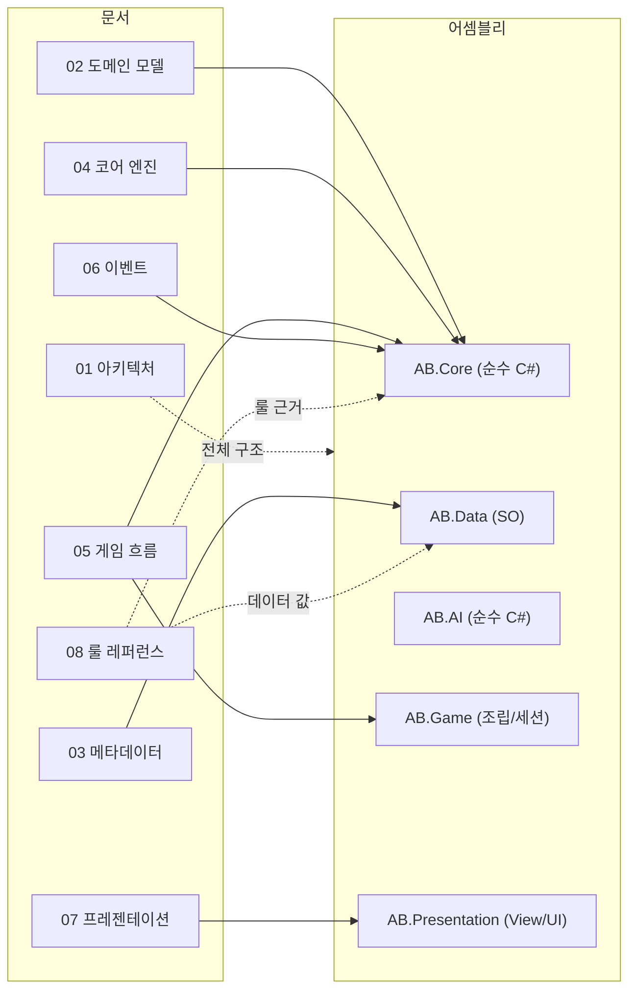
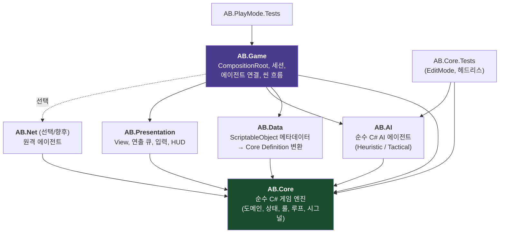

# Project AB — Unity 클라이언트/엔진 완전 재설계 문서

> 작성일: 2026-06-11
> 대상: **사람 개발자** (AI 보조 없이 이 문서만으로 구현 가능해야 함)
> 목표: 기존 TypeScript 모노레포(engine/server/client)를 **Unity 단일 프로젝트**로 완전 재설계.
> 게임 룰은 [GAME_RULES.md](../../GAME_RULES.md)와 100% 동일하며, 본 문서 세트의
> [08-rules-reference.md](08-rules-reference.md)에 구현 가능한 수준으로 전부 재수록되어 있다.

---

## 1. 문서 구성 (읽는 순서)

| # | 문서 | 내용 | 주 독자 |
|---|------|------|---------|
| 0 | **README.md** (본 문서) | 설계 목표, 전체 그림, 문서 지도 | 전원 |
| 1 | [01-architecture.md](01-architecture.md) | 어셈블리 구조, 의존성 그래프, DI, 스레딩/결정론 정책 | 전원 |
| 2 | [02-domain-model.md](02-domain-model.md) | 도메인 타입, 게임 상태, GameChange, PlayerAction 전체 정의 | 코어 담당 |
| 3 | [03-metadata.md](03-metadata.md) | ScriptableObject 메타데이터 시스템, DataRegistry | 코어/데이터 담당 |
| 4 | [04-core-engine.md](04-core-engine.md) | Validator / Resolver / Manager 인터페이스 + 처리 파이프라인 | 코어 담당 |
| 5 | [05-game-flow.md](05-game-flow.md) | GameLoop, 턴/라운드/드래프트 흐름, IPlayerAgent, 타임아웃 | 코어/앱 담당 |
| 6 | [06-events.md](06-events.md) | SignalBus, 시그널 정의, **발행–구독 매트릭스/그래프** | 전원 |
| 7 | [07-presentation.md](07-presentation.md) | 씬 구조, View, PresentationQueue(연출 재생), 입력/UI | 클라 담당 |
| 8 | [08-rules-reference.md](08-rules-reference.md) | **게임 룰 완전 명세** (수치, 데이터, 처리 순서, 에러코드) | 전원 |
| 9 | [09-testing-and-roadmap.md](09-testing-and-roadmap.md) | 테스트 전략, 구현 마일스톤 | 전원 |
| 10 | [10-worked-examples.md](10-worked-examples.md) | 워크스루 예제 재생성 가이드 — 메타데이터 단일 소스 기준 | 코어 담당 |
| 11 | [11-action-flows.md](11-action-flows.md) | **액션별 처리 흐름 가이드** — 입력→연출 전 구간, FAQ | **초보/신규 합류자 (첫 문서로 권장)** |
| 12 | [12-ai-design.md](12-ai-design.md) | AI 플레이어 설계 — Utility AI 파이프라인, 가중치, 결정론 규약 | AI 담당 |
| 13 | [13-camera-design.md](13-camera-design.md) | XCOM 스타일 카메라 — 리그/조작/폴로우/킬캠, UI·UX (※ **3D 전환 결정** 포함) | 클라 담당 |

### 문서 ↔ 모듈 지도



---

## 2. 게임 한 줄 요약

**Project AB**는 16×16 그리드에서 진행되는 1v1(또는 2v2) 턴제 전략 게임이다.
드래프트로 유닛(최대 6기)을 배치하고, 매 라운드 양측이 동시에 유닛 행동 순서를 제출한 뒤,
교차(interleave) 턴 순서로 유닛을 조작한다. 이동(다익스트라) + 직교 직선 공격,
6종 속성(화염/물/산성/감전/빙결/모래)과 타일 변환·원소 반응·넉백/풀/돌진/관통이 핵심 메카닉이다.
상대 전멸 시 승리, 30라운드 초과 시 생존 유닛 수로 판정한다.

---

## 3. 재설계 목표 및 결정 사항

### 3-1. 목표

| ID | 목표 | 달성 수단 |
|----|------|----------|
| G-01 | **룰 로직과 Unity의 완전 분리** | `AB.Core`는 UnityEngine 참조 0개. 순수 C# (.NET Standard 2.1) |
| G-02 | **결정론** (같은 시드+같은 입력 = 같은 결과) | `IRandomSource` 주입, 시간/프레임 의존 금지, 리플레이로 검증 |
| G-03 | **사람이 구현 가능한 명세** | 모든 인터페이스 시그니처 + 처리 순서 + 수치 명문화 |
| G-04 | **연출과 상태의 분리** | 상태는 즉시 갱신, 연출은 `ChangeBatch`를 PresentationQueue가 순차 재생 |
| G-05 | **플레이어 종류 무관** | 인간/AI/리플레이/(향후)네트워크 모두 `IPlayerAgent` 하나로 |
| G-06 | **데이터 주도** | 유닛/무기/스킬/효과/타일/맵 전부 ScriptableObject. 코드에 수치 하드코딩 금지 |
| G-07 | **헤드리스 시뮬레이션** | AI 학습/밸런스 테스트를 Unity 없이 콘솔에서 실행 가능 |

### 3-2. 기존(TS) 대비 주요 설계 변경

| 항목 | 기존 (TypeScript) | 재설계 (Unity/C#) | 이유 |
|------|------------------|-------------------|------|
| 상태 모델 | 완전 불변(매번 새 객체) | **단일 변경 지점(StateApplicator)을 가진 가변 상태 + `IReadOnlyGameState` 뷰** | C#에서 매 변경마다 전체 복사는 GC 부담. 변경 지점을 1곳으로 강제해 불변의 이점(추적 가능성) 유지. AI 시뮬레이션용으로 `Clone()` 제공 |
| 메타데이터 | JSON + Zod | **ScriptableObject + 에디터 검증(OnValidate)** → 순수 C# Definition으로 변환 | Unity 에디터에서 기획자가 직접 편집, 코어는 SO를 모름 |
| 이벤트 | 문자열 키 EventBus | **타입 기반 SignalBus** (`Publish<T>` / `Subscribe<T>`) | 컴파일 타임 안전성, 페이로드 캐스팅 제거 |
| 비동기 | Promise / async | **Task + CancellationToken** (코어), 메인 스레드 await (앱) | 코어의 Unity 비의존 유지. UniTask는 앱 레이어에서 선택적 사용 |
| 클라 통신 | WebSocket (서버 권위) | **로컬 권위 엔진 내장** + 네트워크는 `IPlayerAgent` 구현으로 확장점만 확보 | 1차 목표는 로컬 PvE/PvP. 프로토콜은 [unity-ws-protocol.md](../unity-ws-protocol.md) 재사용 가능 |
| 연출 | React 상태 동기 렌더 | **GameChange 스트림을 큐로 순차 재생** (명령 패턴) | 턴제 게임 연출(이동→피격→넉백→사망)의 순서 보장 |

### 3-3. 유지하는 원칙 (기존 P-01 ~ P-10 승계)

- **[P-01] 하드코딩 금지** — 수치는 전부 SO/`GameConstants`에서.
- **[P-02] 인터페이스 우선** — 본 문서의 모든 서비스는 인터페이스가 먼저 정의됨.
- **[P-03] 단일 변경 지점** — 상태 변경은 `StateApplicator.Apply()` 한 곳에서만.
- **[P-04] 단일 책임** — Validator는 판정만, Resolver는 변화 계산만, Applicator는 적용만.
- **[P-05] 생성자 주입** — `new`는 CompositionRoot(GameInstaller)와 테스트에서만.
- **[P-06] 공통 플레이어 API** — 엔진은 상대가 인간인지 AI인지 모른다.
- **[P-08] 이벤트 기반 전파** — 코어는 구독자를 모른다. SignalBus로만 발행.
- **[P-09] 테스트 필수** — Validator/Resolver/Applicator 100% 커버리지 목표.
- **[P-10] ID 기반 참조** — 모든 게임 데이터는 `MetaId`(문자열) 참조.

---

## 4. 전체 아키텍처 한눈에 보기

### 4-1. 어셈블리 의존성 그래프



**핵심 규칙: 화살표는 위로만(코어 방향으로만) 향한다. `AB.Core`는 아무것도 참조하지 않는다.**

### 4-2. 런타임 데이터 흐름 (1턴의 생애)

```mermaid
sequenceDiagram
    participant Agent as IPlayerAgent<br/>(인간/AI/리플레이)
    participant Loop as GameLoop
    participant Proc as ActionProcessor
    participant Val as Validators
    participant Res as Resolvers
    participant App as StateApplicator
    participant Bus as SignalBus
    participant PQ as PresentationQueue
    participant View as Views (Unit/Tile/HUD)

    Loop->>Agent: RequestActionAsync(ctx, 60s 타임아웃)
    Agent-->>Loop: PlayerAction (타임아웃 시 Pass)
    Loop->>Proc: Process(action)
    Proc->>Val: Validate(action, state)
    alt 거부
        Proc->>Bus: ActionRejectedSignal(errorCode)
    else 승인
        Proc->>Res: Resolve(action, state) → GameChange[]
        Proc->>App: Apply(changes) — 상태 즉시 갱신
        Proc->>Bus: ActionAcceptedSignal(ChangeBatch)
    end
    Bus->>PQ: ChangeBatch 수신 (큐 적재)
    PQ->>View: change 1개씩 순차 연출 재생
    Note over PQ,View: 연출이 끝나지 않아도<br/>코어 상태는 이미 최신
```

### 4-3. 룰 → 담당 모듈 매핑

| 룰 영역 (08-rules 절) | 담당 모듈 | 문서 |
|---|---|---|
| 게임 전체 루프, 페이즈 | `GameLoop`, `GameSession` | 05 |
| 드래프트 (§3) | `DraftManager` | 04, 05 |
| 라운드/유닛 순서 드래프트 (§4–5) | `RoundManager`, `TurnOrderBuilder` | 04, 05 |
| 턴/멀티 액션 (§6) | `TurnController`, `ActionProcessor` | 05 |
| 이동 (§7) | `MovementValidator`, `MovementResolver` | 04 |
| 공격 (§8) | `AttackValidator`, `AttackResolver`, `AffectedPositionCalculator` | 04 |
| 원소 반응 (§9) | `ElementalReactionTable` | 04 |
| 넉백/풀 (§10) | `KnockbackResolver`, `PullResolver` | 04 |
| 효과 (§11) | `EffectManager`, `EffectResolver` | 04 |
| 타일 (§12–13) | `TileEntryResolver`, `PassiveResolver` | 04 |
| 공격 처리 순서 (§14) | `AttackResolver` 파이프라인 | 04 |
| 턴 시작 처리 (§15) | `EffectManager.ProcessTurnStart` | 04 |
| 유닛/무기/스킬/효과/타일/맵 데이터 (§16–23) | `AB.Data` SO 에셋 | 03, 08 |
| 승리 판정 (§24) | `EndDetector` | 04 |
| 상수 (§25) | `GameConstants` | 02 |
| 에러 코드 (§26) | `RuleErrorCode` enum | 02 |

---

## 5. 용어집

| 용어 | 정의 |
|------|------|
| **Definition (Def)** | SO에서 변환된 순수 C# 읽기 전용 메타데이터 (예: `UnitDef`) |
| **GameState** | 진행 중인 게임의 전체 상태. `StateApplicator`만 변경 가능 |
| **GameChange** | 상태에 적용될 원자적 변화 1건 (18종). 연출 재생의 단위이기도 함 |
| **ChangeBatch** | 한 액션 처리로 발생한 GameChange의 순서 있는 묶음 |
| **Signal** | SignalBus로 발행되는 타입 기반 이벤트 객체 |
| **Agent** | 플레이어 의사결정 주체 (`IPlayerAgent`) — 인간 입력 / AI / 리플레이 / 원격 |
| **TurnSlot** | 이번 라운드 턴 순서의 한 칸 (playerId + unitId) |
| **메타 ID (MetaId)** | `"t1"`, `"wpn_ta_melee_kb"` 같은 데이터 식별 문자열 |
| **속성 (Attribute)** | 공격/타일의 원소 속성: none/fire/water/acid/electric/ice/sand |
| **효과 (Effect)** | 유닛에 붙는 상태이상: fire/acid/electric/freeze/water/sand |
